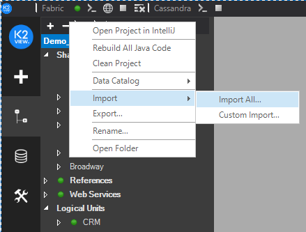
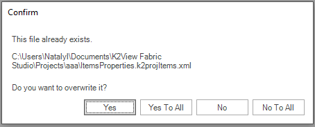
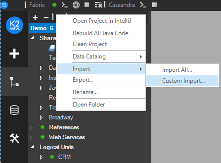
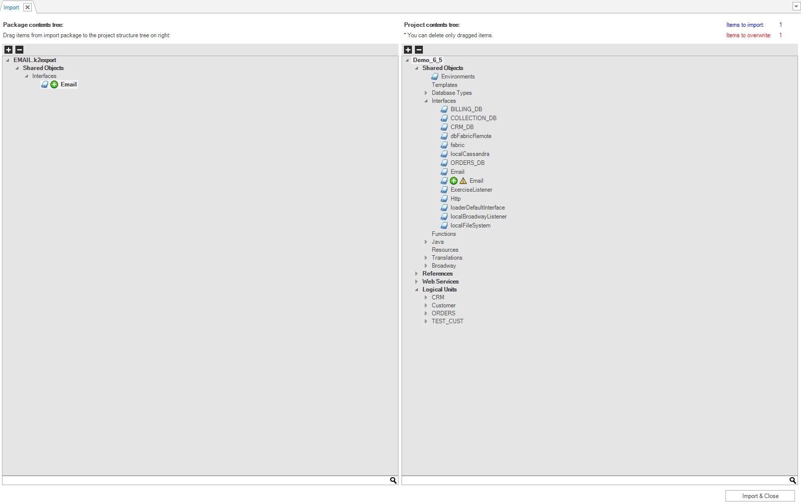

# Exporting and Importing a Fabric Project

<studio>

Fabric Studio has a proprietary encapsulation functionality that packages an entire project or selected components. Fabric projects can be backed up and restored using the Export and Import options that trigger the encapsulation and decapsulation processes.

### Exporting Selected Project Components

There are two Export options:
* Export an entire project.
* Export a specific object, for example:
  * Group items, [Shared Objects](/articles/04_fabric_studio/12_shared_objects.md), References, Web Services, [LU](/articles/03_logical_units/01_LU_overview.md).
  * Sub-groups, [interfaces](/articles/05_DB_interfaces/01_interfaces_overview.md), Java, Resources, [Translations](/articles/09_translations/01_translations_overview_and_use_cases.md), [Tables](/articles/06_LU_tables/01_LU_tables_overview.md).
  * Java files (categories).
  * Objects, whereby you can export a specific object from the Project Tree. Java functions cannot be exported using this method.

To export a project, do the following:
1. Right click the **Project Group** or **Object** and then click **Export**. 
2. Select the exported file’s **Name** and **Location** and then click **Save**. A new file is created with a k2export extension.

### Importing Selected Project Components

You can import an entire exported project or specific branches of a Project Tree whereby the imported objects are attached to an existing project.

**Notes**  
* There is no backwards support compatibility. Importing a project exported from a higher version of K2View Fabric Studio is not supported.
* Only the same type of object can be imported. For example, Logical Unit to Logical Unit, LU Table to LU Table, Java Files to Java Files. You can also copy the same type of object into another group. For example, to copy Java files from Shared Objects to Reference Java files. 
* The Import process is implemented on a Java files level and not on Java functions. Therefore, when a Java file is imported, it overwrites the entire file including its Java functions.  
* When updating a specific function in a Java file, add the function to the Java file manually. 
* Java files are imported into the Category level of the [Logic File](/articles/04_fabric_studio/09_logic_files_and_categories.md). 
* Importing [Globals](/articles/08_globals/01_globals_overview.md) to an existing Globals file does not overwrite the existing Java file. Both files are merged into one file unless they have the same name, in which case, the new file overwrites the existing file with the value of the imported variable. 

### How Can I Import a K2EXPORT File Into My Project?

**Import Options**

* **Import All**, imports the entire exported project together with notes regarding overwritten data and creating new LU.
* **Custom Import**, enables you to select the exported objects or group items to be imported.

**Import All Process**

1. Right click the root of the **Project Tree**, click **Import** and then click **Import All** to open the File **Browser** and select the **k2export** **file** to be imported.  

2. Select the **file** and click **Open**:  
    a. If the file name exists, click either **OK** to confirm or **Ignore** to overwrite or skip the files.\
    b. When importing files to a non-existent LU, select the targeted **LU** or create a new LU saved with the exported LU file’s name.
    
    

3. A confirmation window opens asking you whether you want to:\
    a. Overwrite the specific file.\
    b. Overwrite all the conflicting files in the import package.\
    c. Decline the overwrite of the specific file.\
    d. Decline the overwrite of all the conflicting files. 
    
    

### Custom Import Process

1. Right click the root of **Project Tree**, click **Import** and then click **Custom Import**.

2. Click the **branches** and **items** to import from the file and then click and drag the  icon to the current project’s structure (right pane).  

The Custom Import window displays the number of imported and overwritten items.

3.  Right click the **Target Project Tree** to display a context menu with the following options:

    a. **Remove All Conflicted Items**, removes all conflicting items from the target whereby only new items remain.\
    b. **Remove Import Items**, removes selected items only. Right click an item to select it.\
    c. **Show Conflicted Items Only**, displays only items that conflict with existing items.\
    d. **Show Import Item Only**, displays imported items only.\
    e. **Show All Items**, displays all items in the project tree.

4. Click **Import & Close** to confirm the Import process or close the window to cancel it. 
5. A confirmation window opens asking you whether you want to:

    a. Overwrite the specific file.\
    b. Overwrite all the conflicting files in the import package.\
    c. Decline the overwrite of the specific file.\
    d. Decline the overwrite of all conflicting files. 

**Notes** 

When importing objects with the same name and location in the Project Tree, a yellow triangular notification icon is displayed next to the imported objects. The imported objects overwrite the existing objects. 

</studio>

<web>

### Import / Upload files

Importing project files or folders into your project can be done either by:

* Using the **File > Upload Files...** available at top menu bar, when the target folder at the project tree is selected.
* Drag and drop them from your PC/Mac folder into the required location.

* Using the context menu (right click) on the target folder at the project tree.
       

The upload progress will be displayed in the lower right corner of the screen:

  

> Note: 
>
> * Because this is a standard IDE file upload action, there is no validation on what you are uploading and where. 
> * When asked about overriding elements, your selection affects on all uploaded files.

### Export / Download 

To export files or folders:

1. choose them at the project tree and then 
2. Use the **File > Download** available at top menu bar or context menu (right click) > Download option.

The files and folders are then downloaded into your PC/Mac.

> Note that when selecting folders or multiple files the download outcome is a compressed "tar" file.

</web>

