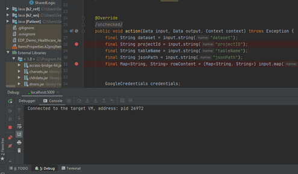
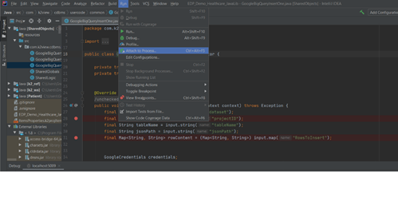
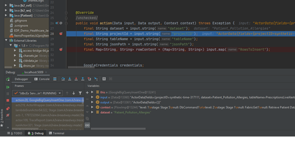
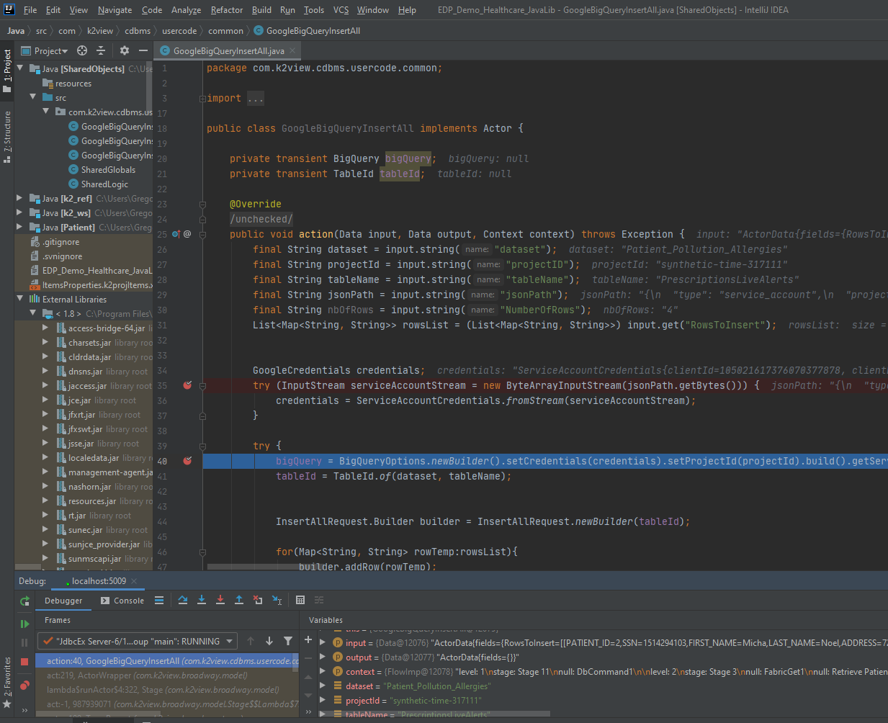

# Debugging with IntelliJ

To accelerate your implementation you can enjoy from a range of key-features offered by the IntelliJ IDE. In this article, we will focus on the code writing and debugging capabilities.


## Code Completion
All your java extensions or fabric built-in functions and libraries will be appearing in the hoovering menu on the code/function you currently write, as explained in the following articles:

-	[Basic]( https://www.jetbrains.com/help/idea/auto-completing-code.html#basic_completion)
- [Statement]( https://www.jetbrains.com/help/idea/auto-completing-code.html#statements_completion)
- [Hippie]( https://www.jetbrains.com/help/idea/auto-completing-code.html#hippie_completion)


## Debugging

Refer to the following links to set up a simple Java debugging scheme on your project:
- [Set breakpoints]( https://www.jetbrains.com/help/idea/debugging-your-first-java-application.html#setting-breakpoints)
- [Run in debug mode]( https://www.jetbrains.com/help/idea/debugging-your-first-java-application.html#running-program)
- [Analyze and Step thru]( https://www.jetbrains.com/help/idea/debugging-your-first-java-application.html#analyzing-state)
- [Stop and Re-run]( https://www.jetbrains.com/help/idea/debugging-your-first-java-application.html#stopping-debugger)

## Step-through Debugging Example

(i)	Open the java file you wish to debug in IntelliJ

(ii)	Select the lines on which to add the breakpoints  - see below the red bullets next to the line numbers. 

 
(iii)	Select the Run -> “Attach to Process” option from the menu bar  

 
(iv)	Select the process to which to attach the Java debugger. 

For example in the screenshot displayed below, the ```26972 com.k2view.fabric.boot.Boot (5009)``` option is selected. 


 
(v)	Run your code and step through the program’s breakpoints using the controls on the left hand-side of the [debug window](https://www.jetbrains.com/help/idea/debugging-your-first-java-application.html#stepping)


