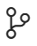

<web>

## Using Source Control in Web Studio

The Fabric Web Studio has integrated source control management (SCM) and includes [Git](https://git-scm.com/) support in-the-box. 

The Source Control  icon in the Activity Bar on the left indicates an **overview of how many changes** you currently have in your repository. 

Clicking the icon will show you the details of your current repository changes: **CHANGES**, **STAGED CHANGES** and **MERGE CHANGES**.

> Tip: To bring up the Source Control View you can also use the keyboard shortcut `CTRL+SHIFT+G`.

Clicking each item will show you in detail **the textual changes within each file**. Note that for unstaged changes, the editor on the right still lets you edit the file.

You can also find indicators of the **status of your repository** in the bottom-left corner of the status bar: the **current branch**, **dirty indicators**, and the number of **incoming and outgoing commits** of the current branch. You can **checkout** any branch in your repository by clicking that status indicator and selecting the Git reference from the list.

## Commit

**Staging** (Git add) and **unstaging** (Git reset) can be done via contextual actions in the files or by drag-and-drop.

You can type a commit message above the changes and press `Ctrl+Enter` (macOS: `⌘+Enter`) to commit them. If there are any staged changes, only changes will be committed. Otherwise, you'll get a prompt asking you to select what changes you'd like to commit and get the option to change your commit settings.

More specific **Commit** actions can be found in the **Views and More Actions** `...`  (ellipsis) menu on the top of the Source Control view.

> **Tip:** If you commit your change to the wrong branch, undo your commit using the **Git: Undo Last Commit** command in the **Command Palette**.

## Git Status Bar Actions

There is a **Synchronize Changes** action in the Status Bar, next to the branch indicator, when the current checked out branch has an upstream branch configured. **Synchronize Changes** will pull remote changes down to your local repository and then push local commits to the upstream branch.

If there is no upstream branch configured and the Git repository has remotes set up, the **Publish** action is enabled. This will let you publish the current branch to a remote.

## Gutter Indicators

If you open a folder that is a Git repository and begin making changes, Web Studio will add useful annotations to the gutter and to the overview ruler. These annotations appear near the line numbers.

* A red triangle indicates where lines have been deleted
* A green bar indicates new added lines
* A blue bar indicates modified lines

## Merge Conflicts

Merge conflicts are recognized by Web Studio. Differences are highlighted and there are inline actions to accept either one or both changes. Once the conflicts are resolved, stage the conflicting file so you can commit those changes.

## Viewing Diffs

The Git tool supports viewing of diffs within Web Studio, showing original and modified file side by side.

>**Tip:** You can diff any two files by first right-clicking on a file in the Explorer or **OPEN EDITORS** list and selecting **Select for Compare** and then right-click on the second file to compare with and select **Compare with 'file_name_you_chose'**.   Alternatively from the keyboard hit `Ctrl+Shift+P` and select **File: Compare Active File With** and you will be presented with a list of recent files.

</web>
