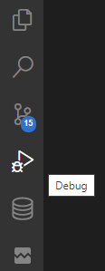
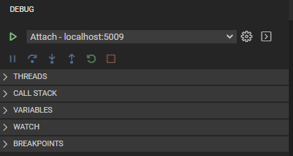
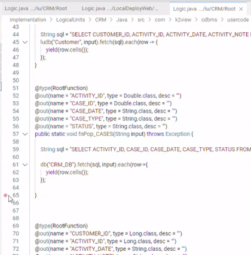
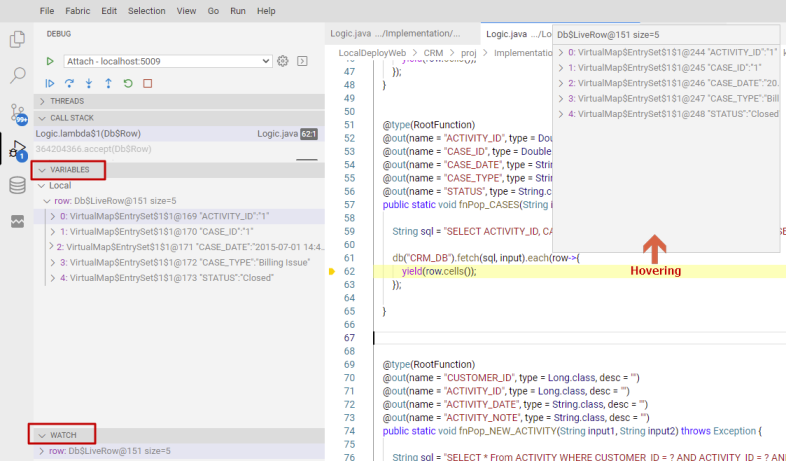
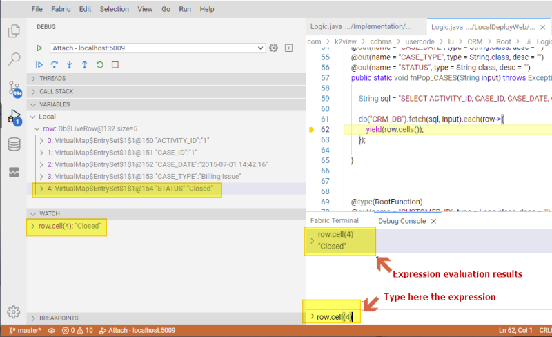
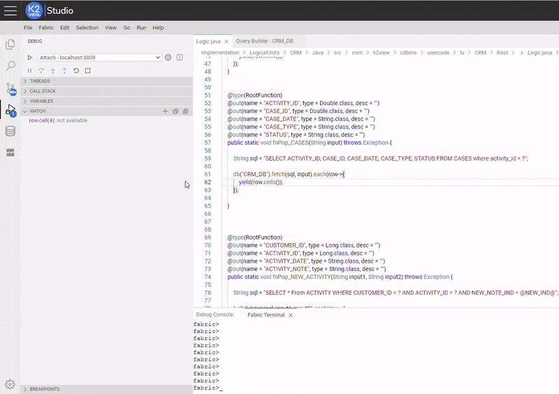

<web>

# Code Debugging

One of the key features of the Fabric Web Studio is its debugging support. The built-in debugger helps accelerate your edit, compile and debug loop.

> Note: This article covers code debugging. you can find [here](/articles/19_Broadway/25_broadway_flow_window_run_and_debug_flow.md) information about Broadway debugging.

## Debug View

To bring up the Debug View, select the Debug icon in the **Activity Bar** on the side of Web Studio. You can also use the keyboard shortcut `CTRL+SHIFT+D`.

The Debug View displays all information related to running and debugging. 

It consists of:

* A top bar with debugging Attach command and configuration settings.
* Debug Actions panel (Continue / Pause, Step Over, Step Into, Step Out, Restart, Stop).
* Data Inspection sections (THREADS, CALL STACK, VARIABLES, WATCH, BREAKPOINTS) which provides variety of data. 

## Breakpoints

Breakpoints can be set and toggled by clicking on the **editor margin** or using `F9` on the current line. In addition, use right-click to set a conditional breakpoint (by expression, hit count or log message). Finer breakpoint control (enable/disable/set condition) can be done in the Debug View's **BREAKPOINTS** section.

* Breakpoints in the editor margin are shown as red filled circles.
* Disabled breakpoints have a filled gray circle.
* When a debugging session starts, breakpoints that cannot be registered with the debugger change to a gray hollow circle. The same might happen if the source is edited while a debug session without live-edit support is running.

## Logpoints

A Logpoint is a variant of a breakpoint that does not "break" into the debugger but instead logs a message to the console. Logpoints are especially useful for injecting logging while debugging production servers that cannot be paused or stopped.

A Logpoint is represented by a "diamond" shaped icon. Log messages are plain text but can include expressions to be evaluated within curly braces ('{}').

Just like regular breakpoints, Logpoints can be enabled or disabled and can also be controlled by a condition and/or hit count.

When debug is running, a Debug Console is opened at bottom panels area, where these logpoints are printed.

## Start debugging

To start debugging your project implementation, click the Attach button.

The Status Bar then changes color (orange-brown for default color themes).

### Debug actions

Once a debug session starts, the **Debug toolbar** becomes active.

- Continue / Pause `F5`
- Step Over `F10`
- Step Into `F11`
- Step Out `Shift+F11`
- Restart `Ctrl+Shift+F5`
- Stop `Shift+F5`

### Data inspection

- Variables can be inspected in the **VARIABLES** section of the Debug View or by hovering over their source in the editor. Variable values and expression evaluation are relative to the selected stack frame in the **CALL STACK** section.

- Variable values can be modified with the **Set Value** action from the variable's context menu. Additionally, you can use the **Copy Value** action to copy the variable's value, or **Copy as Expression** action to copy an expression to access the variable.

- Variables and expressions can also be evaluated and watched in the Debug View's **WATCH** section. 

- Variable names and values can be filtered by typing while the focus is on the **VARIABLES** section

You can also evaluate expressions in the **Debug Console**. Below you can see various ways to inspect the same variable:

## Advanced Topics

### Conditional Breakpoints

A powerful debugging feature is the ability to set conditions based on expressions, hit counts, or a combination of both.

- **Expression condition**: The breakpoint will be hit whenever the expression evaluates to `true`. A conditional breakpoint is represented by an "equal" shaped icon. 
- **Hit count**: The 'hit count' controls how many times a breakpoint needs to be hit before it will 'break' execution. Whether a 'hit count' is respected or not, and the exact syntax of the expression can vary among debugger extensions.

You can add a condition and/or hit count when creating a source breakpoint (with the **Add Conditional Breakpoint** action) or when modifying an existing one (with the **Edit Condition** action). In both cases, an inline text box with a dropdown menu opens where you can enter expressions.

Condition and hit count editing support is also supported for **function** and **exception** breakpoints.
You can initiate condition editing from the context menu, or the inline **Edit Condition** action.

Below is an example of setting and activating an Expression Condition. The condition was set in a similar matter as setting debug execution stops at the breakpoint only when a CASE's status at "CASES" table is equal to "Open" (the used conditional expression is: `row.cell(4).equals("Open")`).

### Run and Debug Java Applications

The Web Studio, as a developers IDE, enables you to create executable Java applications, regardless of the project or a specific LU. To run and debug such Java applications, there are several entry points for starting a debugging session: CodeLens, Context Menu, and Shortcuts.

#### CodeLens

You will find **Run|Debug** on the [CodeLens](/blogs/2017/02/12/code-lens-roundup.md) of your `main()` function.

> Tip: While CodeLens is disabled, you can still access the **Run|Debug** actions by hovering over your `main()` function.

#### Context menu

Another way to start debugging is to right-click a Java file in the File Explorer or editor and select **Run** or **Debug** in the context menu.

#### Shortcuts

Use `F5` to start debug or `CTRL+F5` to start running without debug.

</web>

