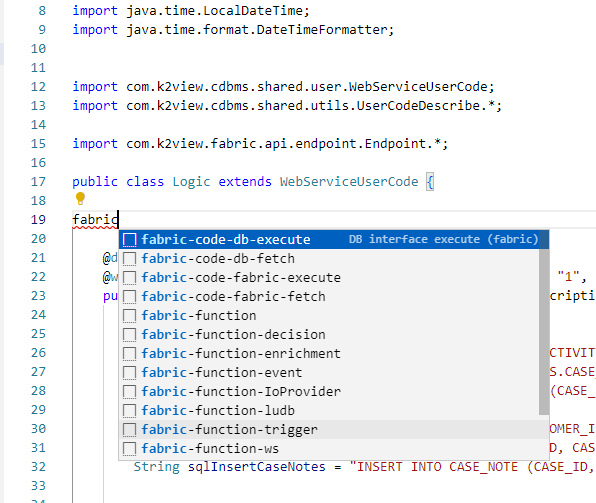

<web>

# Basic Code Editing 

Fabric Studio is a designer tool that manages the construction of [Data Products](/articles/01_fabric_overview/02_fabric_glossary.md#logical-unit--data-product), and includes the features you need for highly productive low-code and source code crafting and editing. 

Web Studio is a full, professional and comprehensive IDE, Visual Studio Code like editor. If you are not familiar with source code editors, you can watch and learn from VS Code's user guides, but keep in mind that Web Studio is not precisely the same (as it is based on Code OSS, the open source project behind VS Code).

This article walks you through the following core capabilities - provided by the Web studio source code editor - that assist with your code editing:

* Powerful Editing
* Easy and streamlined Debugging, as explained [here](/articles/04_fabric_studio/24_web_debug.md)
* In-Product Source Control, as explained [here](/articles/04_fabric_studio/23_web_versioncontrol.md)

## Powerful Editing

Offering a professional code editor, Web Studio provides a wide variety of capabilities, among them are:

- As-you-type reporting of parsing and compilation errors 
- Syntax highlighting and bracket matching
- Smart Code Completion, Code Snippet support and correction suggestions
- Code navigation, such as Go to Definition and Find All References
- Code Refactoring

### Parsing and Compilation Error Indicators

The as-you-type reporting of parsing and compilation errors is shown both inline the editor with a red line under the error, and in the upper-right mini-map code outline.

Along with that, there are other indications of errors and warnings in a file:

* In the Project Tree - where a whole files hierarchy is colored red
* In the Warning and Error panels
* On the left side of the bottom panel 
* In the Top Editor tab

Moreover, the editor, when applicable, uses the language engine and hints as well as suggests a correction to the problem.

The below example illustrates these indicators and hints:

### Syntax Highlighting and Bracket Matching

Syntax highlighting determines the color and style of the displayed source code. It is responsible for changing the color of keywords, thus differentiating them from strings and comments and variable names.

Matching brackets will be highlighted as soon as the cursor is close to one of them. You can easily jump between the brackets and also collapse segments that are surrounded by these brackets as explained [here](/articles/04_fabric_studio/27_web_productivity_tips.md#editing-and-debugging). This capability enables you to cope with a long source code and to focus only on the required piece of code relevant to you now.

### Smart Code Completion

Code smarter with code completion, code hinting and info for variables, methods, member lists and imported modules. These features have been put together by VS Code - which Web Studio is based on - into the general term *IntelliSense*, which, as suggested by its name, provides intelligent code completion based on both language semantics and the analysis of your source code.

When possible completions are found, the IntelliSense suggestions will pop up as you type. If you continue typing characters, the list of members (such as variables and methods) is filtered to include only members containing your typed characters. Pressing Tab or Enter will insert the selected member. 

You can trigger IntelliSense in the editor by typing either Ctrl+Space or a trigger character - the dot character (.) in Java or JavaScript.

More detailed explanations and examples can be found [here](https://code.visualstudio.com/docs/editor/intellisense).

The comprehensive Java language support is done by using Red Hat extension (published in both [Visual Studio Marketplace](https://marketplace.visualstudio.com/items?itemName=redhat.java) and [Open VSX](https://open-vsx.org/extension/redhat/java)).

> **NOTES**: 
>
> * Web Studio comes with a built-in support for various programming languages like Java, JavaScript, TypeScript, CSS and HTML. However, richer language extensions can be found in [Open VSX Registry](https://open-vsx.org/), which is similar to the VS Code Marketplace.
> * Similar code completion and behavior, though less contextual, is available also in Query Builder SQL editor, using the Query Builder Assistance. 

### Code Snippet Support

Code snippets are templates that make it easier to enter repeating code patterns, such as loops or conditional-statements.

Appearing snippets in IntelliSense (Ctrl+Space) are mixed with other suggestions. Similarly, snippet suggestions are also shown when typing a snippet prefix (a trigger text). You can then either select the snippet or scroll down with arrows and then press Tab to insert the snippet.

Web Studio has built-in snippets for several languages such as Java, JavaScript, TypeScript, Markdown, and it also offers various Fabric snippets. 

Typing `fabric` for a Fabric code's snippet prefix, reveals a list of Fabric related snippets. You can continue and type other parts of the snippet prefix as well, which would limit the suggestions. For example, `fabric-func` will retrieve only Fabric's function snippets and not others.

Following are Fabric prefixes and snippets:   

* Functions
  * `fabric-function` - creates a regular [Fabric project function](/articles/07_table_population/08_project_functions.md) template.
  * `fabric-function-enrichment` - creates an [Enrichment function](/articles/10_enrichment_function/01_enrichment_function_overview.md) template.
  * `fabric-function-decision` - creates a [Decision function](/articles/14_sync_LU_instance/05_sync_decision_functions.md) template.
  * `fabric-function-trigger` - creates a [Trigger function](/articles/07_table_population/11_4_creating_a_trigger_function.md) template.
  * `fabric-function-event` - creates an [Event function](/articles/07_table_population/11_5_creating_an_event_function.md) template.
  * `fabric-function-ludb` - creates a [LUDB function](/articles/07_table_population/11_3_creating_an_LUDB_function.md) template.
  * `fabric-function-ws` - creates a [Web-Service function](/articles/15_web_services_and_graphit/07_custom_ws_create_java_ws.md) template.
    * `fabric-methods` - reveals a fabric methods list to be used in WS permissions definition.
  * `fabric-function-ws-raw` - creates a Web-Service snippet function template, with all available parameters and settings.
* Other Fabric code's snippets:
  * `fabric-global` - adds a [Globals](/articles/08_globals/01_globals_overview.md) variable template. 
  * `fabric-code-db-fetch` - adds a code template for fetching data from a DB interface (including loop). 
  * `fabric-code-db-execute` - adds a code template for executing SQL in DB interface.
  * `fabric-code-fabric-fetch` - adds a code template for fetching data from Fabric DB (including loop).
  * `fabric-code-fabric-execute` - adds a code template for executing SQL in Fabric DB.

### Code navigation

Right click on any symbol in your code and see the various options of going to its definitions, its type definitions, references, call hierarchy and so on. You can also use the CTRL key and click on the symbol to go to its definition.

### Refactoring

[Source code refactoring](https://en.wikipedia.org/wiki/Code_refactoring) can improve the quality and maintainability of your project by restructuring your code while not modifying the runtime behavior. Web Studio, following VS Code, supports refactoring operations such as [Extract Method](https://refactoring.com/catalog/extractMethod.html) and [Extract Variable](https://refactoring.com/catalog/extractVariable.html) to improve your code base from within your editor. read [here](https://code.visualstudio.com/docs/editor/refactoring) more about how to use it.

</web>
