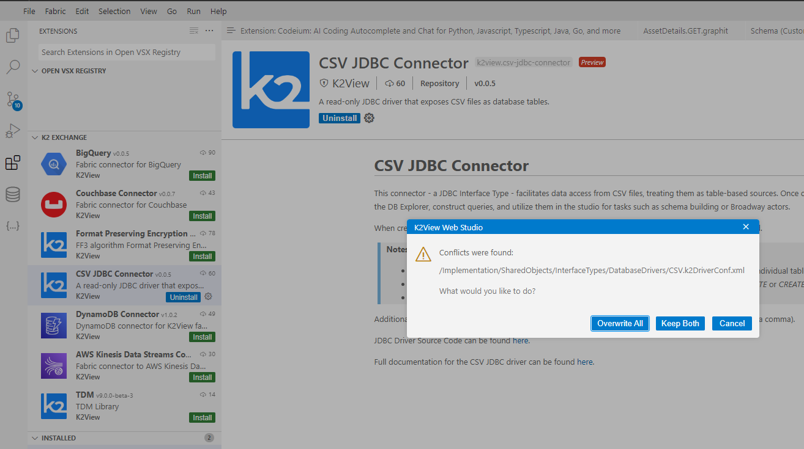
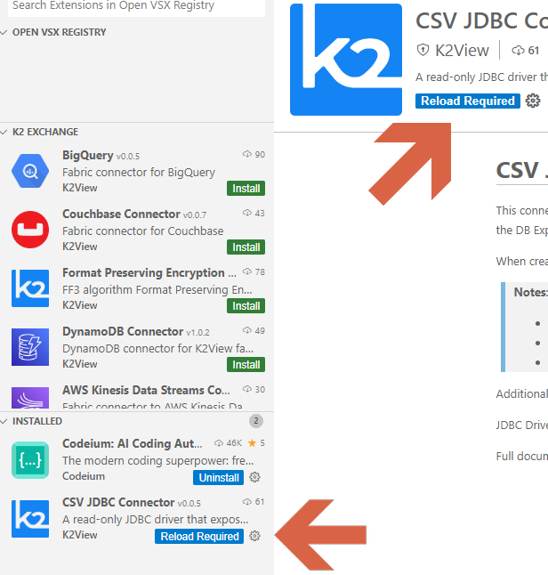

<web>

# K2exchange

The K2exchange is a store-like platform for publishing and consuming Fabric’s modules that are not part of the product and that are hence considered as extensions. Such extension modules can be Broadway actors and flows, connectors, templates, Java code and libraries, LU web-app and SQL queries. 

Project implementors can explore the extensions list, through the Web Studio, install and embed them into their project with a click, to support their development workflow.

Additionally, the Web Studio provides tools for creating, packing and publishing extensions to the K2exchange store.

## Browse for Extensions

You can browse and install extensions from within the Web Studio. Access the **Extensions** view by clicking on the Extensions icon in the **Activity Bar** on the left side of the Studio (), by choosing it at the top View menu > Extensions, or by using View: Extensions keyboard short - Mac: `⇧⌘X`, Windows/Linux: `Ctrl+Shift+X`.

This will present you with a list of the extensions on the K2exchange. Each of the extensions in the list includes a brief description and its publisher. With a mouse hover, you can see a pop-up tooltip that contains more information about the extension, such as its latest version. When selecting an extension item, the extension's details page displays on the right side of the screen, where you can learn more about it.

> The extension list is divided into several sub-lists, such as *INSTALLED*, which can be useful when the main *K2 EXCHANGE* list includes many extensions and you wish to see only the installed ones.

## Install an Extension

To install an extension, select the **Install** button. Once the installation has been completed, an indicating notification will appear at the bottom-right corner of the screen. Additionally, the **Install** button of the extension will be replaced with an **Uninstall** button along with a gear wheel button. 

The installed extension will then also appear on the INSTALLED extensions list.

The extension's installation process includes adding the extension files into your project. After verifying that the extension fits your needs, you shall commit and push it into your project to GIT, in a way that other spaces that will be created upon this project will contain this extension.

As well as those project files, an additional file - *installed_extensions.json* - will be created, given that it is the first extension in the project, otherwise this additional file will be updated with the new extension information. This file contains the installed version and the associated files for each extension. You shall push this file as well with the changes into GIT.

> **Notes:** 
>
> * **Dependencies**: In case 
>
> * **Conflicts**: If a file, which is included in an extension that you are installing, already exists in your project, then Studio will notify about it and will display the list of the conflicting files. In such case, you can decide to either:
>
>   * **Overwrite All** - replace the existing files with those included in the extension.
>   * **Keep Both** - preserve the existing file, aside the extension files that have the suffix '.new'. You can then compare between them and accordingly decide how to handle the changes.
>   * **Cancel** - do not install the extension.
>
>   
>   
>   Example of a Conflicts pop-up window:
>   
>    
>   
>   Note that only 10 files with conflicts will be listed in this pop-up.

## Uninstall an Extension

To uninstall an extension, click on the **Uninstall** button that appears aside the extension. This will uninstall the extension and notify you that a reload is required in order to refresh the list of extensions and their status. Once clicked - the Web studio (the browser tab) will be reloaded.

Once the extension is uninstalled, its related files that were added into the project will be removed, as well as it will be removed from the *installed_extensions.json* file. Consequently, you shall push these changes to GIT, after verifying that the project is not badly affected, i.e., it works as expected without the extension.

 

> If you make changes in the files that are part of an extension, then when uninstalling an extension the Studio will notify you about it and will display the list of these files. Accordingly, you can decide to either:
>
> * **Delete All** - proceed with the uninstallation process, where these files will be removed. 
> * **Keep Changes** - proceed with the uninstallation process, deleting extension-related files, except those that were changed by you.
> * **Cancel** - so that the extension will remain.
>
> 
>
> Example of a Conflicts pop-up window:
>
> 

## Update an Extension

K2echange enables updating extensions. You will probably be informed about such updates by the extension's developer.

To update an extension:

1. Find it in the INSTALLED extension list. 
2. Click on the gear wheel button beside it. A list of the other extension's versions will be shown.
3. Choose the required version (can be any - older or newer).

> While changing the extension version, there is a possibility that changes that have been made would be deleted. In such case, you will be notified, in a similar manner as in the uninstallation process, with the same dialog window, which asks whether you would like to Delete All, Keep Changes or Cancel.

## Install from a VSIX

You can manually install an extension packaged in a `.vsix` file. Using the **Install from VSIX** command in the Extensions view command drop-down - ellipsis menu, or the **Extensions: Install from VSIX** command in the **Command Palette**. Navigate to the `.vsix` file location in the pop-up window that will appear, and choose it.

## Productivity Tips

* It is recommended - for any of the extension actions - first to commit your changes into GIT, in order to easily compare and track changes.

</web>
