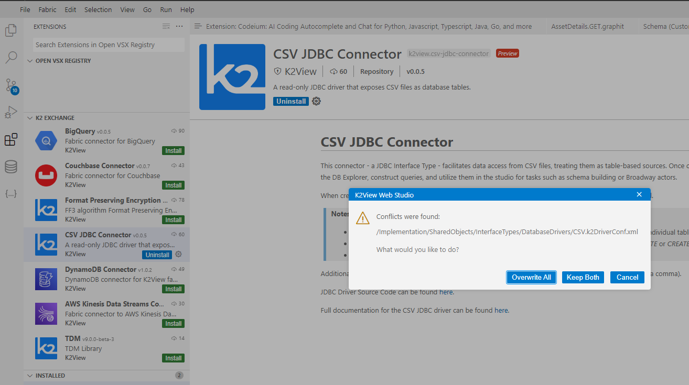
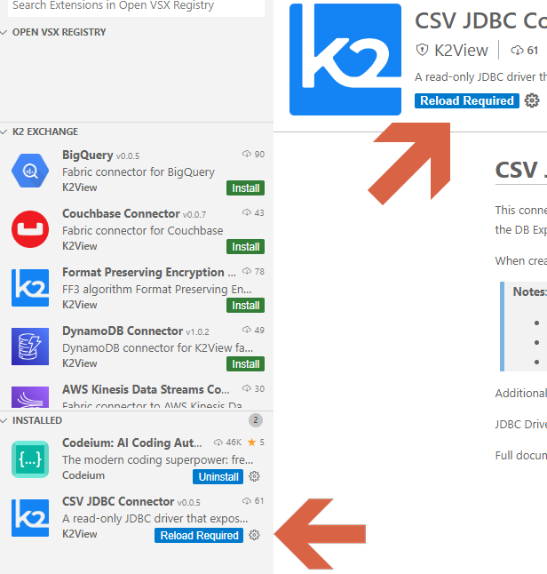
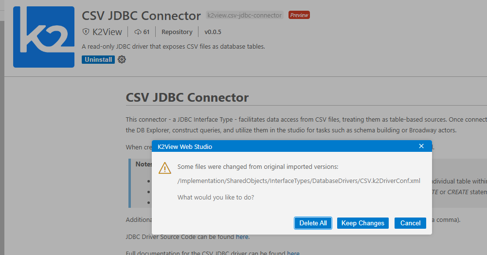
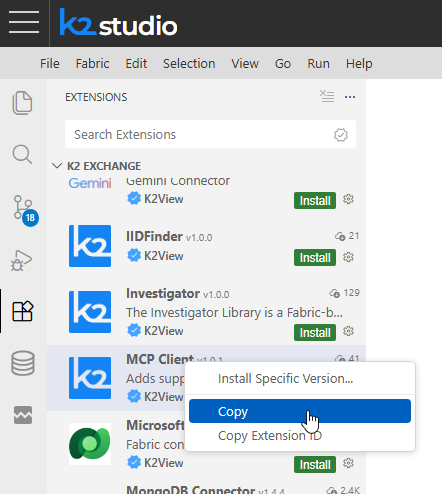

# K2exchange

The K2exchange is a store-like platform for publishing and consuming Fabric’s modules that are not part of the product and that are hence considered as extensions. Such extension modules can be Broadway actors and flows, connectors, templates, Java code and libraries, LU web-app and SQL queries. 

Project implementors can explore the extensions list, through the Web Studio, install and embed them into their project with a click, to support their development workflow.

<web>

Additionally, the Web Studio provides tools for creating, packing and publishing extensions to the K2exchange store. More information can be found [here](/articles/04_fabric_studio/29_web_k2exchange_create_and_edit.md).

## Browse for Extensions

You can browse and install extensions from within the Web Studio. Access the **Extensions** view either by clicking on the Extensions icon in the **Activity Bar** on the left side of the Studio (), by choosing it at the top View menu > Extensions, or by using View: Extensions keyboard short - Mac: `⇧⌘X`, Windows/Linux: `Ctrl+Shift+X`.

This will present you with a list of the extensions on the K2exchange. Each of the extensions in the list includes a brief description and its publisher. With a mouse hover, you can see a pop-up tooltip that contains more information about the extension, such as its latest version. When selecting an extension item, the extension's details page displays on the right side of the screen, where you can learn more about it.

> The extension list is divided into several sub-lists, such as *INSTALLED*, which can be useful when the main *K2 EXCHANGE* list includes many extensions and you wish to see only the installed ones.


## Install an Extension

To install an extension, select the **Install** button. Once the installation has been completed, an indicating notification will appear at the bottom-right corner of the screen. Additionally, the **Install** button of the extension will be replaced with an **Uninstall** button along with a gear wheel button. 

The installed extension will then also appear on the INSTALLED extensions list.

The extension's installation process includes adding the extension files into your project. After verifying that the extension fits your needs, you shall commit and push it into your project to GIT, in a way that other spaces that will be created upon this project will contain this extension.

As well as those project files, an additional file - *installed_extensions.json* - will be created, given that it is the first extension in the project, otherwise this additional file will be updated with the new extension information. This file contains the installed version and the associated files for each extension. You shall push this file as well with the changes into GIT.

> **Notes:** 
>
>
> * **Conflicts**: If a file, which is included in an extension that you are installing, already exists in your project, then Studio will notify about it and will display the list of the conflicting files. In such case, you can decide to either:
>
>   * **Overwrite All** - replace the existing files with those included in the extension.
>   * **Keep Both** - preserve the existing file, aside the extension files that have the suffix '.new'. You can then compare between them and accordingly decide how to handle the changes.
>   * **Cancel** - do not install the extension.
>
>   
>   
>   Example of a Conflicts pop-up window:
>   
>    
>   
>   Note that only up to 10 files with conflicts will be listed in this pop-up.


## Uninstall an Extension

To uninstall an extension, click on the **Uninstall** button that appears aside the extension. This will uninstall the extension and notify you that a reload is required in order to refresh the list of extensions and their status. Once clicked - the Web studio (the browser tab) will be reloaded.





Once the extension is uninstalled, its related files that were added into the project will be removed, as well as it will be removed from the *installed_extensions.json* file. Consequently, you shall push these changes to GIT, after verifying that the project is not badly affected, i.e., it works as expected without the extension.

 

> If you make changes in the files that are part of an extension, then when uninstalling an extension the Studio will notify you about it and will display the list of these files. Accordingly, you can decide to either:
>
> * **Delete All** - proceed with the uninstallation process, where these files will be removed. 
> * **Keep Changes** - proceed with the uninstallation process, deleting extension-related files, except those that were changed by you.
> * **Cancel** - do not uninstall the extension; leave it to remain.
>
> 
>
> Example of a Conflicts pop-up window:
>
> 


## Update an Extension

K2echange enables updating extensions. You will probably be informed about such updates by the extension's developer.

To update an extension:

1. Find it in the INSTALLED extension list. 
2. Click on the gear wheel button beside it. A list of the other extension's versions will be shown.
3. Choose the required version (can be any - older or newer).


> While changing the extension version, there is a possibility that changes that have been made would be deleted. In such case, you will be notified, in a similar manner as in the uninstallation process, with the same dialog window, which asks whether you would like to Delete All, Keep Changes or Cancel.


## Fabric Version Compatibility Validation

Each **Studio extension** may have multiple versions, each requiring a different **minimum Fabric version**. When installing from **K2Exchange**, the system will:

- Validate your current **Fabric** version against the selected extension version's requirements.
- If your Fabric version is too low for the selected extension version, the system will suggest **older versions** of the same extension that might be compatible with your setup.
- This ensures you always install an extension version that works with your Fabric.

For example:

- **Extension *B*, Version *2*** requires **Fabric 8.2+** but
- **Extension *B*, Version *1*** works with lower Fabric versions.
- If your Fabric version is below **8.2**, K2Exchange will suggest **Version 1** instead of Version 2.


## Air-gapped environments

There are cases where K2Exchange is not accessible to all or some of the Studio deployments (like air-gapped environments).

For such cases, the following is recommended:

1. Download the VSIX from your browser and locate it in the project tree
2. Install extension from VSIX
3. Add VSIX to be part of other project files (version control / GIT)

For more information - see below sections


## Install from a VSIX

You can manually install an extension packaged in a `.vsix` file. Using the **Install from VSIX** command in the Extensions view command drop-down - ellipsis menu, or the **Extensions: Install from VSIX** command in the **Command Palette**. Navigate to the `.vsix` file location in the pop-up window that will appear, and choose it.


Installing from VSIX is useful for several cases:

* Air-gapped environments 
* When you do not want to share it in K2Exchange, for example when it is still in testing or when it is dedicated or developed by organization or project teams for their usage.
* When organization regulations require scanning on any deployed module. 
  In such case you may download first the VSIX, scan and verify it, and then use this physical scanned package.


### Download Extension VSIX files 

To download an extension, at Studio:

1. Navigate to Extensions View and look for the required extension.

   1. Right-click and then click on copy
      

2. When pasting the copied info -  extension's synopsis - you will find the `Download URL` attribute, where you can download the extension from.

   An extension's synopsis example:

   ```
   Name: MCP Client
   Id: k2view.mcp
   Description: Adds support for MCP client actors
   Version: 1.0.1
   Publisher: K2View
   Download URL: https://k2exchange.k2view.com/api/K2View/mcp/1.0.1/file/K2View.mcp-1.0.1.vsix
   ```

   

> **Notes:**
>
> * The provided download URL link, as part of the extension's synopsis, is of its latest version. If other versions, change the URL to the required or consult K2View on which version to use. 
> * If your browser, where you access to the Studio, is also blocked to external connection, then either use browser with access or ask the K2View team to provide it. 
>   Usually only the environment is blocked or limited for external network connection but not the user's browser. The native extensions installation is done by Studio itself as server to server.


### Project VSIX files as extensions repository

As mentioned, as part of installing and embedding an extension into your project files, the extension and its files are logged into *installed_extensions.json*. On another space/environment setup, Studio looks for extensions and accesses K2Exchange to get additional info or files, which are not part of the project files, like editors, templates or scripts (optional). This also accomplishes the process of showing the extension as installed in this space.

In such cases, the above process cannot be accomplished.

For this, you can add the extensions' VSIX files to your project, which will be used like an extensions repository, from which other environments will consume, by default, the extensions, rather than from the K2Exchange.

The location of VSIX extensions in the project can be set in the Settings: Settings > Fabric > Exchange > **Vsix Folder Path**. This is a relative path (to the project root) pointing to the folder containing VSIX files. By default, it is *project-resources*. 

Accordingly, when Studio finds candidate extensions in the *installed_extensions* file, it looks first for their files at this VSIX folder path and installs them from there. If they are not found, it tries installing them from K2Exchange.

 

## Productivity Tips

* It is recommended - for any of the extension actions - first to commit your changes into GIT, in order to easily compare and track changes.
* By default, extensions labeled as **“preview”** will not be displayed in the extensions list. A setting flag allows you to enable or disable the visibility of preview extensions.


[](/articles/04_fabric_studio/29_web_k2exchange_create_and_edit.md)

</web>

<studio>

While **Web Studio** lets you see the K2exchange's extension list and install them directly with a click, in **Desktop Studio** extensions must be installed using a **k2export artifact**. These artifacts are not generated by default. You shall request a *k2export* artifact when needed.

</studio>

