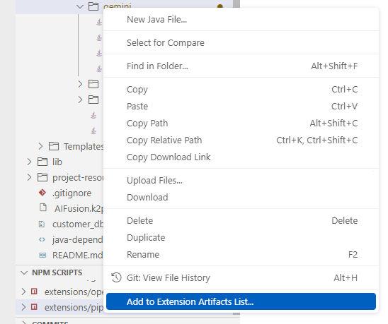
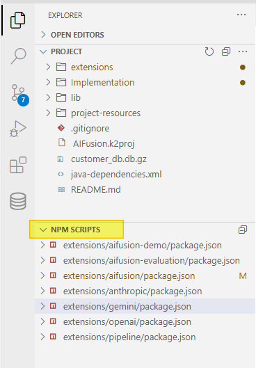
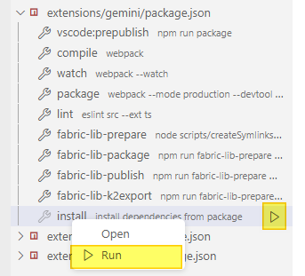

# K2exchange - Create and Edit Extensions

<web>

K2Exchange extensions are integral components of Fabric projects, designed to enhance their functionality. As such, the development of these extensions is naturally conducted within a Fabric project using Studio, which provides a comprehensive suite of tools for creating, editing, packaging, and publishing extensions efficiently.

As will be described, you can pick up specific project files to be included in your extension, while others not, allowing you to continue working on your project without disruptions.

## Creating New Extension

To create a new K2Exchange extension in your project, follow these steps:

1. Open the **Command Palette** (CMD/CTRL+SHIFT+P) and run **New Fabric Extension**.

2. A pop-up window will appear, prompting you to define the **extension name** and **description**.

3. Once confirmed, a new folder is created in the *extensions* folder that resides at the top of the Project Tree. This extension's folder is created with several subfolders and files, which are used as the extension's template, defaults and utilities.

   If this is the first extension, then the *extensions* folder itself will be created as well.

>  You can proceed on this step as many time as you need, having several separated extensions which are built form the same project.

## Adding Project's Files to Extension

The extension’s folder, located at the root of the extensions directory, serves as the foundation for the artifact-building process. All necessary files should be placed there. Nevertheless, Studio eliminates the need to manually copy project files into the extension folder, preventing code duplication. This will let you confidence in that what you developed and tested will be included in the extension.

From the project tree:

1. Select the file/s or folder/s to be included in the extension.

2. Right-click and choose **Add to Extension Artifacts List**.

     

3. A popup window will appear, prompting you to choose from a list, the right extension that these files shall be added into.

4. This operation updates the `artifactsSourcePaths.txt` file, which maintains a list of included files or folders. Thus, when you add project's files the `artifactsSourcePaths.txt` file is automatically opened or get focus, if already opened (The file can be updated manually or incrementally by adding more files as needed.)

## Preparing for Packaging

Once you added the relevant project's files into the extension, you shall update, or at least review, extension's metadata files. These files are auto created during the extension creation with default initial content. 

The key files you should manage include:

- README.md – Contains the README information for the extension. You should provide a detailed explanation of the extension’s purpose, settings, usage guidelines, best practices, and licensing terms.

- package.json – Stores the package configuration, including:
  - `version`: The extension version.

  - `preview`: `true/false` – Determines if the package is considered as preview. Since Fabric 8.2, *Preview* extensions are hidden by default.

  - `minRequiredFabricVersion`: Specifies the minimum required Fabric version (validated during installation).

  - `icon`: Defines the icon that appears in K2Exchange (default is K2 icon).

  - `displayName`: The name displayed in K2Exchange.

  - `description`: A brief description of the extension.

- LICENSE.txt - This is an optional file, describing you license and terms of use, that you might wish to apply for your extension. By default, the README file contains a link to this file.

## Packaging and Publishing Extension

Studio lets you executing several actions for packaging and publishing extensions:

* Building a **VSIX Package** - An extension installer package file (a zip like format), which contains all the extension's necessary components.  It includes the extension's source code, metadata, any required resources or dependencies and Installation instructions, as defined during the extension preparations.

   VSIX can be imported into Studio. This is a good practice for testing an extension before publishing it, or use it when you cannot publish it to the K2exchange store/registry.

* Publishing extension into the **K2exchange store/registry** - This publishes the extension package into K2exchange store/registry, where then the extension can be discovered at the extension list.

* Creating a **k2export** file - This can be useful for extension consumers who are using Desktop Studio, which is not integrated with the K2xchange and thus cannot use neither VSIX package nor K2exchange store/registry.

To run either of these actions, you shall first execute the *install* script, as a one time action per extension:

1. At the project tree go to the *NPM SCRIPTS* section, which appears under the *Project* section.

     

    > if this section is not shown, refresh the Studio page. This might happen only on the first time of creating extensions.

2. Expand the entry with the extension name.

3. Click on arrow aside the Install command action or right-click and from the open menu click on Run

     

Once you ran this, you can now execute the appropriate command to generate the package. This shall be done similar to the *install* action, by either clicking on the arrow aside the command or by using right-click and then choosing the Run action.

The action commands:

* `Fabric-lib-publish`, for publishing into the K2Exchange store/registry.

  > This actions requires a token that provided for users at the K2Exchange portal. Contact K2view team for more information and options.

* `Fabric-lib-package`: Creates a **VSIX** file for importing later by consumers.

* `Fabric-lib-k2export`: Generates a `.k2export` file, which can be imported into .NET Desktop Studio.

>  After running the extension packaging process, you will be able to see at the extension's artifacts folder:
>
>  * under the root folder - the VSIX file
>  * under the artifacts subfolder - the project's files, which are included in the extension, shown as symbolic link

## Updating Extension

To update an existing extension, follow the below steps:

1. Add files and/or folders from the project folder into the extension. You can also remove files or folders.

2. Update the **version number** in `package.json` file.

3. Run the relevant script (`publish`, `k2export`, or `package`).

> **No need to run install again** if you are only updating the package content.

## Best Practices

- Maintain dedicated GIT repository and environment/space where extensions are created.

- Once creating an extension, add its folder files into GIT (but not the artifacts or the VSIX package, if created).

- A single repository can house multiple extensions, though separating them allows for greater flexibility, in terms of GIT branches aspects.

- Before releasing an extension, test it using a VSIX package in a separate environment to ensure proper installation and functionality.

</web>

<studio>Not Available at Desktop Studio</sutdio>
