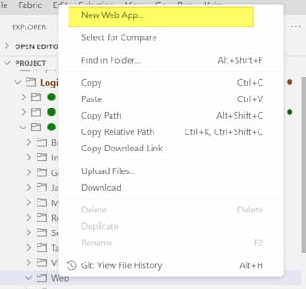
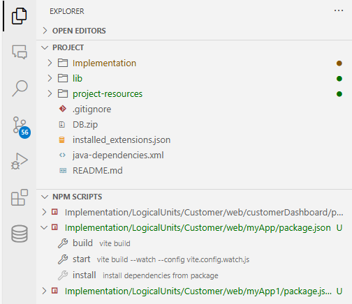
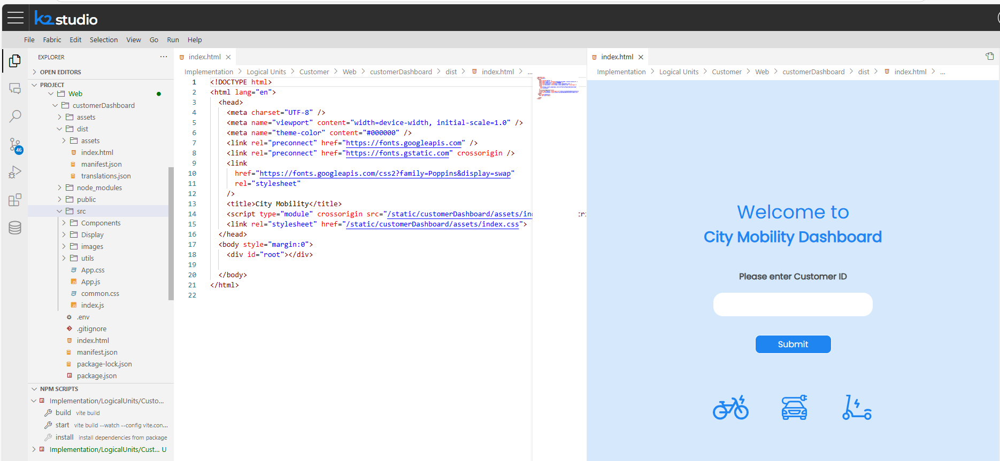
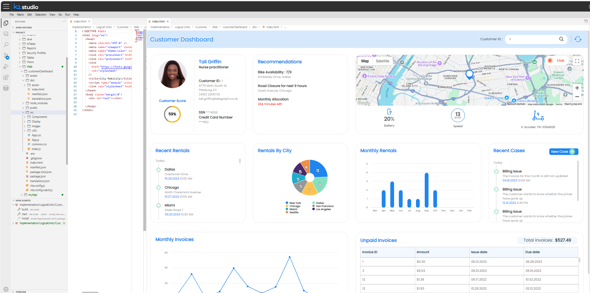

<web>

# Building Web Applications in Web Studio 

## Introduction

In today's fast-paced development environment, having an all-in-one platform for implementing and deploying applications is crucial. **Web Studio IDE** is designed as a one-stop shop, allowing you to seamlessly develop and deploy solutions in an **end-to-end manner** – from building and populating an LU to easily creating related APIs and web applications that consume them. **Web Studio** integrates multiple technologies to accomplish these tasks, offering built-in support for various languages such as Java, JavaScript, HTML, and CSS, along with intelligent code completion and error notifications.

This above-mentioned initiative allows to develop web applications within Web Studio as part of the Fabric solution, catering to various users such as CRM representatives, internal teams, or clients.

One of the key advantages of Web Studio is its **live update** capability, which also applies when developing a React app that typically requires a build step for any changes. Using Web Studio, developers can instantly see changes, as they make modifications, which significantly streamlines the development process.

In this article, we will walk through the steps of building a web application inside Web Studio, illustrating the process with examples and showcasing its powerful features.

## Setting Up a New Web Application

1. In the Project Tree, select the LU where you intend to create the web application, and navigate to the Web folder.

2. Right-click and choose 'New Web App...'

   

3. In the pop-up window, enter a name for your app.

4. In the pop-up window, choose the app type from the following options:

   - **React** – a React framework-based app, where base React source files are pre-generated for you. Additionally, files related to the **Vite** framework are included to support live updates.
   - **Vanilla** – a basic setup with initial files created for you (index.html, main.js, and style.css), along with Vite framework files for live update support.
   - **Empty** – no files are created, allowing you to start from scratch.

5. Once the app has been created, a new app folder appears under the **Web** folder. In addition to the generated files, your app is automatically added to the **apps.json** file, making it available in the K2view web framework's menu (top-left *hamburger menu*).

   > **Note**: It is recommended to manage all apps in the **apps.json** file located in the **Web Services LU**. As the Web Services LU is deployed last, its apps.json file overrides all others. This is particularly relevant in case there are customized apps.json files in your project. 

## Editing and Managing Your Web Application

It is now possible to edit the web application code while benefiting from built-in intelligent code completion and error notifications.

Web Studio also enables to manage — create, edit and debug — the APIs used by the web application, and to first view the data expected to be shown in the app, through the **Studio Query Builder** tool. This whole sequence makes the editing process more efficient and reduces development timelines.

You can see a preview of your HTML files, without going to the app itself, using a built-in Preview view.

To do so, open the HTML file and click on the preview icon , which is located at the top-right corner of the HTML Editor.

## Live Editing and Instant Updates

One of the most powerful features of Web Studio is its **real-time preview**. As the code is modified, updates are immediately reflected in the preview window, eliminating the need for manual builds and deployments. This feature significantly accelerates the development cycle and enhances productivity.

To activate it:

1. In the Explorer View, go to the *NPM SCRIPTS* section, which appears below the *PROJECT* section.
2. Expand the entry with the app name.
3. Hover over the **install** command action and click on the arrow on the right; alternatively, right-click on this command and then click on Run from the open menu.
4. Similarly, click on the **start** command action, which would start the live preview watcher.

Below are screenshots of the City Mobily C360 Demo project, where its React dashboard web application is developed within the Studio. The web application calls the customized project APIs (Java and Graphit files) that enable retrieval and saving of the data inside the LU. Altogether, this allows for the development, debugging and preview to occur in one single place.

</web>

<studio>

# Integrate an Application into the Framework

To introduce a new application using the Fabric web framework, follow these steps:

* Create a new folder, called **web**, under the LU implementation folder.

* Under the **web** folder, create an additional folder representing your new application and place all the web static resources under this folder.

* Add the new application to the **apps.json** file. This file can either be modified on the server side on the existing location, or you can copy this file to the web folder on the client side and edit it accordingly. Fabric will consider the **apps.json** file under the web folder as a higher priority.

  > The order of the applications in the context menu list is determined by their order in the **apps.json** file. 

**Example**

To add the **My Web App** application to the framework, add the following to the **apps.json** file:

~~~json
   {
      "name": "My Simple Web App",
      "appId": "myApp",
      "hidden": false
   }
~~~

</studio>

## Fabric Web Framework Tools

The Fabric web framework exposes a **k2api** object with various methods that can be used by the application, such as navigation, formatting and Fabric commands invocation. An application's style can be set by using either the K2view web framework style sheets (**k2.css**) for a unified 'look & feel' or a different set of style sheets. The framework supports any application type (multi-page or single page) and any routing method (History API, hash-based or regular links).

For detailed documentation about the integration development guidelines, supported methods and code examples, refer to the K2view web framework's menu (top-left *hamburger menu*) and select **Documentation > Web Framework API / Styles**.

To override default web framework styling, you should specify the relevant elements in your project web app files. 

