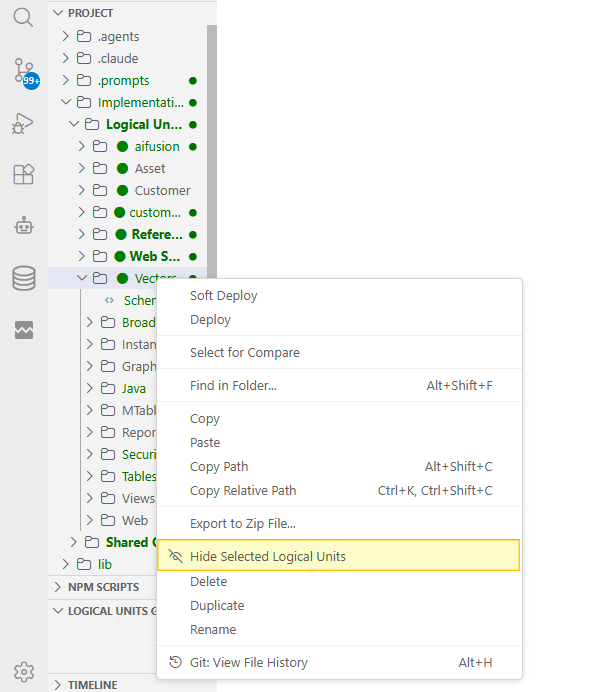
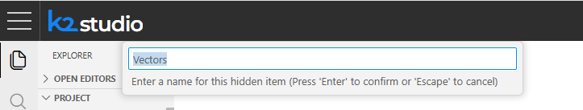
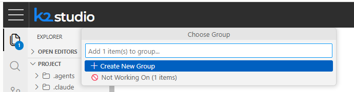
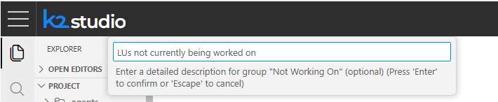
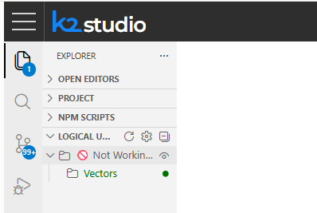
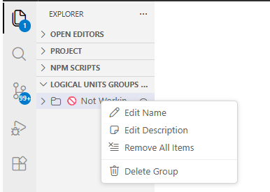
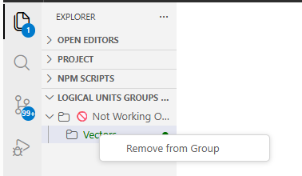
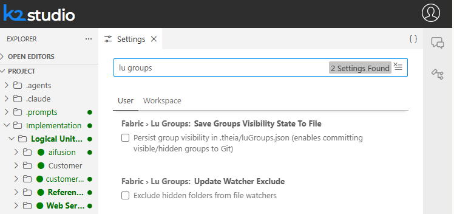

<web>

# Data Product / Logical Units Groups

On large projects, the Project Tree can become overloaded with dozens of Data Products / Logical Units (LUs), most of which you are not actively working on. **Logical Unit Groups** let you hide the LUs you don't currently need, while keeping all of the organization's assets in the same source-controlled project. Hidden LUs:

* Do not appear in the Project Tree.
* Are excluded from the Java build (they are not compiled).
* Are excluded from the **Deploy all Updated Logical Units** command.

Hidden LUs are not simply hidden individually - each one is placed into a **group**. Groups let you act on many hidden LUs at once (hide/unhide, rename, remove) instead of managing them one by one.

>**Note:** Web Service and Reference LUs cannot be hidden - the **Hide Selected Logical Units** command is not available for them.

 

## Hiding Logical Units

To hide one or more LUs:

1. In the **Project Tree**, select the LU(s) you want to hide. Use `Ctrl/Cmd + click` to select several LUs at once.
2. Right-click the selection and choose **Hide Selected Logical Units**.

3. If this is the first hidden LU in the project, you are prompted to name the new group. The name box is pre-filled with the LU's name, which you can keep or change:

   If one or more groups already exist, you are instead asked to **Choose a Group** - either create a new group or add the selection to an existing one (existing groups show how many LUs they already contain):

4. Optionally, enter a description for the group (only shown when creating a new group). This step can be skipped by pressing `Enter` on an empty box:

Once hidden, the selected LU(s) disappear from the Project Tree and appear instead under the **LOGICAL UNITS GROUPS** section, at the bottom of the Explorer side bar.

 

## Managing Hidden LU Groups

Expand the **LOGICAL UNITS GROUPS** section to see all groups and the LUs hidden inside each of them.

### Group-Level Actions

Right-click a group to:

* **Edit Name** - rename the group.
* **Edit Description** - change its description.
* **Remove All Items** - unhide every LU in the group and return them to the Project Tree (the empty group remains).
* **Delete Group** - delete the group and unhide all of its LUs back into the Project Tree.

### LU-Level Actions

Right-click a specific LU inside a group to:

* **Remove from Group** - unhide that single LU and return it to the Project Tree.

 

## Settings

Two related settings are available under **Fabric > LU Groups** in the Settings editor:

* **Save Groups Visibility State To File** - when enabled, group visibility is persisted to `.theia/luGroups.json`, which can be committed to Git so the whole team shares the same hidden LU groups. When disabled (the default), which LUs are hidden is kept locally, per user.
* **Update Watcher Exclude** - when enabled, hidden LUs are also excluded from the file watcher, in addition to being excluded from the Project Tree, build and deploy. Disabled by default.

 

</web>
