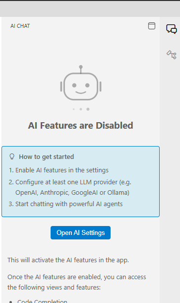
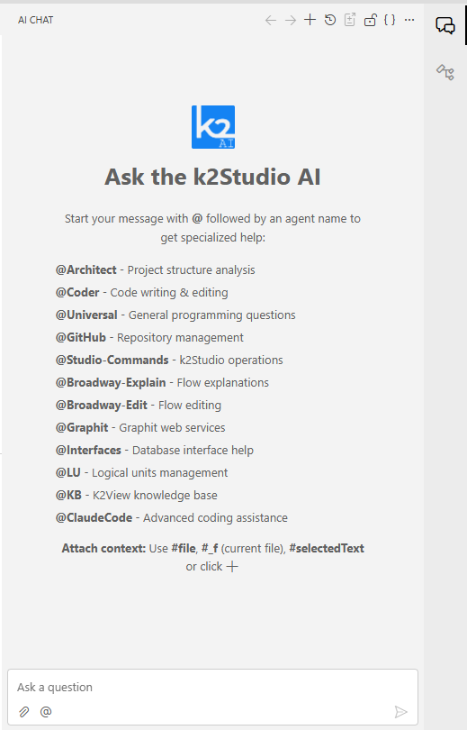
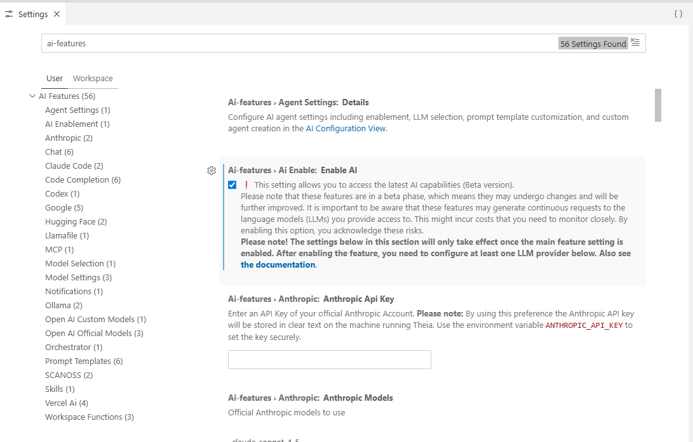

# Getting Started with Studio AI

Studio AI is built into the Web Studio and provides a set of AI-powered agents that can help you design Data Products, write and fix code, explain and edit Broadway flows, query interfaces, and more, all within the context of your open project.

Beyond this, Studio AI also provides infrastructure for managing and improving the AI elements that help you design and build your project: you can view and edit existing agents, create new ones, and manage the skills and tools they use, including built-in tools and MCP tools, which you can provision dynamically.

Studio AI also provides visibility into your AI activity through three dedicated views:

- Chat History - your past conversations (prompts and AI responses), which you can browse and reload into the chat panel.
- AI Agent History - the full content sent to and received from the LLM provider, filterable by agent.
- Token Usage - a breakdown of token consumption, divided into input, output, and cached tokens.

## Base Setup

### Opening the AI Chat

The AI Chat panel is docked on the right side of the Studio. To open it:

- Click the **AI Chat** icon in the far-right panel bar, or
- Use the menu: **View > AI Chat**, or
- Press **Ctrl+Alt+I**.

### The Welcome Screen

When you open AI Chat, what you see depends on whether you have previous sessions:

- **First launch** - The panel shows a setup guide prompting you to enable AI features and configure an LLM provider. 

  
  Follow the steps in [Enabling Studio AI](#enabling-studio-ai) below.
- **After setup**,  The welcome screen shows list of the available product agents, along with chat input at the bottom and an actions toolbar at the top

  

### Enabling Studio AI

If AI features are disabled, you need to enable them and connect at least one LLM provider before the chat becomes active.

Enabling Studio AI can be done either by

1. Clicking on the *the setting menu* deep link, at the AI panel welcome message
2. Using Studio Settings:
   * Open **Settings** via the gear icon at the bottom-left of the Studio, or press **Ctrl+,**.
   * In the left navigation, expand **AI Features** and click **AI Enablement**.

Then: Check the **Enable AI** checkbox.

### Choose and Provision LLM

Once AI is enabled, you need to enter an API key for at least one LLM provider. 

The left navigation lists all supported providers: Anthropic, OpenAI (Official and Custom Models), Google, Codex, Hugging Face, Ollama, Llamafile, and more.

When provisioned, the AI Chat panel will refresh and show the chat interface.

> **Note**: Settings left navigation showing the full list of AI Feature sub-sections including Agent Settings, AI providers and models Settings and more.

## The Agent Model

Studio AI works through **agents**, each one is a specialized AI assistant focused on a specific area of project implementation. To address a specific agent, start your message with `@` followed by the agent name.

After you address an agent once in a session, it becomes **pinned** and you do not need to prefix subsequent messages with `@AgentName`. The agent remains active for the rest of the session unless you switch.

A full description of all available agents is in the [Studio AI Agents Reference](02_studio_ai_agents_reference.md).

## Attaching Context to Your Questions

You can attach files and selections to any message to help the agent give more accurate, targeted answers. The most common context shortcuts are:

- `#_f` — attaches the currently open file.
- `#selectedText` — attaches the text currently highlighted in the editor.
- `#file:path/to/file` — attaches a specific file by path.

For a complete guide to context, including drag-and-drop and the paperclip button, see [Using the AI Chat](03_using_the_ai_chat.md).

## A Recommended Starting Workflow

For many tasks, especially for coding, the most effective approach is to have task plan:

1. Use **@Architect** to describe your goal. The agent will generate a structured implementation plan and present it with an **"Execute with Coder"** button.
2. Review and refine the plan in the chat, then click the button to hand it off to @Coder in a fresh session.
3. @Coder implements the plan autonomously, tracking its progress with a visual task list as it works.

For a full walkthrough of this workflow, see [Plan-First Development with the Architect Agent](05_plan_first_development.md).

## Next Recommended Steps

- Learn about available agent: [Studio AI Agents Reference](02_studio_ai_agents_reference.md)
- Understand all chat features: [Using the AI Chat](03_using_the_ai_chat.md)
- Learn how code changes are proposed and applied: [AI Code Editing: Reviewing and Applying Changes](04_ai_code_editing_and_changesets.md)
- Plan complex features before coding: [Plan-First Development with the Architect Agent](05_plan_first_development.md)
