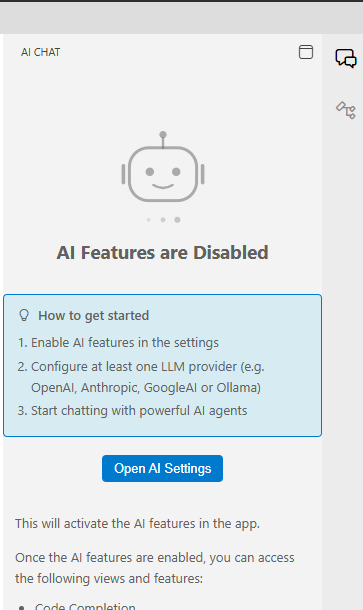
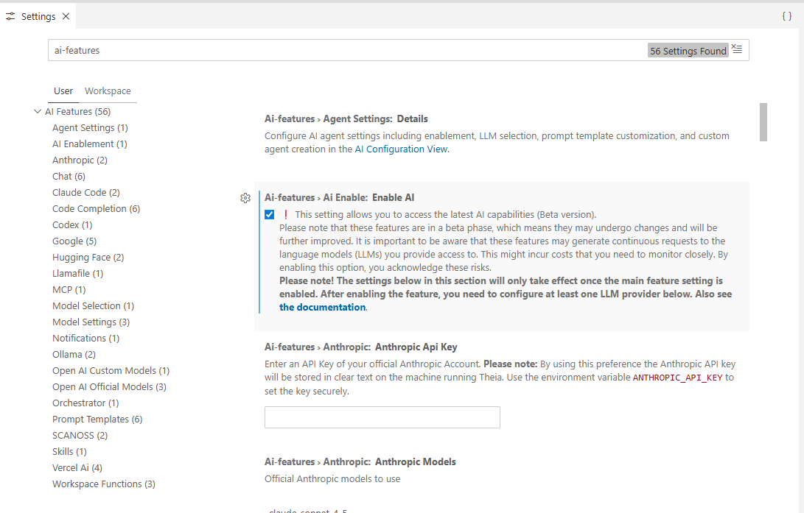

# Getting Started with Studio AI

Studio AI is built into the Web Studio and provides a set of AI-powered agents that can help you design Data Products, write and fix code, explain and edit Broadway flows, query interfaces, and more, all within the context of your open project.

Beyond this, Studio AI also provides infrastructure for managing and improving the AI elements that help you design and build your project: you can view and edit existing agents, create new ones, and manage the skills and tools they use, including built-in tools and MCP tools, which you can provision dynamically.

Studio AI also provides visibility into your AI activity through three dedicated views, aimed both for usability and auditing:

- Chat History - your past conversations (prompts and AI responses), which you can browse and reload into the chat panel.
- AI Agent History - the full content sent to and received from the LLM provider, filterable by agent.
- Token Usage - a breakdown of token consumption, divided into input, output, and cached tokens.

## Opening and Using the AI Chat

The AI Chat panel is docked on the right side of the Studio. To open it:

- Click the **AI Chat** icon in the far-right panel bar, or
- Use the menu: **View > AI Chat**, or
- Press **Ctrl+Alt+I**.

### The Welcome Screen

When you open AI Chat, what you see depends on your setup state:

- **AI disabled / no LLM provisioned** - The panel shows a setup guide prompting you to enable AI features and configure an LLM provider.

  Follow [Enabling Studio AI](#enabling-studio-ai) and [Choose and Provision LLM](#choose-and-provision-llm) below.
- **Ready to use** - The welcome screen reads **"Ask K2assistant"**. It explains that @k2-assistant answers by default, so you can just type your question, and shows how to use `#` (or the paperclip icon) to attach context. A **Get Started with AI** button opens the [AI walkthrough](#the-get-started-with-ai-walkthrough). If you have previous sessions, a **Restored** list of your most recent chats appears for quick resumption. The chat input is at the bottom, with a compact toolbar at the top of the panel.

  *(Screenshot pending refresh for the current UI.)*

## Setup and Onboarding

The setup is built from 3 steps:

1. Enable AI Features in Settings.
2. Provision an LLM provider - either a provider API key, or Fabric itself (see [Using Fabric as the LLM Provider](#using-fabric-as-the-llm-provider)).
3. Install the **Studio AI Core Artifacts** extension (recommended - it adds the Fabric skills).

### The Get Started with AI Walkthrough

From V8.5.2, the Studio **Welcome** page includes a **Get started with AI** walkthrough that takes you through these steps with progress tracking. Open it from the Welcome page, from the **Get Started with AI** button on the AI Chat welcome screen, or with **Help > Open Walkthrough...**. Its steps are:

1. **AI support in K2view Web Studio** - what the AI features do, and a link to this documentation.
2. **Turn on the AI features** - enables AI.
3. **Connect a language model** - enter an API key for a hosted provider (OpenAI, Anthropic, Google), or use **Fabric as a proxy**: install the LLM connector for your provider from the K2 Exchange and define an interface for it in the project. Ollama, llamafile and other OpenAI-compatible endpoints are set up in the **Providers & Models** page of AI Configuration.
4. **Ask your first question** - opens the AI Chat.
5. **Add the Studio AI core skills** - installs the Studio AI Core Artifacts extension in one click. The step is marked done once the extension is installed.
6. **Stay in control of what agents do** - links to the **Tools** page of AI Configuration, where you set which tools need your confirmation. See [Security and Privacy](13_security_and_privacy.md#tool-confirmations) for the Studio defaults.
7. **Go further** - prompts and skills, MCP servers, token usage, and the experimental *AI First* layout.

The Welcome page opens on Studio startup. To stop that, clear the **Show welcome page on startup** checkbox on the Welcome page.

### Enabling Studio AI

If AI features are disabled, you need to enable them and connect at least one LLM provider before the chat becomes active.

Enabling Studio AI can be done either by

1. Clicking the *settings menu* button on the AI panel's welcome message
2. Using Studio Settings:
   * Open **Settings** via the gear icon at the bottom-left of the Studio, or press **Ctrl+,**.
   * In the left navigation, expand **AI Features** and click **AI Enablement**.

Then: Check the **Enable AI** checkbox.

### Choose and Provision LLM

Once AI is enabled, you need to enter an API key for at least one LLM provider.

The left navigation lists all supported providers: Anthropic, OpenAI (Official and Custom Models), Google, Codex, Hugging Face, Ollama, Llamafile, and more. From V8.5.2, you do not maintain a model list for Anthropic, OpenAI or Google: once the API key is set, Studio reads the available models from the provider, and you choose which of them appear in the chat in the **Providers & Models** page of [AI Configuration](06_ai_configuration_and_settings.md#providers-and-models). The Settings left navigation also exposes a much larger set of AI Feature sub-sections beyond enablement and provisioning: chat behavior, server-side compaction, token usage warnings, security-relevant defaults, and more. See [AI Features Settings](15_ai_features_settings.md) for the full map.

When provisioned, the AI Chat panel will refresh and show the chat interface.

### Using Fabric as the LLM Provider

From V8.5.1, Fabric can act as the LLM provider itself. Fabric exposes an OpenAI-compatible endpoint backed by the project's [AI LLM interface](/articles/24_non_DB_interfaces/15_LLM_interface.md), so the provider credentials are held in Fabric rather than by each developer. Users do not enter an API key, and the organization controls which models are reachable through Fabric and who may use them. Fabric as the provider does not prevent a developer from also configuring a provider of their own; see [Security and Privacy](13_security_and_privacy.md#choose-where-data-goes).

Fabric is connected as a custom OpenAI provider. Studio ships a ready model entry for it, which authenticates as the signed-in Fabric user, so no API key is entered in Studio. On the Fabric side, install the LLM connector for your provider from the K2 Exchange and define the AI LLM interface with the provider's API key. See [Fabric as a Provider](16_custom_llm_providers.md#fabric-as-a-provider) for the settings.

### Install the Studio AI Core Artifacts Extension

From V8.5.2, **@k2-assistant** (the default agent) and its worker sub-agent **k2-worker** are built into the Studio. The **Studio AI Core Artifacts** extension on K2 Exchange adds the Fabric **skills** - instructions, references and workflows for the most common Fabric tasks - which the agents load on their own. The chat works without it, but installing it is recommended.

To install it, either use the **Add the Studio AI core skills** step of the [walkthrough](#the-get-started-with-ai-walkthrough), or:

1. Open the **Extensions** view (left activity bar) and search for **Studio AI Core Artifacts** under **K2 Exchange**.
2. Click **Install**.
3. This creates a `.agents/` folder in your workspace, with skills under `.agents/skills/` (each skill is a self-contained folder with a `SKILL.md` entry point).

> The extension provides an **Init Claude Skills** command, which imports the same skills for use with Claude Code instead of (or alongside) the Studio AI.

> Up to V8.5.1, the extension also installed @k2-assistant and k2-worker under `.agents/agents/`. From V8.5.2 the built-in agents are used, and workspace copies of these two agents are ignored.

Once imported, the skills become available immediately - no restart required. See [Studio AI Agents Reference](02_studio_ai_agents_reference.md) for the agent roster and [Skills and Slash Commands](11_skills_and_slash_commands.md) for how skills work.

## Just Start Asking

You do not need to know which agent to use. By default, your message goes to **@k2-assistant**, the Fabric project assistant shown on the AI Chat welcome screen ("Ask K2assistant"). It figures out what you need and handles it: answering directly, loading a relevant skill, or delegating to a specialized agent behind the scenes - all without you having to pick anything.

Just type your question or task and press **Enter**. This is the recommended way to work with Studio AI for the vast majority of tasks.

@k2-assistant works in one of three modes, selected in the chat input: **Ask** (read-only answers), **Plan** (read-only, writes a plan) and **Act** (the default - makes changes). See [Ask, Plan and Act Modes](05_plan_first_development.md).

## Addressing a Specific Agent (Optional)

Studio AI is built from a set of specialized agents behind the scenes, and you can address one directly by starting your message with `@` followed by its name - for example, `@Coder` or `@Architect`. This is useful if you already know exactly which specialist you want, or want to bypass automatic routing.

Once you address an agent, it becomes **pinned** for the rest of the session - you do not need to keep prefixing messages with `@AgentName`. Type a new `@AgentName` at any time to switch.

Direct agent addressing is an advanced/optional feature. If you want to explore it, see the [Studio AI Agents Reference](02_studio_ai_agents_reference.md).

## Attaching Context to Your Questions

You can attach files and selections to any message to help the agent give more accurate, targeted answers. The most common context shortcuts are:

- `#_f` - attaches the currently open file.
- `#selectedText` - attaches the text currently highlighted in the editor.
- `#file:path/to/file` - attaches a specific file by path.

For a complete guide to context, including drag-and-drop and the paperclip button, see [Using the AI Chat](03_using_the_ai_chat.md).

## Next Recommended Steps

- Understand all chat features: [Using the AI Chat](03_using_the_ai_chat.md)
- Learn how @k2-assistant reads, plans and makes changes: [Ask, Plan and Act Modes](05_plan_first_development.md)
- Optional/advanced - address specific agents directly: [Studio AI Agents Reference](02_studio_ai_agents_reference.md)
