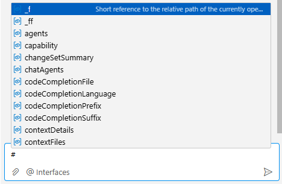
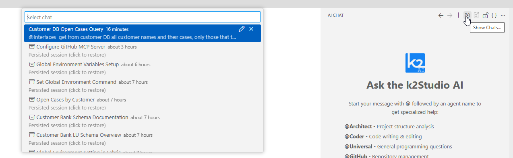

# Using the AI Chat

The AI Chat panel is the primary interface for Studio AI. This article covers all of its features: the toolbar, composing messages, attaching context, chat modes, session history, and more.

## Opening AI Chat

Open the AI Chat panel via **View > AI Chat** or press **Ctrl+Alt+I**. It appears as a panel on the right side of the Studio.

## The AI Chat Toolbar

The toolbar at the top of the AI Chat panel contains the following actions:

<table>
  <thead>
    <tr>
      <th>Icon</th>
      <th>Action</th>
      <th>Description</th>
    </tr>
  </thead>
  <tbody>
    <tr>
      <td style="width:100px;"> </td>
      <td>Navigate</td>
      <td>Navigate between chats</td>
    </tr>
    <tr>
      <td></td>
      <td>New Chat Session</td>
      <td>Starts a fresh conversation, clearing the current context</td>
    </tr>
    <tr>
      <td></td>
      <td>Session History</td>
      <td>Opens the list of previous chat sessions for review and resumption</td>
    </tr>
    <tr>
      <td></td>
      <td>Summarize current session</td>
      <td>Generates a summary of the current chat session and save it into a prompt md file. Once done the icon becomes to a copy/open summary and the summary file is opened. Prompts are saved at ".prompts" folder at the project tree, which let you also share it via GIT.</td>
    </tr>
    <tr>
      <td></td>
      <td>Turn Auto scrolling on and off</td>
      <td>Toggles automatic scrolling as new messages arrive. If turned On (default), then when a new message arrives or an AI response streams in, the screen automatically shifts downward to keep the newest text in view. If turned Off, then the scroll position remains exactly where you left it. If new messages arrive while you are reading something older, they will load "off-screen" below your current view without snapping you downward.</td>
    </tr>
    <tr>
      <td><strong>{ }</strong></td>
      <td>JSON View</td>
      <td>Shows the raw JSON of the current conversation</td>
    </tr>
    <tr>
      <td><strong>…</strong></td>
      <td>More Options</td>
      <td>Additional actions</td>
    </tr>
  </tbody>
</table>

## Composing Messages

Type your question or instruction in the **"Ask a question"** input at the bottom of the panel. Press **Enter** to send, or press **↑** to recall a previous message from history.

To address a specific agent, start your message with `@AgentName`. Once an agent is addressed, it is **pinned** for the rest of the session — subsequent messages automatically go to the same agent without the `@` prefix. To switch agents, type a new `@AgentName`.

## Attaching Context

The quality of AI responses depends heavily on the context you provide. You can attach relevant files and selections in several ways.

### Using Context Variables (Recommended)

The AI Chat input field showing the # autocomplete popup with context variable options.

Type `#` in the chat input to see a list of all available context variables. The most commonly used are:

<table>
  <thead>
    <tr>
      <th>Variable</th>
      <th>Shortcut</th>
      <th>Description</th>
    </tr>
  </thead>
  <tbody>
    <tr>
      <td><code>#file:path/to/file</code></td>
      <td><code>#filename</code></td>
      <td>Attaches a specific file. After typing <code>#file:</code>, autocomplete suggestions appear based on recently opened files.</td>
    </tr>
    <tr>
      <td><code>#currentRelativeFilePath</code></td>
      <td><code>#_f</code></td>
      <td>Attaches the file currently open in the editor</td>
    </tr>
    <tr>
      <td><code>#currentRelativeDirPath</code></td>
      <td>—</td>
      <td>Attaches the directory of the currently open file</td>
    </tr>
    <tr>
      <td><code>#selectedText</code></td>
      <td>—</td>
      <td>Attaches the text currently highlighted in the editor</td>
    </tr>
  </tbody>
</table>

Using context variables inside your prompt lets you also describe *why* a file is relevant.
All files added via variables appear in the context overview below the chat input field.

### Drag and Drop / Browse-to-add

You can also drag files from the File Explorer directly into the chat input, or click the paperclip button at the bottom-left of the input area to browse and attach files. You can then type the file name among the project files.

This method does not let you annotate why the file is relevant, but is convenient for quick attachments.

### Image Support

You can attach images to your messages. Use the context variable `#imageContext` or drag an image file into the chat input. Images pasted inline are displayed as thumbnails at their insertion point; images attached via the paperclip button are grouped below the message text. This is useful for sharing diagrams, schema screenshots, or UI mockups with the agent.

## Chat Modes

@Coder supports two operating modes that you can switch between using the **mode selector dropdown** in the chat input area.

* Edit Mode (default) - The agent proposes changes and presents them as diffs for you to review before anything is applied. This is the recommended mode for targeted, carefully reviewed modifications.

* Agent Mode - The agent operates autonomously: it reads files, writes changes, runs tests, and iterates until the task is complete, without requiring your approval at each step. While working, it displays a **visual task list** in the chat so you can follow its progress through multi-step implementations. Use this for larger tasks. See [AI Code Editing: Reviewing and Applying Changes](04_ai_code_editing_and_changesets.md) for details.

## Agent Pinning

When you address an agent with `@AgentName`, it is pinned for the ongoing session. This means you only need to type the agent name once — all subsequent messages in that session go to the same agent automatically. To switch to a different agent, simply type `@NewAgentName`.

## Editing Sent Messages

You can edit a previously sent message in the chat. Click the edit icon next to any previous message, make your changes, and resend.

When you edit and resend a message this way, Studio AI **automatically branches the conversation** into a new session, preserving the original thread exactly as it was. This makes it easy to explore alternative approaches — for example, trying a different prompt phrasing or changing a requirement — without losing your current work. The original session remains accessible in Session History.

## Starting Chat from the Editor

You can initiate a chat message directly from the editor. Right-click on selected code or a file and choose **Ask AI** (or similar) from the context menu. This pre-populates the chat input with the selected content as context, saving you the manual step of adding `#selectedText`.

## Chat Session History

Every conversation is automatically saved and accessible via the **Session History** icon () in the toolbar. Clicking it opens a dialog listing all your saved sessions — both active and archived — which you can review, resume, or delete.

Key details about session history:

- Up to **25 sessions** are stored. When the limit is reached, the oldest session is automatically removed to make room for a new one.
- Sessions with responses that arrived while you were viewing a different session are marked with a **badge** so you can spot new activity at a glance.
- You can **manually delete** sessions from the history dialog if you no longer need them.
- The welcome screen shows your **most recent sessions** as clickable cards for quick resumption.

For more on AI history and token monitoring, see [Viewing Token Consumption and AI History](08_token_consumption_and_ai_history.md).

## Agent Completion Notifications

When an agent finishes a task, particularly when running in Agent Mode in the background, a notification appears in the Studio. The notification includes the agent name, the session it completed, and a **"Show Chat"** button that takes you directly to that session to review the result.

You can configure whether each agent sends completion notifications from the [AI Configuration](06_ai_configuration_and_settings.md) view.
