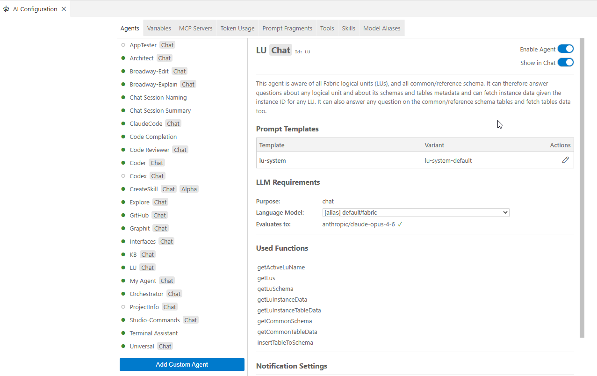

# AI Configuration: Managing Agents and Settings

The AI Configuration panel is the central place to manage every aspect of Studio AI: which agents are active, which language models they use, prompt customizations, token usage, MCP server connections, and more. This article covers the panel's layout and each of its tabs.

## Opening AI Configuration

Click the **AI Configuration** icon at the far right of the AI Chat panel bar (the second icon from the right). The panel opens alongside the chat, replacing the chat view with the configuration interface.

You can also access it via **View > AI Configuration** from the menu bar.

## Panel Overview

The AI Configuration panel is organized into seven tabs along the top:

<table>   <thead>     <tr>       <th>Tab</th>       <th>Purpose</th>     </tr>   </thead>   <tbody>     <tr>       <td><strong>Agents</strong></td>       <td>Enable or disable agents, assign language models, configure notifications</td>     </tr>     <tr>       <td><strong>Variables</strong></td>       <td>View and set global context variables available to all agents</td>     </tr>     <tr>       <td><strong>MCP Servers</strong></td>       <td>Add, edit, and remove Model Context Protocol server connections</td>     </tr>     <tr>       <td><strong>Token Usage</strong></td>       <td>Monitor cumulative token consumption by model</td>     </tr>     <tr>       <td><strong>Prompt Fragments</strong></td>       <td>Manage reusable prompt snippet files</td>     </tr>     <tr>       <td><strong>Tools</strong></td>       <td>View and manage the tools (functions) available to agents</td>     </tr>     <tr>       <td><strong>Model Aliases</strong></td>       <td>Define named LLM aliases and priority lists used across agents</td>     </tr>   </tbody> </table>

## Agents Tab

The **Agents** tab lists every agent available in Studio AI. For each agent you can:

- **Enable or disable** the agent using the toggle. A disabled agent does not appear in the chat and cannot be addressed.
- **Set the language model**: choose which model (or model alias) the agent uses by default. If your organization has configured multiple LLMs, you can assign different models to different agents. For example, a faster model for @Universal and a more capable model for @Coder.
- **Configure completion notifications**: toggle whether the agent sends a notification when it completes a task. This is particularly useful for long-running Agent Mode sessions.

Changes to agent settings take effect immediately and no restart required.

## Variables Tab

The **Variables** tab shows all context variables that are available in the chat via the `#` prefix. This includes both built-in variables (such as `#currentRelativeFilePath`) and any custom variables your organization has defined.

For custom variables, you can set or update their values here. Variables defined in this panel are injected into agent prompts automatically when referenced.

## MCP Servers Tab

The **MCP Servers** tab lets you manage connections to external tools and data sources through the Model Context Protocol. Studio AI supports both local stdio-based and remote HTTP/SSE MCP servers.

To add a new server, click **Add MCP Server** and fill in the connection details:

- **Name** - a display name for the server
- **Type** - `stdio` for a local process or `HTTP/SSE` for a remote endpoint
- **Command / URL** - the command to run (stdio) or the endpoint URL (HTTP/SSE)
- **Arguments and environment variables** - any additional parameters the server requires

Once connected, the tools provided by the MCP server become available to agents automatically. You can edit or remove any server using the action buttons in the list.

For full details, see [MCP Servers](12_mcp_servers.md).

## Token Usage Tab

The **Token Usage** tab shows a summary table of all LLM usage accumulated in the current Studio session, broken down by model:

<table>   <thead>     <tr>       <th>Column</th>       <th>Description</th>     </tr>   </thead>   <tbody>     <tr>       <td><strong>Model</strong></td>       <td>The LLM that handled the requests</td>     </tr>     <tr>       <td><strong>Input Tokens</strong></td>       <td>Total tokens sent to the model (prompts, context, files)</td>     </tr>     <tr>       <td><strong>Output Tokens</strong></td>       <td>Total tokens generated by the model (responses)</td>     </tr>     <tr>       <td><strong>Total Tokens</strong></td>       <td>Combined input + output</td>     </tr>     <tr>       <td><strong>Last Used</strong></td>       <td>Timestamp of the most recent request to this model</td>     </tr>   </tbody> </table>

Use this table to understand which models are consuming the most tokens, and to spot unexpectedly large requests (for example, attaching very large files as context).

For the full history of individual requests and responses, use the **AI Agent History** panel — see [AI History and Token Usage](08_token_consumption_and_ai_history.md).

## Prompt Fragments Tab

The **Prompt Fragments** tab lists reusable prompt snippet files (`.prompttemplate` files) that can be referenced across multiple agent prompt templates. Creating a fragment here makes it available to any agent prompt that imports it.

For details on writing and using prompt fragments, see [Customizing Agent Prompts](07_ai_configuration_and_prompts.md).

## Tools Tab

The **Tools** tab shows all the function tools registered with Studio AI — these are the capabilities agents can call during a conversation, such as reading files, running commands, or querying the project structure. You can review which tools are active and, where applicable, enable or disable individual tools.

## Model Aliases Tab

The **Model Aliases** tab is where you define the named LLM identifiers that agents use. Instead of hardcoding a specific model name in every agent configuration, agents reference an alias such as `default/code` or `default/universal`, and this tab defines what model (or ordered list of models) each alias maps to.

Each alias entry contains:

- **Alias name** - the identifier referenced in agent configurations (e.g., `default/code`)
- **Priority list** - an ordered list of LLM provider/model pairs. Studio AI uses the first available model in the list; if it is unavailable, it falls through to the next

**Default aliases in Studio AI:**

<table>   <thead>     <tr>       <th>Alias</th>       <th>Typical use</th>     </tr>   </thead>   <tbody>     <tr>       <td><code>default/code</code></td>       <td>@Coder, @ClaudeCode, and other code-focused agents</td>     </tr>     <tr>       <td><code>default/universal</code></td>       <td>@Universal and general question-answering agents</td>     </tr>     <tr>       <td><code>default/fabric</code></td>       <td>K2View-specific agents (e.g., @LU, @Interfaces, @Broadway-Edit)</td>     </tr>     <tr>       <td><code>default/summarize</code></td>       <td>Session naming, summary, and background agents</td>     </tr>     <tr>       <td><code>default/code-completion</code></td>       <td>Inline code completion</td>     </tr>   </tbody> </table>

To change which model backs an alias, edit the priority list. This is the recommended way to swap LLM providers across all agents at once without updating each agent individually.
