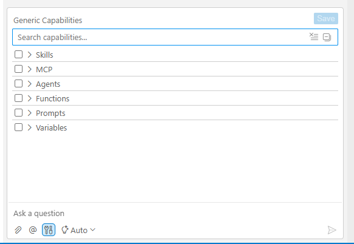

# Agent Capabilities

Agent capabilities are optional extensions that expand what an agent can do during a conversation. They are designed to be opt-in: by default, agents operate in a focused mode without extended permissions, and you activate capabilities only when a specific task calls for them.

## Capabilities Overview

A **capability** is a bundle of additional tools and permissions that an agent can use when the user enables it. Capabilities allow agents to do things they cannot do by default, such as running shell commands or interacting with GitHub.

This design keeps agents predictable and contained in everyday use, while still giving you access to more powerful behaviors when you need them.

## Capability Chips in the Chat Input

Agents that advertise optional capabilities show compact toggle **chips** directly in the chat input area. Each chip represents a named capability that is **off by default** - click the chip to enable it for your next request, click again to disable. When any capability is on, a small blue dot appears on the tools icon in the chat toolbar so you can see at a glance that a capability is active.

@Coder advertises three chips in Agent Mode:

- **Shell Execution** - grants @Coder access to the `shellExecute` tool, allowing it to run shell commands on the host (the Fabric Dev server). The agent still prefers workspace tasks and dedicated file tools and falls back to shell execution only when no better option exists.
- **GitHub** - lets @Coder delegate to the @GitHub agent during a task, so it can read issues, create pull requests, query repositories, and perform other Git operations as part of the implementation workflow.
- **AppTester** - delegates to the AppTester agent after an implementation step to run UI verification, forming an implement-and-test loop without extra prompting.

Other agents (including custom and plugin-provided agents) can declare their own chips - see [Declaring Capabilities in an Agent Prompt](#declaring-capabilities-in-an-agent-prompt) below.

## The Generic Capabilities Panel

Beyond the chat-input chips, Studio AI provides a **Generic Capabilities Panel** for fine-grained control over everything an agent can call into. The panel exposes not only the capability bundles surfaced as chips, but also individual skills, MCP server tools (grouped by server), built-in tool functions (grouped by provider), prompt fragments, agent delegation targets, and variables.

To open the panel:

- Click the **tools icon** in the chat toolbar, or
- Press **Ctrl+Shift+.** (or **Cmd+Shift+.** on Mac), or
- Use the command palette: **F1 > Open Capabilities Panel**.

The panel displays a searchable tree. Each entry shows its name, description, and current status; you can enable or disable individual items from here. MCP tools appear and disappear live as MCP servers connect or stop.



Use this panel when:

- You want to see everything that is available, not just the chips visible for the current agent
- You need to enable a capability for an agent that does not surface it as a chip
- You want to disable a tool or skill you previously enabled
- You want to make a selection persistent (see below)

## Capability Persistence

Toggle chips and Generic Capabilities Panel selections are **per session**. When you start a new chat session, all capabilities reset to their defaults (off) so that permissions do not silently carry over from one task to the next.

Within the current session, once a capability is enabled it stays on for all subsequent messages until you explicitly disable it.

If you want a selection to survive across sessions, use the **save** icon in the Generic Capabilities Panel - it writes your current selection to your settings file so the same capabilities are pre-enabled on the next session.

## Declaring Capabilities in an Agent Prompt

A capability becomes a **chip on an agent** when the agent's prompt template declares it. The declaration uses the syntax:

```
{{capability:<capability-name> default off}}
```

For example, the @Broadway-Flow-Builder agent in the Fabric Project AI Plugin declares `{{capability:shell-execution default off}}` so that a Shell Execution chip appears in the chat input when that agent is pinned.

You can add the same line to a custom agent's prompt template (see [Creating Custom Agents](09_creating_custom_agents.md) and [Agents Prompt Customization](07_ai_configuration_and_prompts.md)) to expose any registered capability as an opt-in chip. The `default off` clause is important: it ensures the capability remains opt-in even after the prompt is edited.
