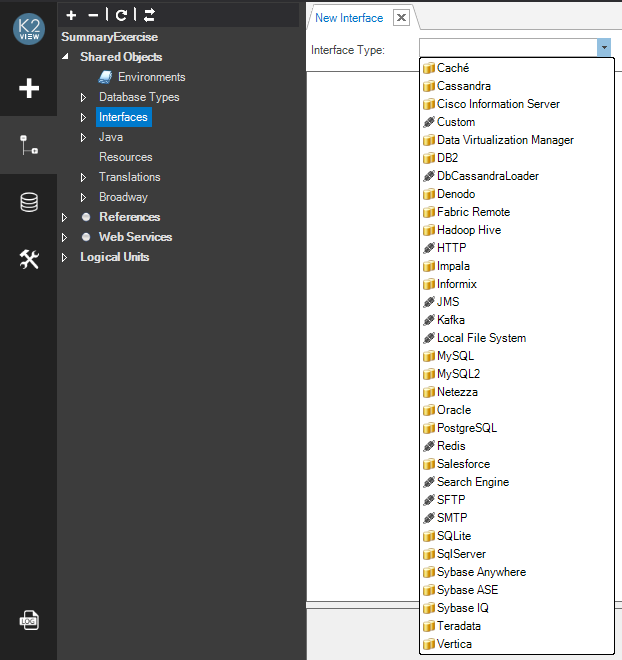
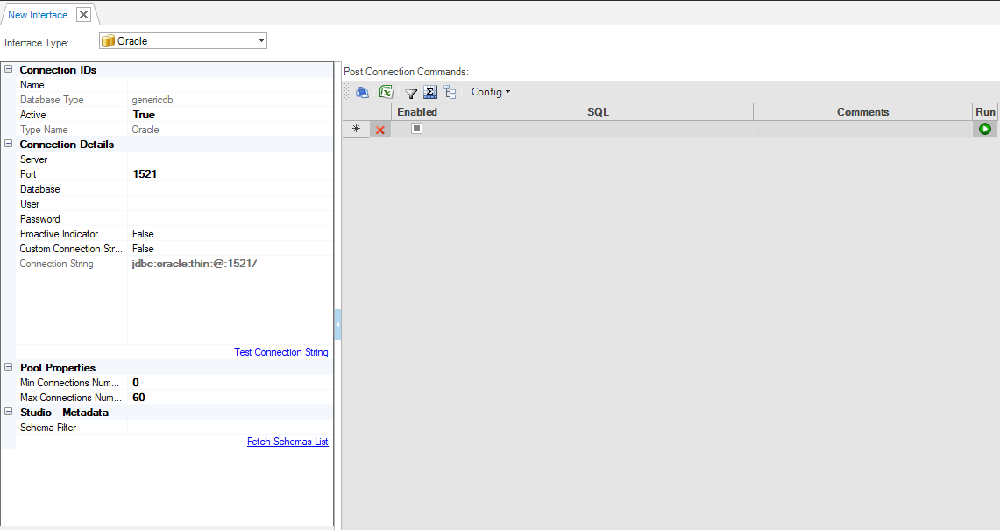
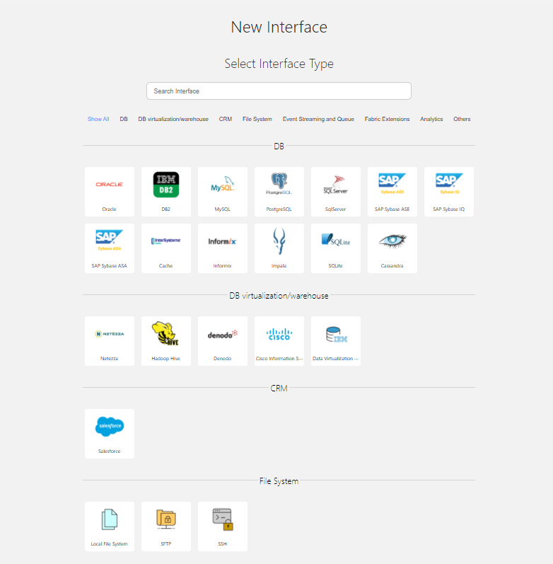
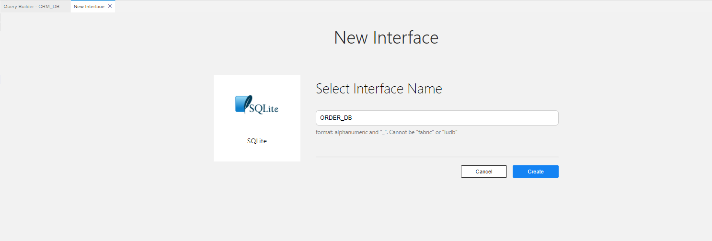
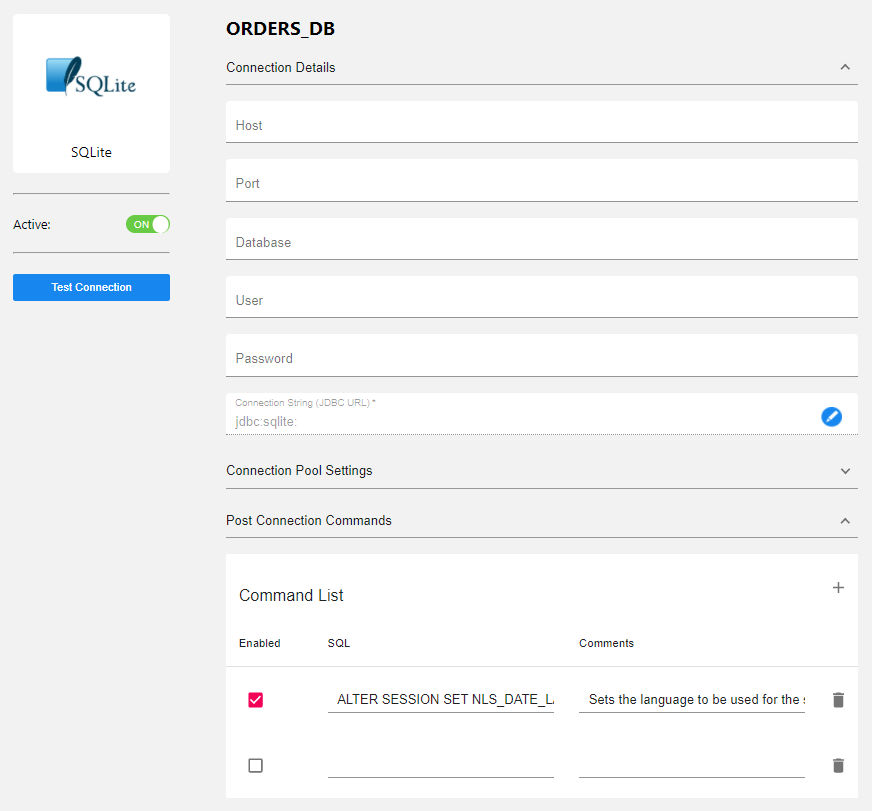
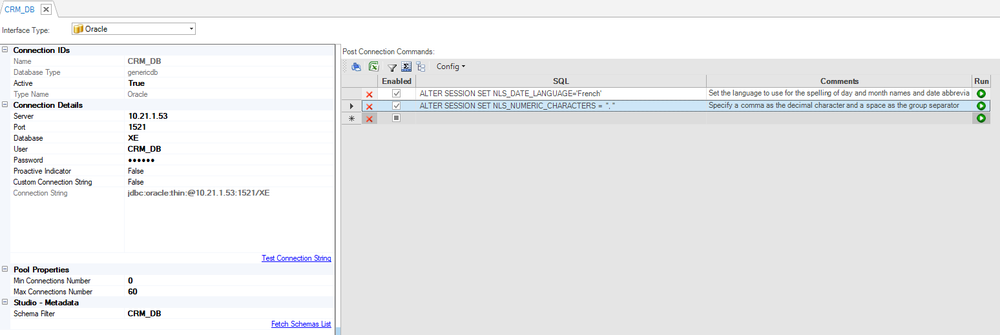

# Creating a New Database Interface

### How Do I Create a Database Interface?

<!--studio
1. Go to **Project Tree** > **Shared Objects**, right click **Interfaces** and select **New Interface**.\


The following screenshot displays a list of available Interface Types.
     *  = DB interfaces. 
     *  = Non-DB interfaces.



2. Click **Interface Type** and select the **Type** value to open the **DB Interface** window. The **DB Interface** window displays the Connection IDs and Connection Details to be populated. 



3. Populate the **DB Connection Name** and set **Active** to **True**.

4. Populate the [**Connection Details**](/articles/05_DB_interfaces/03_DB_interfaces_overview.md#database-connection-settings).

    * For DB Interface types other than Oracle, PostgreSQL or SQL Server, go to the project's **Lib directory** in Windows at:
    **[Fabric Project's Directory]\\[Project Name]\lib** and add a **JDBC driver jar** of this DB type there.   
    
    * To check if the connection settings are correct, click the **Test Connection String**:
       * If the connection is OK, the **Connection is OK** notification is displayed on the bottom of the window.
       * If the connection fails, a description of the problem is displayed on the bottom of the window. 
    
5. Optional: Edit the **Pool Properties**.

6. Optional: Set the [**Post Connection Commands**](/articles/05_DB_interfaces/04_creating_a_new_database_interface.md#post-connection-commands) to define multi commands to be executed post JDBC interface connection on the DB Interface.

7. Click **Save**.
-->


1. Go to **Project Tree** > **Shared Objects**, right click **Interfaces** and select **New Interface**.\


The following screenshots display a list of available Interface Types.



2. Click **Interface Type** and select the **Type** value to open the **DB Interface** window. The **DB Interface** window displays the Connection IDs and Connection Details to be populated. 



3. Populate the **DB Connection Name** and set **Active** to **True**.

4. Populate the [**Connection Details**](/articles/05_DB_interfaces/03_DB_interfaces_overview.md#database-connection-settings).

    * For DB Interface types other than Oracle, PostgreSQL or SQL Server, go to the project's **Lib directory** in Windows at:
    **[Fabric Project's Directory]\\[Project Name]\lib** and add a **JDBC driver jar** of this DB type there.   
    
    * To check if the connection settings are correct, click the **Test Connection String**:
       * If the connection is OK, the **Connection is OK** notification is displayed on the bottom of the window.
       * If the connection fails, a description of the problem is displayed on the bottom of the window. 



    
5. Optional: Edit the **Pool Properties**.

6. Optional: Set the [**Post Connection Commands**](/articles/05_DB_interfaces/04_creating_a_new_database_interface.md#post-connection-commands) to define multi commands to be executed post JDBC interface connection on the DB Interface.

7. Click **Save**.


Note that if required, a new database type can be defined or an existing database type can be overwritten as a part of a product package.

[Click for more information about the Database Types](/articles/05_DB_interfaces/10_database_types.md).

### DB Interface Window

The DB Interface window enables you to define DB interfaces for your project. By default, new DB interfaces are created in the generic DB interface format. 


#### Generic Interface Definition
<!--studio


Interfaces created using previous Fabric versions remain as is and can be converted to the generic interface.


#### Previous Fabric Version Interface Definition

The following screenshot displays an interface configuration in an older format which uses ADO.NET/ODBC drivers.


#### When are Interfaces Created in an Older Format in the Current Fabric Version?

In the current Fabric version, if the project already has at least one interface created in the older format, Fabric preserves this interface format. All new interfaces of the same type are also created in the same format (ADO.NET/ODBC drivers) by default.

From Fabric 6.5.2 and on, all new interfaces will be created with the new format.

An additional reason for an interface to be created in a legacy format in the current Fabric version is the definition of a DB type in the Fabric Studio Config file. The **k2FabricStudio.exe.config** marks a specific DB type as **Legacy** whereby all new interfaces of this type are created using ADO.NET/ODBC drivers.  

The **k2FabricStudio.exe.config** setting is created as follows and can be manually edited by the user at any time:

 ```<add key="UseFabricLegacyAdoDatabaseTypesForNewInterfaces" value="Cassandra"/>``` 


In this setting, value = a list of DB types to be created in an old format, separated by a comma.

Note that it is **recommended** that you convert the existing interface into a generic format to avoid the need for ADO.NET/ODBC drivers. To do so, click the **Convert to Generic DB Interface** link.

New generic interfaces cannot be converted to older interface formats based on ADO.NET/ODBC drivers. 
-->
#### Post Connection Commands
The **Post Connection Commands** tab of the DB Interface window enables definition of multiple init commands to be executed post JDBC connection and before running SQL statements on the DB Interface. See the example below:
<!--studio

-->


[](03_DB_interfaces_overview.md)[](05_adding_a_fabric_remote_interface_type.md)
