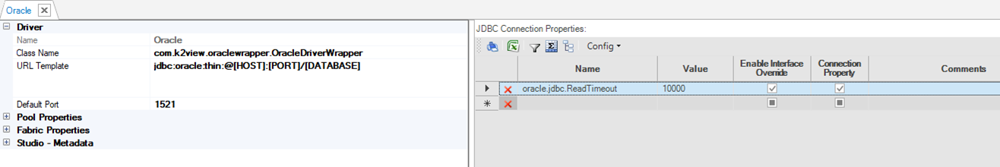
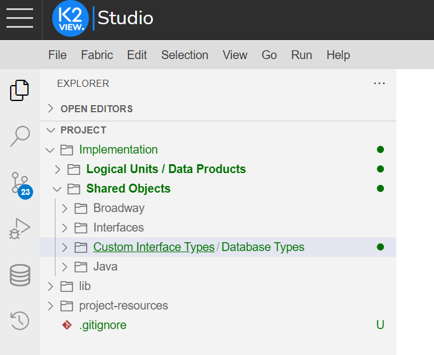
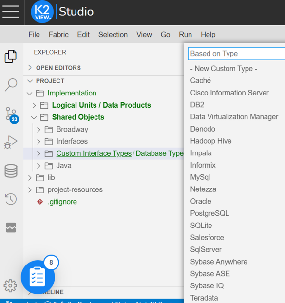
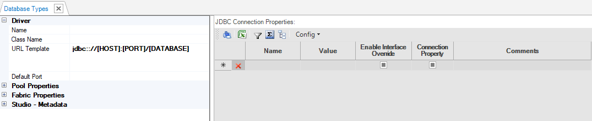
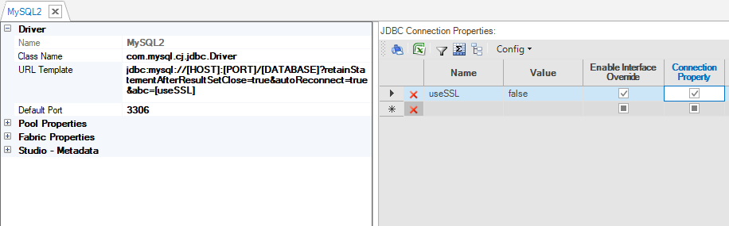
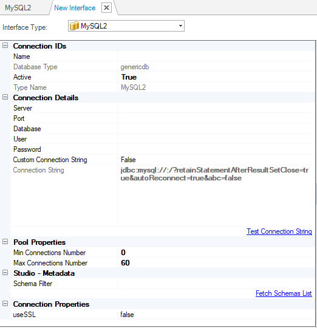

# Custom Interface Types / Database Types 

### Overview

Fabric supports creating a new custom interface type based on a JDBC driver's specifications or overriding existing database types without the need for product enhancement. 

Once saved, the database type appears in the Interface type dropdown list and can be selected when [creating a new Interface](/articles/05_DB_interfaces/04_creating_a_new_database_interface.md).

### How Do I Create a New Custom Interface Type/Database Type, from the start or based on a template ?

A new database type can be created from a template to customize a built-in database type or when a new database type is very similar to an existing type. 

When creating a database type from a template based on an existing database type (e.g. Oracle), make sure to save it according to your needs: either with the same name (Oracle) in order to override default configurations, or with a different name which will be handled as a new database type, along side the original.

To create a new custom interface type/database type _based on a template_, do the following:
<studio>

1. Go to Project Tree > Shared Objects, right-click Database Types and select New Database Type From Template and then select the DB type, for example Oracle.

2. Edit the required properties. For example, add the following connection property for Oracle:

   ```
   oracle.jdbc.ReadTimeout=10000
   ```

   

3. **Save** the database type.

</studio>

<web>
1. Go to **Project Tree** > **Implementation** > **Shared Objects** > **Custom Interface Types/Database Types**.

   - Right-click on the folder icon (left), next to **Custom Interface Types/Database Types**.

     

   - Choose/click on **New Custom DB Interface Type** in the opened context menu.

   - Choose the **Custom type** from the available list. Press **Enter** to confirm or **Escape** to cancel.

     

2. Name the new custom interface.
3. Edit the required properties. For example, add the following connection property for Oracle:

   ```
   oracle.jdbc.ReadTimeout=10000
   ```
4. **Save** the custom interface type.   
</web>

To create a new custom interface type/database type _from start_, do the following:


<studio>

1. Go to Project Tree > Shared Objects, right-click Database Types and select New Database Type.

   

2. Populate the **Driver's Settings**: 

   * **Name**, a unique Database type name.

   * **Class Name**, **URL Template** and **Default Port** (optional). Settings from the JDBC driver.

</studio>

<web>

1. Go to Project Tree > Implementation > Shared Objects > Custom Interface Types/Database Types.

   - Right-click on the folder icon (left), next to **Custom Interface Types/Database Types**.

   - Click on **New Custom DB Interface Type** in the opened context menu.

   - Choose **New Custom Type** option. Press **Enter** to confirm or **Escape** to cancel.

   - Name the **new custom type**. Note that the field is prepopulated with *Type name*, which you should change.

</web>


3. Optional: Edit the **Pool Properties** and **Fabric Properties** fields. 

   * Note that the Pool Properties and Fabric Properties should be modified only by advanced users. During an initial setup, use the default values.

4. Optional: Populate the **Studio – Metadata** settings (to be used by Fabric Studio only):
   * **SQL Query for Tables List** and **SQL Query for Column List**, with SQL queries to retrieve the lists of tables and columns from the schema.
   * **SQL Query for FKs List** and **SQL Query for PKs List**, with SQL queries to retrieve the list of foreign keys (FK) and primary keys (PK) of the tables. These keys can be used by the [Auto Discovery Wizard](/articles/03_logical_units/06_auto_discovery_wizard.md) when creating a new [Logical Unit](/articles/03_logical_units/01_LU_overview.md). 
   * Note that if the JDBC driver does not enable access to metadata and the above settings have not been populated, you can still work with this DB and run queries on it. However the Fabric Studio's Auto Discovery Wizard, DB Query and [Query Builder](/articles/11_query_builder/02_query_builder_window.md) schemas will not work above it. The implementor must write the Root functions and all SQL queries manually. 
   * Populating the above queries can be also done to customize the list of tables or columns to be returned by the schema. For example, when the schema includes many tables and only a small subset of tables is required.
   * Set **Query Builder: Identifiers Case Sensitivity** as either:
      * Insensitive (default).
      * SensitiveUpperCase.
      * SensitiveLowerCase.
5. Set **JDBC Connection Properties** as follows:
   * A **Name** and a **Value** for parameters to be used as a part of JDBC connection properties.
   * When setting the **Enable Interface Override**, the parameters are displayed under the Connection Properties section of the [Interface window](03_DB_interfaces_overview.md), parameter values can be updated. 
   * When setting the **Connection Property**, the connection properties map is sent to the JDBC driver.
6. **Save** the customer interface type/database type.


<studio>

#### Example of JDBC Connection Properties Definition

- Create a new **MySQL2** Database type that includes the **useSSL** JDBC Connection Property and add it to the URL Template as shown below:

~~~
&abc=[useSSL]
~~~



- Create a new Interface using the **MySQL2** Database type. Note that **useSSL** JDBC Connection Property is added to the [Interface window](03_DB_interfaces_overview.md) under Connection Properties section and the following is added to the Connection String:

~~~
abc=false
~~~



* If needed, update the value of **useSSL** property. When updated, it is also reflected in the Connection String.

</studio>


### JDBC Drivers Management

When introducing a new database type, the JDBC driver is saved under:

**[Fabric Project's Directory]/[Project Name]/lib/[new database type]**.

Each database type is kept in a separate folder in order to avoid overlapping or conflicts with other drivers (dynamically loaded). <web>When creating a new custom interface type, such folder is automtically created, so that you just need to drop there the driver files.</web>

Note that the JDBC drivers are not a part of the [Fabric Deployment](/articles/01_fabric_overview/02_fabric_glossary.md#deployment) and must be copied to the Fabric server to the following folder prior to running the Linux server:

~~~
/home/k2view/ExternalJars/
~~~


[](09_fabric_API_for_DB_interfaces.md)


