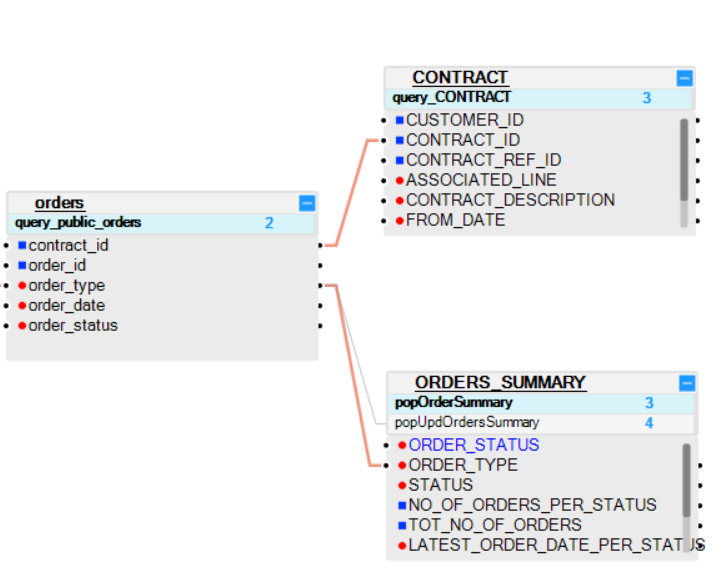

# Table Indexes

## What Is an LU Table Index?  
An index can be created for an LU table in order to improve performance when querying / updating LU tables in memory during the Sync process. Indexes are created on a table level and can be built for either one field or many fields. Each LU table can have several indexes, where each index can contain several columns.

## When Do I Create an Index?
When querying LU tables, indexes should be considered for fields used in WHERE clauses.
Indexes should always be built in the same order as in the conditions of the WHERE clause of the query. This also applies when using actions like Group By or Distinct that must be applied on indexed fields as displayed in Example 1.
When an LU table is invoked as a Lookup table, create an index for the lookup input links that are used in the WHERE statement.
It is recommended to create an index on the fields of a [parent LU table](/articles/03_logical_units/12_LU_hierarchy_and_linking_table_population.md) that are used as a key to a child table within the LU Schema, as displayed in Example 2.

**Example 1**
The USAGE table contains 100K records per customer. The SELECT SQL statement is:

<pre><code>SELECT sum (CALLS) from USAGE where TYPE = ‘I’ and PRIORITY = ‘High’
</code></pre>

To improve the performance of this statement, a combined index should be created for the TYPE and PRIORITY columns, where TYPE is the 1st column in the index and PRIORITY is the 2nd.

**Example 2**
The ORDERS table is a parent table of the CONTRACT and ORDERS_SUMMARY tables: 
*	The CONTRACT table is linked to the ORDERS table via the CONTRACT_ID field.
*	The ORDERS_SUMMARY table is linked to the ORDERS table via the ORDER_TYPE field. 
It is therefore recommended to create 2 indexes for the ORDERS table:
*	one for the CONTRACT_ID field, and
*	one for the ORDER_TYPE field.

<studio>

## Index Definition 
LU table indexes are defined in the **Indexes Tab** in the **Table window**, where they can also be added, modified or removed from a table. The following Index settings can be defined:  

<table>
<tbody>
<tr>
<td width="200pxl">

<strong>Index ID</strong>

</td>
<td width="700pxl">

(Read only). Index identifier in the current table. &nbsp;

</td>
</tr>
<tr>
<td width="122">

<strong>PK</strong>

</td>
<td width="464">

Defines whether the current index is a primary key. Check to set or unset this definition.

</td>
</tr>
<tr>
<td width="122">

<strong>Unique</strong>

</td>
<td width="464">

Defines whether the current index is unique. Check to set or unset this definition.

</td>
</tr>
<tr>
<td width="122">

<strong>Columns</strong>

</td>
<td width="464">

(Read only). A list of LU table columns that define the current index. &nbsp;

</td>
</tr>
</tbody>
</table>

## How Do I Add an Index? 
1.	Go to **Project Tree** > **Logical Units** > [**LU Name**] > **Tables** > double-click [**Table Name**] to open the table’s settings. 
2.	In the **Columns** tab, right-click one field or more fields and select **Create Index from Selected Columns**. 
3.	Click the **Indexes** tab to display a list of indexes. 
4.	Check / uncheck **PK** and **Unique** to complete the index definition.
5.	**Save** the table. 

## How Do I Delete an Index?  
1.	Go to **Project Tree** > **Logical Units** > [**LU Name**] > **Tables** > double click [**Table Name**] to open the table’s settings. 
2.	In the **Indexes** tab, click **Delete** to delete the index.

</studio>

<web>

## Index Definition 

1. Select the LU table by either 
   - Go to **Project Tree** > **Logical Units** > [**LU Name**] > **Tables** > double-click [**Table Name**] to open the table
   - Go to **Project Tree** > **Logical Units** > [**LU Name**] > **Schema** > select the relevant table 
2. Reveal the table's properties side panel by clicking the  icon in the upper-right corner of the window (it might be already opened)
3. Expand the Indexes tab, where you can see the already defined indexes.
4. Click the "+" to add indexes 
   - The index is automatically gets an index ID.
   - You can choose whether it will be a unique index.
   - Select the table's fields to be part of the index.
5. You can delete an index by clicking on the trash icon aside its ID.

</web>

## How Do I Get a List of Indexes? 

The **DESCRIBE** command is one of Fabric view commands and it is used to query the Fabric metadata structure on a deployed project in the Fabric console. For example, before performing a SELECT SQL query in the Web Service to get the list of indexes.
To get the list of indexes for a specified table, use one of the following commands.

**Syntax:**

- Get all system indexes: `DESCRIBE INDEX;` 

- Get all indexes of the schema of an LU: `DESCRIBE INDEX LU-Name;`. For example: to get all indexes of the schema of LU Customer: `DESCRIBE INDEX Customer;`.

- Get the indexes of a specific table within the LU name: `DESCRIBE INDEX LU-Name.Table-Name`. For example:

  - Get the indexes of a specific table within the Customer LU: `DESCRIBE INDEX Customer.address_billing; `
  -  Get the indexes of all tables starting with address:`DESCRIBE INDEX Customer.address%;`

  

[Click for more information about The Fabric View commands](/articles/02_fabric_architecture/04_fabric_commands.md#fabric-view).

