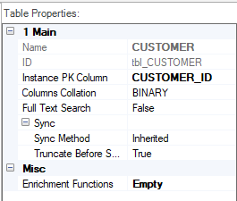

# LU Table Properties

The Table Properties tab is displayed in the right pane of the Table's window.

The Properties tab displays a list of properties that must be defined for each LU table, as follows:

<table width="900pxl">
<tbody>
<tr>
<td width="200pxl">

<strong>Main</strong>

</td>
<td width="700pxl">

Non-editable fields:

<ul>
<li>Name - LU table name.</li>
<li>ID - generated by Fabric.</li>
</ul>
</td>
</tr>
<tr>
<td width="200pxl">

<h4>Instance ID Column</h4>

</td>
<td width="700pxl">

A unique field that is used as the LU table Instance ID.</a>

</td>
</tr>
<tr>
<td width="200pxl">

<h4>Columns Collation</h4>

</td>
<td width="700pxl">

There are 3 options:

<ul>
<li>BINARY - (default) compares the exact string in the field with the SQL statement.</li>
<li>NOCASE - enables the Select statement to ignore upper/lower case fonts when comparing text fields. For example:   Select TYPE from tblExample where NAME = &lsquo;value&rsquo; returns records when the NAME field is set either to &lsquo;VALUE&rsquo; or &lsquo;value&rsquo;.</li>
<li>RTRIM - enables the Select statement to ignore white space characters on the right of the string when comparing text fields. For example:  Select TYPE from tblExample where the NAME = &lsquo;value&rsquo; returns records that match both &lsquo;value&rsquo; and &lsquo;value &lsquo;.</li>
</ul>
</td>
</tr>
<tr>
<td width="200pxl">

<h4>Full Text Search</h4>

</td>
<td width="700pxl">

When set to True, it enables the use of the MATCH Sqlite command as part of the WHERE clause of a Select statement that reads data from a Fabric table. Default = False.

Click for more information about the Match command:

<a href="http://www.sqlite.org/fts3.html#section_3">http://www.sqlite.org/fts3.html#section_3</a>

</td>
</tr>
<tr>
<td width="200pxl">

<h4>Sync Method</h4>

</td>
<td width="700pxl">

There are 4 <a href="/articles/14_sync_LU_instance/04_sync_methods.md">Sync methods</a>:

<ul>
<li>None.</li>
<li>Inherited (default).</li>
<li>Time Interval.</li>
<li>Decision Function.</li>
</ul>
</td>
</tr>
<tr>
<td width="200pxl">

<h4>Delete Mode</h4>

</td>
<td width="700pxl">
    
This property defines the delete mode of the previous records in the LU table (populated previous to the current sync). The values are <strong>All</strong> (default value), <strong>Off</strong>, or <strong>NonUpdated</strong>: 

        <li>All - the entire LU table is truncated before the populations are executed.</li>
        <li>Off - neither of the records is updated. The previous records remain "as is".</li>
        <li>NonUpdated - delete only the previous records that are not updated by the current sync (old data). 
     
Notes:

   <ul>
    <li>It is recommended to set the <strong>NonUpdated</strong> value when the LU table has <a href="/articles/18_fabric_cdc/01_change_data_capture_overview.md">CDC fields</a> in order to send <a href="/articles/18_fabric_cdc/03_cdc_messages.md">CDC messages</a> only for the updated records. If the Delete Mode is set to All, Fabric sends delete messages for all the truncated records and insert messages for the newly inserted records.</li>
    <li>It is recommended to define a PK on the LU table and set the <a href="/articles/07_table_population/04_table_population_properties_tab.md#target-lu-table-properties">LU table population mode</a> to Upsert or Updade if the Delete Mode is NonUpdated in order to delete only the old data. If the LU table does not have a PK, the new records are added to the LU table and all the previous records are deleted.</li>
 </ul>     
</td>
</tr>
<tr>
<td width="200pxl">

<h4>Enrichment Functions</h4>

</td>
<td width="700pxl">

<a href="/articles/10_enrichment_function/01_enrichment_function_overview.md">Enrichment Functions</a> which are executed after all LU tables are populated.

<ul>
<li>The execution order is determined on an LU level and based on the Sync policy of the attached table. When no Enrichment function is attached - displays &lsquo;Empty&rsquo;.</li>
<li>When one or more Enrichment functions are attached &ndash; displays &lsquo;&lt;x&gt; enrichments&rsquo; (where &lt;x&gt; is the number of attached Enrichment functions).</li>
</ul>

To select an Enrichment function, click the three dots next to the Enrichment functions property and select the function name. Only functions without input and output parameters are displayed.

</td>
</tr>
</tr>
<tr>
<td width="200pxl">

<h4>On Change</h4>

</td>
<td width="700pxl">

<a href="/articles/07_table_population/11_4_creating_a_trigger_function.md">Trigger functions</a> which are executed when there is a change in LU table's data.

To select a Trigger function, click the three dots next to the On Change property and select the function name. Only Trigger functions are displayed.

</td>
</tr>
</tbody>
</table>

