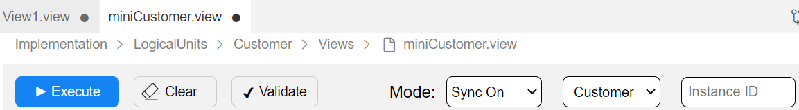
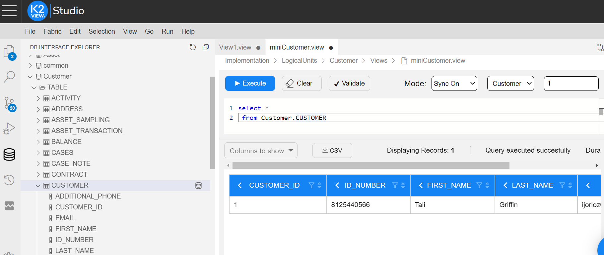

# LU Views

### Overview

Starting from Fabric V6.5.8, **LU views** are introduced to Fabric. 

**LU views** are designed to keep a pre-defined query on [LU tables](01_LU_tables_overview.md) in the Fabric MicroDB, allowing an easy access to a required data collection.

The SQL statement of the LU view can include a SELECT statement from one LU table or several joint LU tables. Additionally, it supports the use of [LUDB functions](/articles/07_table_population/11_3_creating_an_LUDB_function.md). 

LU views are part of the [Logical Unit](/articles/03_logical_units/01_LU_overview.md) definition; however, they are not part of the LU Schema. LU views are populated with data at the end of the sync process, after all LU tables population has been completed. 

LU view's column data type is the same as the respective LU table's column data type. LU views don't have their own properties and can't be indexed. 

There are two techniques in which LU view data can be accessed: either via a direct querying of an instance's MicroDB or via the Declarative field level authorization mechanism. When using the latter technique, the query on an LU table is replaced by a query on an LU view. This replacement is based on a security profile of a Fabric user's role.

[Click for more information about Declarative field level authorization mechanism](/articles/17_fabric_credentials/04_fields_level_authorization.md).

Note that once an LU view is connected to a security profile, it cannot be accessed directly by a query on MicroDB. This restriction is done in order to prevent unauthorized access to sensitive data.

[Click for more information about Security Profiles](/articles/17_fabric_credentials/05_security_profiles.md).

### How Do I Create a New LU View?

1. Go to **Project Tree** > **Logical Units** > [**LU Name**], right-click **Views** > **New View** to display the **View** window.
2. Create an SQL statement that represents the view. You can do it by either clicking on **Open Query Builder** or by writing the query manually.
3. Once the query is ready, click on **Validate Query** in order to validate the syntax. 
4. Save the view. 

<web>

1. Go to Project Tree > Implementation > Logical Units / Data Products

   - Choose Logical Units / Data Products by clicking anywhere along the line
   - Choose any one of the available Logical Units / Data Products (recognizable by a green circle on the left of each) 
   - Choose/click on the *Views* component of the selected Logical Unit / Data Product
   - Choose New View from the opened context menu
   - Name the new View. Note that the field is prepopulated with *View Name*, which you should change. Press **Enter** to confirm or **Escape** to cancel.

2. Go to DB Interface Explorer (icon on the vertical left panel of the screen)

   - Choose/click on a DB, for example: fabric, by clicking on > symbol on its left 

   - Choose a Logical Unit / Data Product, for example: Customer, by clicking on > symbol on its left. A visible sub-folder, called TABLE, opens, containing available table names.

   - Choose a table, for example: CUSTOMER, right-click on it and a popup message appears: Add Select Statement

   - Clicking on this message automatically populates the upper half of the main window with an internally generated Select statement. Note: a Select statement can also be manually typed in.

   - Populate the Instance ID box manually (top panel, rightmost box). The other 2 boxes (indicating the Mode & Logical Unit) are prepopulated, but can be changed via their drop-down arrows.

       

3. Clicking on Execute runs the Select statement, which results with a display of a created view at the bottom half of the main window.

   

</web>