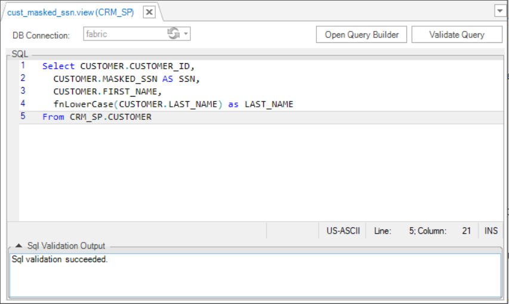

# LU Views

### Overview

Starting from Fabric V6.5.8, **LU views** are introduced to Fabric. 

**LU view** is a result set of a stored query on Fabric DB, which can be queried just as any persistent [LU table](01_LU_tables_overview.md). This pre-established query command is kept in the Fabric MicroDB dictionary, allowing an easy access to a required data collection.

The SQL statement of the LU view can include a SELECT statement from one LU table or several joint LU tables. Additionally, it supports the use of [LUDB functions](/articles/07_table_population/11_3_creating_an_LUDB_function.md). 

LU views are part of the [Logical Unit](/articles/03_logical_units/01_LU_overview.md) definition; however, they are not part of the LU Schema. LU views are populated with data at the end of the sync process, after all LU tables population has been completed. 

LU view's column data type is the same as the respective LU table's column data type. LU views don't have their own properties and can't be indexed. 

There are two techniques in which LU view data can be accessed: either via a direct querying of an instance's MicroDB or via the Declarative field level authorization mechanism. When using the latter technique, the query on an LU table is replaced by a query on an LU view. This replacement is based on a security profile of a Fabric user's role.

[Click for more information about Declarative field level authorization mechanism](/articles/17_fabric_credentials/04_fields_level_authorization.md).

### How Do I Create a New LU View?

1. Go to **Project Tree** > **Logical Units** > [**LU Name**], right-click **Views** > **New View** to display the **View** window.
2. Create an SQL statement that represents the view. You can do it by either clicking on **Open Query Builder** or by writing the query manually.
3. Once the query is ready, click on **Validate Query** in order to validate the syntax. 
4. Save the view. 

