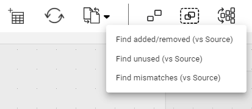
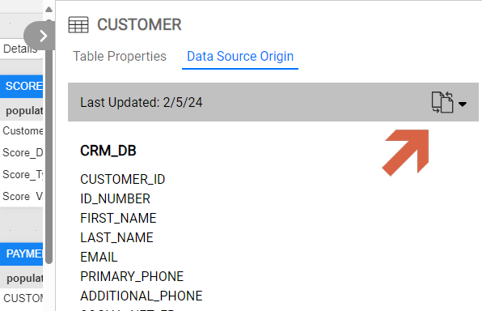
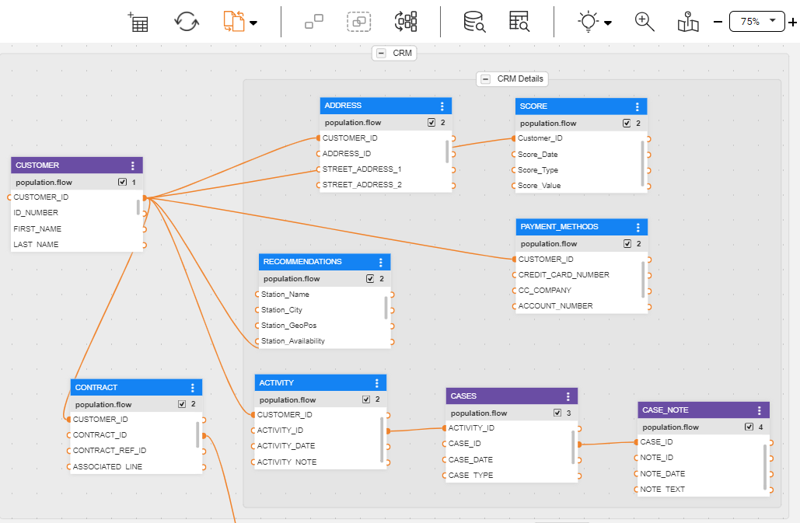
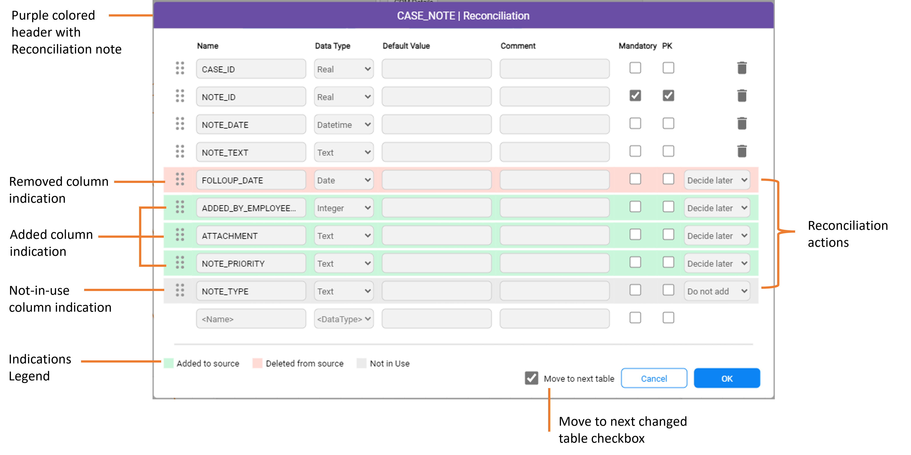
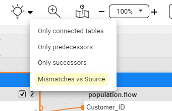

<web>

# Data Product (LU) Tables Reconciliation

The Tables Reconciliation is a feature that enables analysis of changes made to the connected source data platform tables upon which your project’s tables are based. It provides a valuable solution for two primary scenarios, throughout the project lifecycle:

1. **Data Product Business Entity Model Changes**: During the initial setup of project tables from source data platforms, implementors may decide to select only those essential for the business entity model of the data product. Subsequent requirements may necessitate the incorporation of columns previously omitted. The Tables Reconciliation feature facilitates the identification of these columns for the potential addition.
2. **Source Data Platforms changes**: Over the course of a project, changes may occur in the source data platform tables that are linked to it - columns could be added or removed. Tables Reconciliation can be used to spot these differences between the source and project tables, enabling informed decision-making within the Table Editor.

> Note: The Tables Reconciliation process is relevant only for those tables that were built based on source data platforms, using the DB Explorer, since introducing this feature - Fabric 8.0. While an LU's table is built, the platform saves additional data - the source data, schema and table it was created upon - as part of the table's metadata in Fabric; this enables the reconciliation process to find any existing mismatches. 

## Activating the Reconciliation Mismatches Finder

The first step of the reconciliation feature is to find the mismatches. This can be done according to 1 of the following 3 options: Find **only added/removed** tables' columns (added to the source or removed from it), Find **unused** columns in the project tables (comparing with the source), Find **all** mismatches between the project and the source tables (added/removed/unused). 

You can trigger the mismatches finder either in *schema* level or per *table*:

#### Schema

Activating the mismatches finder in the schema - the main tables design surface - provides a mismatches overview of the LU (aka Data Product) schema's tables.

1. At the top schema toolbar, look for the  Reconciliation action icon. 
2. Click on this icon to activate the mismatches finder, or click on the arrow next to the icon and choose 1 of the 3 options (image below).
3. As a result, the mismatches finding process starts.

#### Table

You can activate the mismatches finder on a specific table, rather than on an LU schema:

* In the schema, choose a table and click to open its Properties panel.

* In the Project tree, choose the table and open it; then click to open its Properties panel.

  

1. Switch to the *Data Source Origin* tab (image below).
2. Look for the  Reconciliation action icon. You can either click on the icon to activate the mismatches finder or click on the arrow next to the icon and choose 1 of the 3 options.
3. As a result, the mismatches finding process starts.

> Note: The mismatches finding process looks either directly at the source data platforms or at the Catalog's Discovery outcome, when it is being used.
>

## Reconciliation Mismatches Finder Results

Upon completion of the mismatches finding process:  

- When mismatches are found by the finder -
  - within a *schema*, the relevant tables' headers turn purple. Then, examining of each table’s changes can start, by opening the table for editing through the table's menu.
  - within a *table* that was opened for editing from the Project tree, you will immediately see the changes in the table.
- If no mismatches are found, a notification message would appear at the bottom-right side of the window, indicating it.

When the mismatches finding process is activated, the Reconciliation action icon turns orange, hinting to the user that Reconciliation is turned-on and "active". Being in this state:

* You can click on the Reconciliation action icon to turn it off, hiding all the mismatches findings.
* You can switch to one of the other mismatches finder options, by clicking on the down arrow and selecting it. You can do it as long as you did not take any actions on the finder's results. If you have already taken action, you shall first save your changes or discard them, before being able to activate another option.

## Table Editor - Reconciliation Mode

Upon opening a table which was signed by the Reconciliation Mismatches Finder, the table editor is opened in a *Reconciliation Mode*.

The green and red colored table's entries, are those that are identified with changes in the data source. Gray colored entries are those that exist in the source data platform tables, but not in the corresponding LU table.

> The above example illustrates a case where there are various changes (added, removed, not-in-use columns). Usually, within a specific table, fewer changes will be made.
>
> Tables' columns are represented in the Table Editor as entries/lines. The terminology that is being used here is columns or entries.

## Reconciliation Actions

According to the Reconciliation Mismatches Finder results, as shown in the table editor screen, you can choose - for each one of the mismatched columns - to either take action or postpone such decision and do it later, as follows:

* **Added** columns at source table (green-colored entries):

  * *Decide Later* whether to add it or not. For example, you may prefer not to decide now because you wish to be advised by your team if this column shall be used in your project.

  * *Add* the column also to the project's LU table.

  * *Do not Add* the column to the project's LU table. 

    According to this decision, Studio will not alert you later that this column exists in the source. You will still be able to find it when searching for *unused* columns.

* **Removed** columns from source (light red-colored entries):

  * *Decide Later* whether to remove it or not. For example, you may not decide now because you wish to be advised by your team if this column shall be removed or maybe it is still needed.

  * *Preserve* the column, although it was removed from the source. This is probably useful in cases where this column is in use in the implementation and therefore needs to remain. Note that it is your responsibility - from now on - to populate its data as the data will not be retrieved from source. 

    According to this decision, Studio will not alert you later that this column was removed at the source.

  * *Remove* from table and be aligned with the source table.

* **Not In Use** at the LU table, while existing at the source data table: 

  * *Do not Add* the column to the project's LU table. 
  * *Add* the column also to the project's LU table.

Once done with handling a table - either if you have made a decision at the tables entries and have taken action or not - you can close it by either:

* *Clicking on OK*: the open table is considered as handled, and your changes are preserved. In addition:
  * The table heading color turns back into its "natural" blue color.
  * Opening the table over again, you will be able to see and examine the decision you have made, as long as you did not save the change (saving the schema if you are in the schema editor, or saving the table if you are in table editing, opened from the Project tree).
  * The Table Properties Source Origin (see below) indicates that you handled that table.
  * You are automatically moved into the next table that found during the Reconciliation Mismatches Finder. This will be done as long as the bottom "Go next table" checkbox is ticked (default). This means that Table Editor will remain opened where next candidate table will appear.
* *Clicking on Cancel*: the table is considered as not handled and accordingly, the above accompanying implications do not hold.

## Table Properties Source Origin

The Table Properties Panel second tab - Data Source Origin - provides an overview and indicates upon which source data platform tables, this LU table is based and built upon. 

The tab's top header shows when was the last time that the table was updated during the Reconciliation process, and also enables you to execute the  Reconciliation Mismatches Finder on this specific table, as explained above.

The tab's body lists the source data platform columns, organized by Interface, the schema and the table at the source data platform.

## Highlighting Mismatched Tables

In case you deal with a big schema, containing many tables, you can easily find those tables, which were found during the Reconciliation Mismatches Finder process, by using the Highlighting option:

1. At the top schema toolbar look for the Highlighting action icon.  

2. Click on the arrow next to this icon and choose the *Mismatches vs Source* option.

   

3. As a result, the relevant tables become highlighted while other are grayed-out

> In case Reconciliation is not activated at the schema then this option is disabled

</web>
