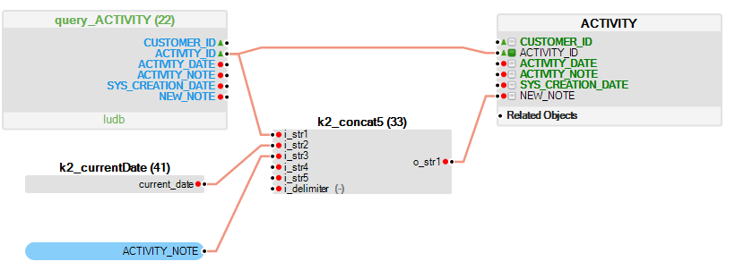
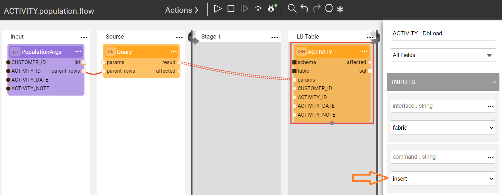

# Table Population Mode

### What Is a Table Population Mode?

The **Table Population Mode** determines how the target [**LU table**](/articles/06_LU_tables/01_LU_tables_overview.md) is populated. 
There are four table population modes: 
*	**Insert** (default), the extracted record is inserted as a new record into the table.
*	**Upsert**, the system checks via the [**Primary Key (PK)**](/articles/06_LU_tables/03_table_indexes.md#index-definition) if the record already exists in the **LU table**. If the record does not exist, the new record is inserted into the table (similar to **Insert** mode). If the record already exists, the existing record is updated.
*	**Update**, updates a record in a database table using the **key column(s)** marked in the **target LU table**. If a key column is not set in the target **LU table**, an **Update** is performed on all target records of each source record instead of updating a specific row.
*	**Delete**, deletes a record in a database table using the **key column(s)** marked in the **target LU table**. If a key column is not set in the target LU table, a **Delete** is performed on all target records of each source record instead of deleting a specific row.

<studio>

### Update and Delete Modes - How Do I Set the Key on a Target LU Table? 

If the population mode of the target LU table is set to **Update** or **Delete**, the key column(s) must be defined to enable the target LU table’s records to be updated or deleted correctly. The selected key column(s) is then added to the **WHERE** clause of the **UPDATE** or **DELETE** SQL statement. 

To define a key:
*	Check the checkbox on the left side of the **Column Name**. The color of the checkbox turns green.  
*	Mark one or several columns, if needed.

**Example:**
Update the NEW_NOTE column of the target table ACTIVITY for each ACTIVITY_ID of the source object.

*	The ACTIVITY_ID column on the target LU table is defined as a **key column** for the **UPDATE** statement.
*	The **k2_concat5** function maps the updated value to the NEW_NOTE column on ACTIVITY table. 
*	The value of the NEW_NOTE column in the target table ACTIVITY is updated based on the ACTIVITY_ID key of each entry in the source object.

</studio>

<web>

### How Do I Set the Population Mode on a Target LU Table?

The population mode of the target LU table is defined by the Actor used at the **LU Table** Stage of the population flow.

* Use the **DbLoad** Actor to perform INSERT, UPDATE or UPSERT command.
* User the **DbDelete** Actor to perform DELETE based on keys.

[Click for more information about the DB Actors](/articles/19_Broadway/actors/05_db_actors.html).

</web>
