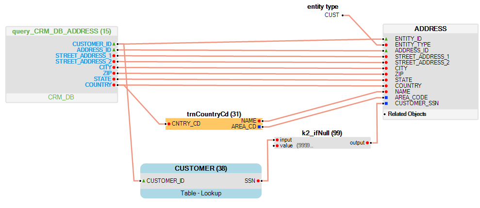
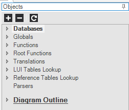

<studio>

# Table Population Transformation Rules

Data transformation rules can be applied during the [LU Table Population](/articles/07_table_population/01_table_population_overview.md) process in a number of ways using the following tools: 
*	[Functions](/articles/07_table_population/08_project_functions.md).
*	[Translations](/articles/09_translations/01_translations_overview_and_use_cases.md).
*	[Globals](/articles/08_globals/01_globals_overview.md).
*	[Constants](/articles/07_table_population/06_table_population_transformation_rules.md#constants).
*	[Lookup Tables](/articles/07_table_population/11_lookup_tables.md).

Data transformation is performed from the source object’s data to the target LU table’s data. Since the source object includes one or more records, the transformation is applied on each source record. 
When defining data transformation rules, the object’s Input and Output fields must be connected to a source table, target table and/or other objects in the population, as displayed in the following example: 

Data transformation rules are set in the [Table Population](/articles/07_table_population/01_table_population_overview.md) map or [Parser Map] in the Objects tab in the Table Population or Parser Map windows. 

### Functions
Functions can be added to a [Table Population](/articles/07_table_population/01_table_population_overview.md) map to apply various data transformations. There are two types of functions: 
*	[Built-in functions](/articles/07_table_population/07_fabric_built_in_functions.md) that are part of the Fabric infrastructure. They can perform standard transformation of dates, strings, or basic mathematical operations.
*	[Project  functions](/articles/07_table_population/08_project_functions.md) that are created specifically for the current project and can perform more complex logic. 
Both Built-in and Project functions can be either connected in a map (Table Population or Parser), to other Fabric objects or invoked from another function via Java coding.
Note that [Root functions](/articles/07_table_population/11_1_creating_or_editing_a_root_function.md) which are also displayed in the Objects tab can only be used as a source object and not for data transformation. 

### Translations and Globals

[Translations](/articles/09_translations/01_translations_overview_and_use_cases.md) and [Globals](/articles/08_globals/01_globals_overview.md) can be added to a Table Population map to transform the data from one set of values to another. Translations and Globals are defined either under an [LU](/articles/03_logical_units/01_LU_overview.md) or under [Shared Objects](/articles/04_fabric_studio/12_shared_objects.md). Those defined under Shared Objects are available for all LUs in a project.

### Constants

Constants are hard-coded values that can be used in a [Table Population](/articles/07_table_population/01_table_population_overview.md) map to set a constant value. The scope of a constant is in the current Fabric object where the constant is defined. Constants are not managed as variables in Fabric and cannot be used by various Fabric objects.

To add a **Constant** to the Table Population:
1.	Right click in the **Table Population** working area and select **Insert Constant Value** to add the constant to the map.
2.	Set the constant’s **Name** and **Value** by editing the **Constant** in the **Table Population**.
3.	Connect the **Constant** to the object in the **Table Population**, for example to a column in the target **LU table** or to another Fabric object.

To modify a **Constant**, double click it and edit the **Value**.     

To delete a **Constant**, select it in the Table Population and press **Delete**. 

### Lookup Tables

[Lookup tables](/articles/07_table_population/11_lookup_tables.md) can be added to a [Table Population](/articles/07_table_population/01_table_population_overview.md) map to get additional information about each record retrieved from the source object. A lookup can retrieve data from a Source DB table, an [LU Table](/articles/06_LU_tables/01_LU_tables_overview.md#lu-tables-overview) or from a [Reference Table](/articles/22_reference(commonDB)_tables/01_fabric_commonDB_overview.md). 

For improved performance, it is recommended to create lookups based on an LU table and not a DB table. The reason is that an LU table is usually much smaller than a Source DB table since it includes only data relevant and/or applicable for an LU. In addition, the LU table is kept in the Fabric memory and is faster to retrieve. 

A lookup returns only one record for each input record. For example, if the population needs to get a customer’s bills and to add a billing address to each record, define the Address table as a lookup table connected to the Bill table.

</studio>
