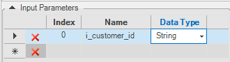

<studio>

# Creating or Editing a Root Function

### What Is a Root Function?

A Root function is a specific type of Fabric function that is used as a Source Object to trigger the [Table Population](/articles/07_table_population/01_table_population_overview.md) mechanism.
There are two types of **Source Objects** for a Table Population object:
* DB query, (default) an SQL SELECT query with one or several tables that is executed on a predefined [DB interface](/articles/05_DB_interfaces/03_DB_interfaces_overview.md). 
* Root function, which can run various SQL SELECT queries and execute complex logic including data manipulations and calculations using Java code. Data returned by a Root function is populated into the target LU table of the Table Population object. 

A Root function is used when a Table Population requires complex logic. For example, when a population requires data from multiple DB interfaces or non-DB interfaces. 

[Click for more information about using Root Functions in a Population.](/articles/07_table_population/02_source_object_types.md#db-query-vs-root-function-comparison-analysis)

### How Can I Create or Edit a Root Function?
There are several ways to create a Root function: 
* In the LU Schema window, by using the **New Table from SQL Based Root Function** option. Using this option, a new [LU table](/articles/06_LU_tables/02_create_an_LU_table.md), new population and new Root function are created by the Fabric Studio. The Root function’s code is generated based on the selected SQL. It is recommended to edit the generated function and add a **WHERE** clause to the generated SQL to retrieve only the relevant data of the [LU Instance](/articles/01_fabric_overview/02_fabric_glossary.md#lui).
* Dragging the LU table from the DB Objects tab in the LU Schema window and selecting the **Create Table Based Root** function. A new LU table, new population and new Root function and its generated code are created by the Fabric Studio. 
* Creating a new Table Population map, and then selecting **Create a New Root Function** from the **Objects tab** in the Table Population window. Using this option, the **New Function** window opens where you can write the required business logic.
* Creating a new function from the Project Tree.

The steps for creating a Root Function in Fabric Studio are the same as those for a regular function. Set the **Function Type** to **Root Function**. It is recommended to include all Root functions under one category file named Root.

[Click for more information about How to Create a Project Function.](/articles/07_table_population/10_creating_a_project_function.md)

### Input and Output Parameters of a Root Function

A Root function must have at least one Input parameter and at least one Output parameter. The Input parameter connects the Root function of an LU with its parent object in the [LU schema](/articles/03_logical_units/03_LU_schema_window.md). 
The Root Table in an LU schema is always populated by the [Instance ID](/articles/01_fabric_overview/02_fabric_glossary.md#lui). The Output of a Root function serves as Input for the Table Population. 
A Root function must have a **yield()** command to return the array of Objects (with the type Object []). All records yielded from the function are inserted into the target table.
The Input and Output parameters can be [added to the function automatically](/articles/07_table_population/10_creating_a_project_function.md#how-do-i-automatically-define-functions-parameters) using the Objects / Database pane in the Function Manager window.

**Example of the Input and Output Parameters Settings**

### Function Body

The Root function’s main SELECT statement and loop over the SELECT results can be [automatically generated](/articles/07_table_population/10_creating_a_project_function.md#how-do-i-automatically-define-functions-parameters)  to act as the basis for a function.

**Example of the Generated Code of a Root Function** 

~~~java
String sql = "SELECT SSN, FIRST_NAME, LAST_NAME FROM CUSTOMER";
db("CRM_DB").fetch(sql, [val1], [val2], ...).each(row->{
   yield(row.cells());
});
~~~

The Root function should be edited as follows:
* Add the **WHERE** clause to the above SELECT statement using binding parameters, otherwise the query will select all records from the table rather than selecting the relevant data for the LU Instance. 
* [val1], [val2], … are place holders for the query’s Input parameters. Either remove them from the **fetch()** command if they are not needed, or replace them with the SQL query’s Input parameters. 
* Add the required business logic to the Root function, including additional SELECT statements and the execution of Fabric commands. 

**Example of the Edited Code of a Root Function** 

~~~java
String sql = 
"SELECT SSN, FIRST_NAME, LAST_NAME FROM CUSTOMER WHERE CUSTOMER_ID = ?";
db("CRM_DB").fetch(sql, i_customer_id).each(row->{
   //do something
   yield(row.cells());
}
~~~

[Click to go to the Root Function’s Code Example.](/articles/07_table_population/11_2_root_functions_code_examples.md)

### How Do I Delete a Root Function?

1.	Go to **Project Tree > Logical Units > [LU Name]**.
2.	Click **Java > Root Category**, right click **[Root Function Name] > Delete Selected Items**.
3.	Click **Yes** in the confirmation pop-up message.

Note that if a deleted Root function is used by a population, update the population to include a different source object.

</studio>

