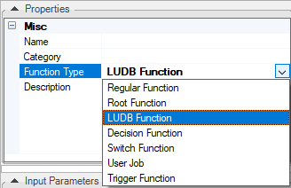

# Creating an LUDB Function

### What Is an LUDB Function?

An LUDB (Logical Unit Data Base) function is a Project function invoked from an SQL query to perform more complex operations on an LU or reference data than those performed using standard SQL statements.
*	LUDB functions are invoked from an SQL statement.
*	LUDB functions must have at least one output value.

### How Do I Create or Edit an LUDB Function? 
To create an LUDB function, refer to the steps in [How to Create Project Functions](/articles/07_table_population/10_creating_a_project_function.md).

<studio>

</studio>

When creating an LUBD function, make sure that:
*	Function Type = **LUDB Function.** 
*	The LUDB function returns at least one output parameter.

### Example of an LUDB Function

1.	Create a new function with Function Type = **LUDB Function**.
2.	Define the Input (optional) and **Output** parameters of the function.
3.	Create another function, for example a **Root function**, that invokes the **LUDB function** from the **SELECT** statement:

~~~java
String sql = 
"SELECT CUSTOMER_ID, ACTIVITY_ID, ACTIVITY_DATE, ACTIVITY_NOTE, fnCreateInstId(?) IID FROM Customer.ACTIVITY";
Db.Rows rows = ludb().fetch(sql,input);
for (Db.Row row:rows){
	yield(row.cells());
}
~~~

A full example of **fnCreateInstId** LUDB Function can be found in the Demo project.

