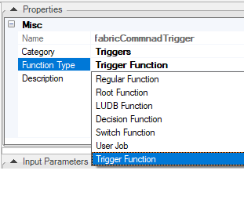
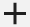
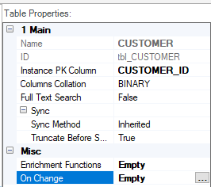
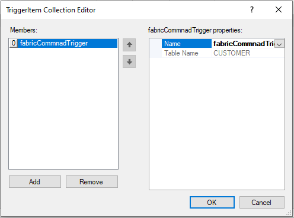

# Creating a Trigger Function

### What Is a Trigger Function?

<web>

A Trigger function is a Project function invoked from the **Triggers List** in the [LU table property](/articles/06_LU_tables/04_table_properties.md) when the LU table's data has been modified.

</web>

<studio>

A Trigger function is a Project function invoked from the **On Change** [LU table property](/articles/06_LU_tables/04_table_properties.md#on-change) when the LU table's data has been modified.

</studio>

* Any Trigger function on a Shared or LU level can be attached to an LU table.
* The same Trigger function can be attached to several LU tables in the same LU.
* Several Trigger functions can be attached to an LU table. Their execution order is established when the function is attached to the LU table.

### How Do I Create or Edit a Trigger Function?  

To create a Trigger function, refer to the steps in [How to Create Project Functions](10_creating_a_project_function.md).

<studio>

</studio>

When creating a Trigger function, make sure that:

*	**Function Type = Trigger Function.** 
*	The function has an  **tableDataChange** input parameter with a **TableDataChange** data type.

The **TableDataChange** data type exposes a set of methods which allow getting additional information about the change such as:

* What kind of change occurred? Possible values are INSERT / UPDATE / DELETE.
* Which table has changed?
* Which fields have changed?
* What are the old values and the new values?

The Trigger function analyzes the change using the above information and executes business logic, for example, write the old and the new values into a log table.

<web>

### How Do I Attach or Remove a Trigger Function?

A Trigger function must be attached to one or more [LU tables](/articles/06_LU_tables/01_LU_tables_overview.md) in the [LU Schema](/articles/03_logical_units/03_LU_schema_window.md) to be executed when there are changes in an LU table's data. 

1. Go to **Project Tree** > **Logical Units** > [**LU Name**] > **Tables** > [**Table Name**] to display the **Table Schema** window.
2. In the Table Properties, click  icon in the **Triggers** tab to add an existing Trigger function from the list. 
3. If needed, add additional Trigger functions and use the arrows to set the correct execution order.
4. To remove a Trigger function, click  icon next to the Trigger function definition in the Table Properties.
5. **Save** the LU Table.

</web>

<studio>

### How Do I Attach a Trigger Function to an LU Table?

A Trigger function must be attached to one or more [LU tables](/articles/06_LU_tables/01_LU_tables_overview.md) in the [LU Schema](/articles/03_logical_units/03_LU_schema_window.md) to be executed when there are changes in an LU table's data. 

Do the following:

1. Go to **Project Tree** > **Logical Units** > [**LU Name**] > **Tables** > [**Table Name**] to display the **Table Schema** window.

2. To attach the Trigger function using the [LU Table Properties tab](/articles/06_LU_tables/04_table_properties.md), click the **three dots** next to the **On Change** option to open the **Trigger Item Collection Editor**. 

   

3. Click **Add** and then click the area next to **Name** to display the list of Trigger functions. Select the function from the list. 

   

4. (Optional) To add more **Trigger functions** to the same LU table, click **Add** again and select the additional functions. Define the Trigger functions execution order using the **arrows** next to the **function names** in the **Editor**.

5. Click **OK** to close the Editor and then **Save** the table.

### How Do I Remove a Trigger Function from an LU Table? 

To remove a Trigger function from the LU table, do the following:

1. Go to **Project Tree** > **Logical Units** > [**LU Name**] > **Tables** > [**Table Name**] to display the **Table Schema** window.

2. In the [Table Properties tab](/articles/06_LU_tables/04_table_properties.md), click the **three dots** next to the **On Change** option to open the **Trigger Item Collection Editor**.

3. Select the function and click **Remove**.

4. Click **OK** to close the Editor and then **Save** the table.

</studio>

### Example of a Trigger Function

1. Create a new function with **Function Type = Trigger Function**.

2. Write the business logic, for example if the change type = INSERT, populate the table name, the old values and the new values into a specific log table defined in the Fabric Common DB.

   ~~~java
   String tbl = tableDataChange.getTable().toString();
   DataChangeType change = tableDataChange.getType();
   List newValuesList = tableDataChange.newValuesAsList();
   String newValues = newValuesList.toString();
   List oldValuesList = tableDataChange.oldValuesAsList();
   String oldValues = oldValuesList.toString();
   
   if( change == DataChangeType.INSERT) {
       Db ci = db("fabric");
       ci.beginTransaction();
       ci.execute("insert into DATA_CHANGES values (?,?,?)",tbl,oldValues,newValues);
       ci.commit();
   }
   ~~~

3. Open LU table's properties window and attach the Trigger function using the table's properties tab.

