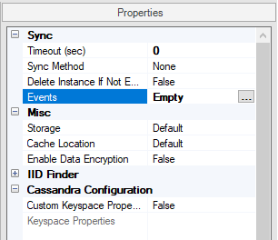
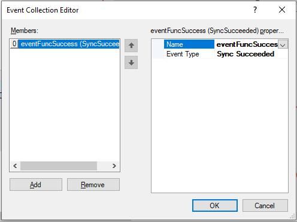
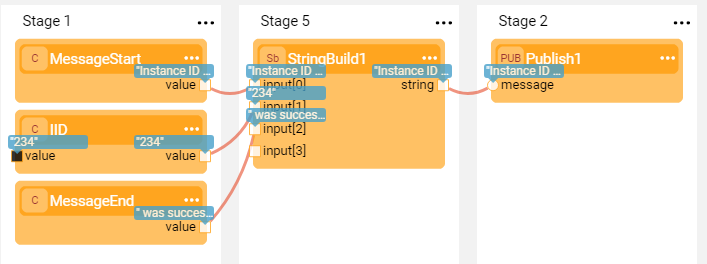

# Creating an Event Function

### What Is an Event Function?

An Event function is a Project function invoked from the **Events** [LU Schema property](/articles/04_LU_properties.md).

* An Event function enables running user code upon the completion of Sync or Delete Instance.
* The function is triggered on one of the following events:
  * Post Sync success, post Sync failure, post Delete Instance success.
* Any Event function on a Shared or LU level can be attached to an LU Schema.
* The same Event  function can be attached to several LU Schema event.

Notes:

*  The Event functions run synchronously. If needed to run a function asynchronously, it can be done by implementation in the Event function's code. 
* The implementer is responsible to handle the Event function's exceptions. It will decide whether to catch an exception or to display it to the user in case the Event function fails.

### How Do I Create or Edit an Event Function?

To create an Event function, refer to the steps in [How to Create Project Functions](10_creating_a_project_function.md).

When creating an Event function, make sure that:

*	**Function Type = Event Function.** 
*	The function has an  **eventDataContext** input parameter with a **EventDataContext** data type.

The **EventDataContext** data type exposes a set of methods which allow getting additional information about the change such as:

* Instance ID
* LU Type name
* Exception

Using the above information the function can execute any required business logic, for example, write the Instance ID and the exception into a log table or publish a message to Kafka. 

### How Do I Attach an Event Function to an LU Schema?

1. Go to **Project Tree** > **Logical Units** > [**LU Name**] > **Schema** to display the **LU Schema** window.

2. To attach the Event function using the LU Schema [Properties tab](/articles/03_logical_units/04_LU_properties.md), click the **three dots** next to the **Events** option to open the **Event Collection Editor**. 

   

3. Click **Add** and then click the area next to **Name** to display the list of Event functions. Select the function from the list and select the Event Type.

   

4. (Optional) To add more **Event functions** to the same LU, click **Add** again and select the additional functions and select an event type for each one of them.

5. Click **OK** to close the Editor and then **Save** the LU Schema.

### How Do I Remove an Event Function from an LU Schema? 

1. Go to **Project Tree** > **Logical Units** > [**LU Name**] > **Schema** to display the **LU Schema** window.

2. In the [Properties tab](/articles/03_logical_units/04_LU_properties.md), click the **three dots** next to the **Events** option to open the **Event Collection Editor**.

3. Select the function and click **Remove**.

4. Click **OK** to close the Editor and then **Save** the LU Schema.

### Example of an Event Function

1. Create a new function with **Function Type = Event Function**.

2. Write the business logic, for example populate the IID, LU name and a message into a specific log table defined in the Fabric Common DB. In addition, publish a message to Kafka using a Broadway flow.

   ~~~java
   String IID = eventDataContext.getInstanceId();
   String luTypeName = eventDataContext.getLuTypeName();
   
   Db ci = db("fabric");
   ci.beginTransaction();
   ci.execute("insert into DATA_CHANGES values (?,?,?,?)",IID,luTypeName,"NA","Post Sync Success");
   ci.commit();
   
   fabric().execute("broadway Customer.publishCustomer iid="+ IID);
   ~~~
   
3. Create a Broadway flow that publishes a message to Kafka.

   

4. Open LU Schema's properties window and attach the Event function to the **Events** property.

[Click to display an example of a Trigger Function in the Demo project.](/articles/demo_project)

