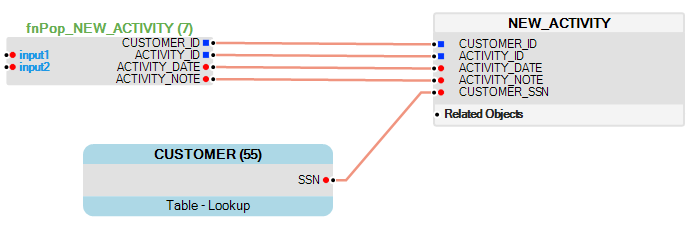
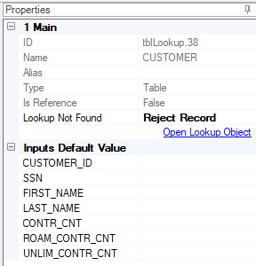

<studio>

# Lookup Tables

A **Lookup table** is an object that is added to a [Table Population](/articles/07_table_population/01_table_population_overview.md) to get information from a source DB table, [LU table](/articles/06_LU_tables/01_LU_tables_overview.md) or [Reference table](/articles/22_reference(commonDB)_tables/01_fabric_commonDB_overview.md). A lookup returns one record for each input record. The matching SQL query is generated for a Lookup table by Fabric: 
*	**Input** fields are used for the WHERE clause of an SQL statement. 
*	**Output** fields are used for the SELECT statement of an SQL statement.

The input in a Lookup table is optional if the Lookup has only one record. For example, when a Lookup is created based on the Customer LU table and the Customer is the Root Table of the LU. In this case the Customer LU table will only have one record. 

### How Can I Add a New Lookup To a Table Population?

1.	Go to **Project Tree** > **Logical Units** > [**LU Name**]. 
2.	Click **Tables** > [**Table Name**] > [**Table Population**].
3.	Click the **Objects** tab in the right panel of the **Table Population** working area.
4.	Do either:
    *	To create an **LUI Table Lookup** or **Reference Table Lookup**:    
    Click **LUI Tables Lookup / Reference Tables Lookup** to display the list of tables, select the table and drag it to the working area.
    *	To create a **Database Table Lookup**:  
    Click **Database** to display the list of tables, select the table and drag it to the working area and then click **Create as DB Table Lookup**.

5.	Connect the Lookup’s **Input** and **Output** fields to the table columns. 
    *	Optional: connect the Lookup **Input** fields to the **Source Table**.
    *	Connect the Lookup **Output** fields to the **Target**.
    
    
    
6.	Right click the **Lookup** and select **Minimize** to display only the Lookup’s connected fields.
7.	In the [**Properties Tab**](/articles/07_table_population/04_table_population_properties_tab.md) (right panel of the Table Population working area), click the dropdown list and select the action for when a Lookup Value is not found. 

**Notes**  
*	It is recommended to create a Lookup based on an [LU table](/articles/06_LU_tables/01_LU_tables_overview.md) and not a DB table in order to improve performance. The reason is that an LU table is usually much smaller than the source DB table, since it includes only the data which is relevant / applicable for an LU. In addition, the LU table is kept in the Fabric memory and is faster to retrieve. 
*	It is recommended to create an [index  on the LU table](/articles/06_LU_tables/03_table_indexes.md#table-indexes) for the Input fields in order to improve performance of the Lookup table’s Search.
*	When creating a Lookup based on an LU table, check that the Lookup object is populated **before** the current table. Which means that the table has a higher [execution order](/articles/07_table_population/13_LU_table_population_execution_order.md) than the Lookup object.

### Lookup Properties Tab

The following information is displayed in the Lookup Properties:

<table style="width: 632px;">
<tbody>
<tr>
<td width="200pxl">

<strong>Main</strong>

</td>
<td width="700pxl">

Non-editable fields:

<ul>
<li><strong>ID</strong>, generated by Fabric.</li>
<li><strong>Name</strong>, displays the lookup name.</li>
<li><strong>Type</strong>, displays the lookup type:
<ul>
<li>Table, when the Lookup is based on an LU table.</li>
<li>DB object, when the Lookup is based on the source DB or reference table.</li>
</ul>
</li>
<li><strong>Is Reference</strong>, indicates whether the lookup is a reference table or not.</li>
<li>Editable fields:</li>
<li><strong>Alias</strong>, displays the Lookup alias.</li>
</ul>
</td>
</tr>
<tr>
<td style="width: 141.333px;">

<strong>Lookup Not Found</strong>

</td>
<td style="width: 477.667px;">

Dropdown list of Fabric actions when the Lookup value is not found:

<ul>
<li><strong>Reject Record</strong> (default), the record is rejected and is not inserted into the target table.</li>
<li><strong>Reject Instance</strong>, (for critical errors), the entire LUI is rejected and is not loaded into the Fabric database. For example, you can define that if no Billing Address is found for a Customer when the Customer is a Root Table of the LU to reject an entire Customer instance.</li>
<li><strong>Continue</strong>, ignore an error and load the record. Used when the lookup value is defined as optional in the target table.</li>
<li><strong>Report and Continue</strong>, reports a message to Fabric log file and continues with the load. You can check the issue later using the reported message.</li>
</ul>
</td>
</tr>
<tr>
<td style="width: 141.333px;">

<strong>Misc.</strong>

</td>
<td style="width: 477.667px;">

Non-editable fields, applicable only for source DB table lookups:

<ul>
<li><strong>Connection Name and Owner</strong></li>
</ul>
</td>
</tr>
<tr>
<td style="width: 141.333px;">

<strong>Open Lookup Object</strong>

</td>
<td style="width: 477.667px;">

Link to open the <a href="/articles/06_LU_tables/02_create_an_LU_table.md#table-schema-definition"> Table Schema</a> window.

</td>
</tr>
<tr>
<td style="width: 141.333px;">

<strong>Inputs Default value</strong>

</td>
<td style="width: 477.667px;">

User-defined default values for each Input field in the Lookup. Used when there is no link connected to the field or when a Null value is received.

</td>
</tr>
</tbody>
</table>

</studio>
