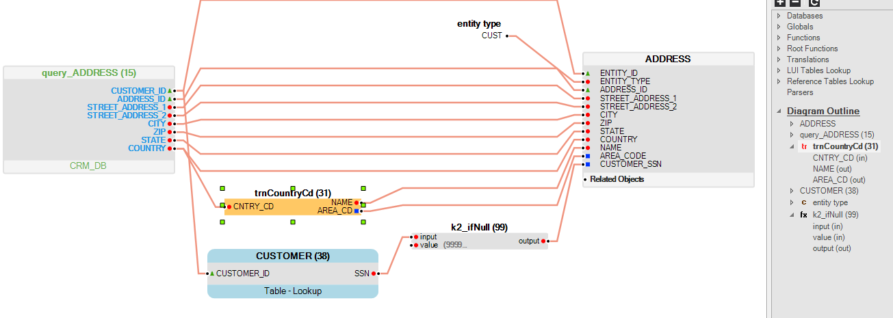

<studio>

# Table Population Diagram Outline

The **Diagram Outline** of the population map is located in the **Objects tab** of the [Table Population](/articles/07_table_population/01_table_population_overview.md) window and displays all objects that are currently found in the population map. When clicking the object’s name, or object’s column name in the Diagram Outline, the matching object or column is marked in the Table Population working area.
For example, the following diagram outline displays a  list of objects  included in the table population:

<table>
<tbody>
<tr>
<td width="114">

<strong>ADDRESS</strong>

</td>
<td width="491">

Target LU table.

</td>
</tr>
<tr>
<td width="114">

<strong>query_ADDRESS</strong>

</td>
<td width="491">

Source DB query.

</td>
</tr>
<tr>
<td width="114">

<strong>tr trnCountryCd</strong>

</td>
<td width="491">

Translation in the population that transforms data from the source to the target.

</td>
</tr>
<tr>
<td width="114">

<strong>CUSTOMER</strong>

</td>
<td width="491">

LU lookup table.

</td>
</tr>
<tr>
<td width="114">

<strong>c entity_type</strong>

</td>
<td width="491">

Constant value used in the population of a target table.

</td>
</tr>
<tr>
<td width="114">

<strong>fx k2_ifNull</strong>

</td>
<td width="491">

Built-in function that transforms data from the source to the target.

</td>
</tr>
</tbody>
</table>

When an object or a field of an object is selected in the Diagram Outline, it is also highlighted in the map. For example, in the above diagram the Translation object trnCountryCd is selected in the Diagram and it is highlighted in the map. 

 

</studio>
