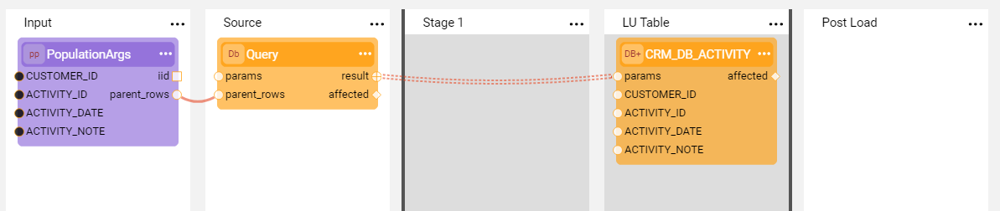
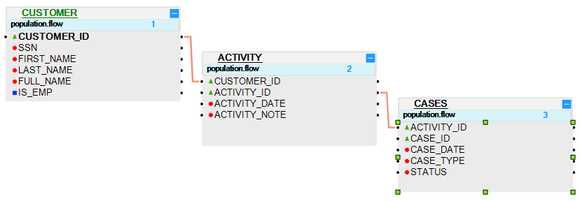
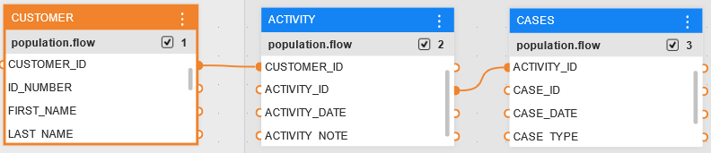

# Table Populations Based on Broadway Flows

<studio>

A [Table Population](/articles/07_table_population/01_table_population_overview.md) defines and executes mapping and transformation rules from a data source to a target. A table population can be created based on a source object or based on a Broadway flow. 

A [Broadway flow](/articles/19_Broadway/02a_broadway_flow_overview.md) is a core Broadway object that represents a business process and is built from several [Stages](/articles/19_Broadway/19_broadway_flow_stages.md) where each Stage includes one or more [Actor](/articles/19_Broadway/03_broadway_actor.md).

The advantages of using a Broadway flow for table population rather than a source object based population are:

* Streamlining logic and all related validations into one business process whereby improving the project's maintainability.
* Populating more than one table in a single population flow.
* Replacing the source DB with another action such as an HTTP call.

[Click for more information about Broadway](/articles/19_Broadway/01_broadway_overview.md).

</studio>

### Flow Population Template

A Broadway population is created as a template with predefined Stages and designated Actors. The template flow is ready to be used and can be executed as part the Logical Unit population without any changes. If needed the flow can be modified by adding or removing Actors and Stages.

The following example displays a Broadway flow template created to populate the CASES table in the Logical Unit. 

**Predefined Stages and Actors**

* **Input** Stage, defines the population's input arguments using a designated **PopulationArgs** Actor. 

  *  **PopulationArgs** is a mandatory Actor in the Broadway population and is the only Actor that cannot be removed from the template. The purpose of the **PopulationArgs** Actor is to connect the current population with the LU Schema by setting the parent-child relationship via the **iid** and **parent_rows** output arguments.

  * The input arguments of the **PopulationArgs** are either added automatically based on the selected table's fields or must be added manually. 

  * The **iid** output argument indicates the instance ID of the execution. The **parent_rows** output argument is an array of objects that iterate over parent rows. For example, when the CASES table is related to the ACTIVITY table in the LU Schema, the **iid** is a customer ID and the **parent_rows** includes the list of activity IDs of this customer.

    <studio>
    
    
    
    </studio>
    
    <web>
    
    
    
    </web>

* **Source** Stage, defines a query that retrieves source data using the **SourceDbQuery** Actor. The **SourceDbQuery** Actor inherits from the [DbCommand Actor](/articles/19_Broadway/actors/05_db_actors.md) and extends it with additional **parent_rows** and **size** input arguments.

  * The interface for the query's execution is selected from the list of Fabric [DB interfaces](/articles/05_DB_interfaces/03_DB_interfaces_overview.md). 

  * The **sql** input argument holds a query that is either populated automatically or must be added manually. A query can be validated in the [Query Builder window](/articles/11_query_builder/02_query_builder_window.md) by clicking **QB** in the **sql** input argument field. 

  * The **size** value is used to group the rows from **parent_rows** where each group is used to generate the WHERE clause for the provided SQL statement. The **size** is important for the Actor's performance since it enables generating less calls to the source DB.

  * The WHERE clause is generated automatically in the same way as for regular populations and is not visible in the Actor's UI. 

    For example, when the **sql** input argument displays the statement:

    ~~~sql
    SELECT * FROM CASES
    ~~~

    The SQL statement that will actually be executed in the server side is:

    ~~~sql
    SELECT * FROM CASES WHERE ACTIVITY_ID IN (...)
    ~~~

  * The **size** value determines the number of ACTIVITY_ID values included in the SQL.

  * Additional parameters can be added to the WHERE clause if needed. For example, to filter cases by their status.

  * The **SourceDbQuery** Actor supports non-prepared statement parameters. For example, to dynamically transfer a table or column name to a query.

  * [Click for more information about parameters support and non-prepared statement parameters](/articles/19_Broadway/actors/05_db_actors.md).

* **Stage 1**, a placeholder in the template that enables adding additional activities that can be performed on the data prior to loading it to the target DB. This feature is similar to using a [Root function](/articles/07_table_population/02_source_object_types.md) that is added in a regular population object.  

* **LU Table** Stage, defines the target LU table using the **DbLoad** Actor. 

  * The target **interface**, **schema**, **table** and INSERT, UPDATE or UPSERT **commands** are set using the Actor's input arguments. 
  * The [link type](/articles/19_Broadway/07_broadway_flow_linking_actors.md#link-object-properties) from the Query to the load is set as **Iterate** to enable looping over the query results.
  * Note that by default, **schema** and **table** input arguments are defined as an [External population type](/articles/19_Broadway/03_broadway_actor_window.md#actors-inputs-and-outputs) to enable populating these parameters dynamically. When required, a **Const** or **Link** population type can be defined. 

* **Post Load** Stage, a placeholder added to the template to indicate that additional activities can be performed after the data has been loaded to the target DB. This feature is  similar to using an [Enrichment function](/articles/10_enrichment_function/01_enrichment_function_overview.md). If it is not needed, this Stage can be deleted or left empty.

### Example of Creating a Population Based Broadway Flow

1. <studio>In the **DB Objects tab** of the **LU Schema**, drag the required table into the main area and click **Create Table based Broadway Flow**.</studio> <web>In the Project Tree, right click  on the LU table  > **New Population** and provide the population name.</web> The flow's template is created and includes the basic steps for retrieving  source data and loading it into the target.

   

2. Connect the required input arguments of the **PopulationArgs** Actor to the relevant port of the parent table in the LU Schema. 

3. (Optional) Add the WHERE clause to the **sql** input argument of the **Query** Actor.

[Click for display the examples of parameters support and non-prepared statement parameters](/articles/19_Broadway/actors/05_db_actors.md#examples).

<studio>

</studio>

<web>

</web>
