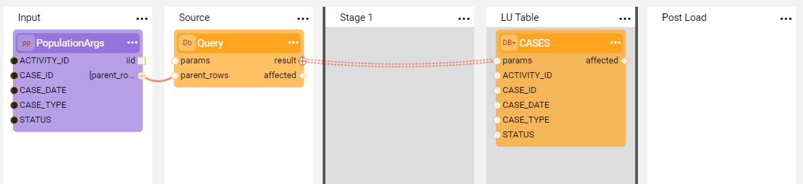

# Table Population Based on a Broadway Flow

A [Table Population](/articles/07_table_population/01_table_population_overview.md) defines and executes mapping and transformation rules from a data source to a target. A table population can be created based on a source object or based on a Broadway flow. 

[Broadway](01_broadway_overview.md) is a Fabric module that is used to design data movement, its transformation and the orchestration of business flows. A [Broadway flow](/articles/19_Broadway/02a_broadway_flow_overview.md.md) is a core Broadway object that represents a business process and is built from several [Stages](https://github.com/k2view-academy/K2View-Academy/blob/KB_DROP2_99_BROADWAY/articles/19_Broadway/19_broadway_flow_stages.md) where each Stage includes one or more [Actor](https://github.com/k2view-academy/K2View-Academy/blob/KB_DROP2_99_BROADWAY/articles/19_Broadway/03_broadway_actor.md).

The advantage of using a Broadway flow for table population rather than a source object based population, is to streamline logic and all related validations into one business process to improve the project's maintainability.

### How Do I Create a Population Based on a Broadway Flow?

The starting points for creating a population based on a Broadway flow are:

* [Auto Discovery Wizard](/articles/03_logical_units/06_auto_discovery_wizard.md), check the **Table population based Broadway flow** checkbox in step 2 of the Wizard.
* [LU Schema window](/articles/03_logical_units/03_LU_schema_window.md#logical-unit-lu-schema), either:
  * Right click and select **New table from SQL based Broadway flow**.
  * Drag a DB table and select **Create table based Broadway flow**.
* Project Tree, right click a table object and select **Create Table Population based Broadway Flow**.
* Reference, right click and select **Create References from DB tables**.

The population is created as a template with predefined Stages and designated Actors. Complete the missing information and if needed, update the flow and then connect the table population to the LU hierarchy via the LU Schema window.

[Click for more information about building an LU hierarchy and linking table populations](/articles/03_logical_units/12_LU_hierarchy_and_linking_table_population.md).

**Example of Creating a Population Based Broadway Flow from the Project Tree**

1. Right click the **table name** under the **Project Tree** and then click **New Table Population based Broadway Flow**.

2. Enter the **population name** and click **OK** to open a Broadway flow window. The flow's template is created and includes the basic steps for retrieving  source data and loading it into the target. 

   

3. Populate the **PopulationArgs** Actor's input arguments, the **Query** Actor's **interface**, and the **sql** statement to complete the flow. Add or modify steps if needed.

Note that when the creation of a population flow is initiated from the [LU Schema window](/articles/03_logical_units/03_LU_schema_window.md#logical-unit-lu-schema), the input fields, interface and SQL statement are added automatically based on the selected table's fields. If needed, remove redundant fields. 

### How Do I Use a Flow Population Template?

A Broadway population flow template includes predefined Stages and designated Actors and can be modified by adding more Actors when needed. 

A population flow template has the following Stages:

* **Input** Stage, defines the population's input arguments using a designated **PopulationArgs** Actor. 
  
  * Input arguments are either added automatically based on the selected table's fields or must be added manually. 
  * The **iid** output argument indicates the instance ID of the execution. The **parent_rows** output argument is an array of objects that iterate over parents rows.
  
* **Source** Stage, defines a query that retrieves source data using the **SourceDbQuery** Actor. 

  * The interface for the query's execution is selected from the list of Fabric [DB interfaces](/articles/05_DB_interfaces/03_DB_interfaces_overview.md). 
  * A query can be validated in the [Query Builder window](/articles/11_query_builder/02_query_builder_window.md) by clicking **QB** in the **sql** input argument field of the Actor. 
  * The **SourceDbQuery** Actor inherits from the [**DbCommand** Actor](05_db_actors.md) and extends it with additional **parent_rows** and **size** input arguments whereby improving the Actor's performance and generating less calls to the source. The **Size** value is used to group the rows from **parent_rows** where each group is used to generate the WHERE clause for the provided SQL.

  <!-- Tali -please add a more detailed explanation about the size. In addition- does it add a where statement automatically to the select like Fabric does for a DbQuery?. Also- how can we use parameters in the query? Please add a screenshot with an exapmple for a source query that has a where statement with parameters.  -->

* **Stage 1**, an empty Stage added to the template to indicate that additional activities can be performed on the data prior to loading it to the target DB. 

* **LU Table** Stage, defines the target LU table using the **DbLoad** Actor. 

  * The target interface, table and INSERT, UPDATE or UPSERT commands are set using the Actor's input arguments. 
  * The [link type](/articles/19_Broadway/07_broadway_flow_linking_actors.md#link-object-properties) from the Query to the load is set as **Iterate** to enable looping over the query results.

* **Post Load** Stage, an empty Stage added to the template to indicate that additional activities can be performed after the data has been loaded from the [LU table](/articles/06_LU_tables/01_LU_tables_overview.md) for the target DB. If not needed, this Stage can be deleted or left empty.

[Click for more information about Broadway and its building blocks](/articles/19_Broadway/README.md).

