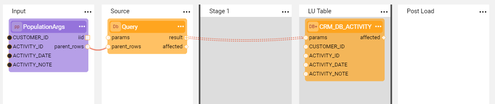

# Parent Rows Grouping

### Overview

The **SourceDbQuery** Actor is used in the Broadway populations to query the source data. The Actor executes the query defined in the population flow, appended with a dynamically generated `WHERE` clause. 

The server generates this `WHERE` clause automatically before execution. It incorporates the keys and values passed from the `parent_rows` output object of the **PopulationArgs** Actor.

Starting from **Fabric V8.4**, the structure of this generated `WHERE` clause is determined by the **Parent Rows Grouping** parameter located in the Fabric properties section of the **Interface Type** definition for JDBC.

### Parent Rows Grouping Settings

The following table explains how each **Parent Rows Grouping** setting impacts the generated SQL query structure. The resulting query depends on the number of input keys and whether those keys contain multiple values.

<table style="width: 900px;">
<tbody>
<tr>
<td style="width: 250px;"><strong>Parameter Value</strong></td>
<td style="width: 130px;"><strong>Keys</strong></td>
<td style="width: 320px;"><strong>Generated Query Example</strong></td>
<td style="width: 200px;"><strong>Comments</strong></td>
</tr>
<tr>
<td style="width: 250px;" rowspan="2"><strong>OR</strong></td>
<td style="width: 130px;">1</td>
<td style="width: 320px;">SELECT * FROM PATIENT WHERE PATIENT_ID = ? OR PATIENT_ID = ?</td>
<td style="width: 200px;" rowspan="2">Default value for all DB types except Cassandra.</td>
</tr>
<tr>
<td style="width: 130px;">&gt; 1</td>
<td style="width: 320px;">SELECT * FROM PATIENT WHERE PATIENT_ID = ? AND VISIT_ID = ? OR PATIENT_ID = ? AND VISIT_ID = ?</td>
</tr>
<tr>
<td style="width: 250px;" rowspan="3"><strong>IN</strong></td>
<td style="width: 130px;">1, with 1 value</td>
<td style="width: 320px;">SELECT * FROM PATIENT WHERE VISIT_ID = ?</td>
<td style="width: 200px;">Used for a single key with a single value.&nbsp;</td>
</tr>
<tr>
<td style="width: 130px;">1, with multiple values</td>
<td style="width: 320px;">SELECT * FROM PATIENT WHERE VISIT_ID IN (?,?)</td>
<td style="width: 200px;">Used for a single key with multiple values.&nbsp;</td>
</tr>
<tr>
<td style="width: 130px;">&gt; 1</td>
<td style="width: 320px;">SELECT * FROM PATIENT WHERE (PATIENT_ID, VISIT_ID) IN ((?,?), (?,?))</td>
<td style="width: 200px;">Used for composite keys. Tupling is utilized within the JDBC SQL string.</td>
</tr>
<tr>
<td style="width: 250px;" rowspan="3"><strong>IN_WITHOUT_TUPLING</strong><strong> </strong></td>
<td style="width: 130px;">1, with 1 value</td>
<td style="width: 320px;">SELECT * FROM PATIENT WHERE VISIT_ID = ?</td>
<td style="width: 200px;">Used for a single key with a single value.&nbsp;</td>
</tr>
<tr>
<td style="width: 130px;">1, with multiple values</td>
<td style="width: 320px;">SELECT * FROM PATIENT WHERE VISIT_ID IN (?, ?)</td>
<td style="width: 200px;">Used for a single key with multiple values.&nbsp;</td>
</tr>
<tr>
<td style="width: 130px;">&gt; 1</td>
<td style="width: 320px;">SELECT * FROM PATIENT WHERE PATIENT_ID = ? AND VISIT_ID = ? OR PATIENT_ID = ? AND VISIT_ID = ?</td>
<td style="width: 200px;">Used for composite keys;. Recommended for DBs that do not support Tupling, such as Aerospike.</td>
</tr>
<tr>
<td style="width: 250px;"><strong>NONE</strong></td>
<td style="width: 130px;">1 or many</td>
<td style="width: 320px;">SELECT * FROM PATIENT WHERE PATIENT_ID = ? AND VISIT_ID = ?</td>
<td style="width: 200px;">Default for Cassandra; requires separate server calls for each value.</td>
</tr>
</tbody>
</table>

