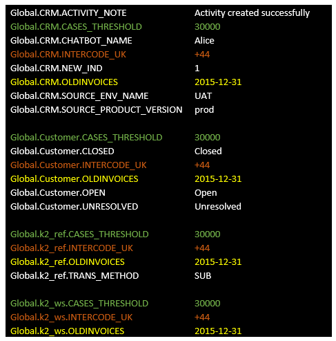

# SET and SET_GLOBAL GLOBAL Commands for Global Variables 

Two Fabric commands can override a Global:

* **set_global global**, overrides the value at a **cluster level** whereby both the original and new values are saved in Cassandra. 
* **set**, overrides or shows the value at a **session level**.

Both commands can override a global value only if the global is not defined as Final.

### How Do I Use the Set_Global Global Command?

This command overrides a global value on the entire cluster, impacting all Fabric sessions, including open ones.
**set_global global '<LUT_NAME>.<PARAM_NAME>[=<PARAM_VALUE>]';**

The **set_global global** command sets the value of the global indicated by <PARAM_NAME> to the value provided by the <PARAM_VALUE>. The PARAM_NAME must be defined as a Global Variable in Fabric.

<table>
<tbody style="vertical-align:top">
<tr>
<td width="234">

set_global global

'*.&lt;PARAM_NAME&gt;[=&lt;PARAM_VALUE&gt;] &lsquo;;

</td>
<td width="319">

Set the value of the Global indicated by &lt;PARAM_NAME&gt; to the value provided by the &lt;PARAM_VALUE&gt; - for <b>all</b> LUT.

Example:

set_global global &lsquo;*.SOURCE_PRODUCT_VERSION=100&rsquo;;

</td>
</tr>
<tr>
<td width="300pxl">

set_global global

'&lt;LUT NAME&gt;.&lt;PARAM_NAME&gt; [=&lt;PARAM_VALUE&gt;]';

</td>
<td width="600pxl">

Set the value of the Global indicated by &lt;PARAM_NAME&gt; and optionally also by &lt;LUT NAME&gt; to the value provided by the PARAM_VALUE.

<UL>
<LI>When the LUT NAME is specified and the Global is also defined under Shared Objects, the Global value is overridden only for the given LUT NAME.  Note that if the command of all LU settings is executed after the command with the LUT NAME it is also applied on that LU.</LI>
<LI>If the variable was not defined during implementation on a Shared Objects or LU level, the command is not applied and an error message is displayed indicating that it does not exist in the LU.</LI>
</UL>

Example:

set_global global &lsquo;CRM.SOURCE_PRODUCT_VERSION=100&rsquo;;

</td>
</tr>
<tr>
<td width="234">

set_global global

'&lt;LUT NAME&gt;.&lt;PARAM_NAME&gt;=&rsquo; ;

</td>
<td width="319">

Set the Global to a NULL value.

Example:

set_global global &lsquo;CRM.SOURCE_PRODUCT_VERSION=&rsquo;;

</td>
</tr>
<tr>
<td width="300">

set_global global

'&lt;LUT NAME&gt;.&lt;PARAM_NAME&gt; &lsquo;;

</td>
<td width="600">

Reset the Global to its original value when the &lt;PARAM_VALUE&gt; is not provided. The original value is its value prior to the override.

Example:

set_global global &lsquo;CRM.SOURCE_PRODUCT_VERSION&rsquo;;

</td>
</tr>
</tbody>
</table>

### How Do I Use the Set Command?

The **SET** command can be used to set a variable **per session** so that the variable is available for all Fabric objects in the same session. This command can be used either to set a new ad-hoc variable (not defined in the Fabric implementation), or to override an existing global for the Fabric session if the global is not Final.

<table>
<tbody style="vertical-align:top">
<tr>
<td width="300pxl">

set [&lt;LUT_NAME&gt;.]&lt;PARAM_NAME&gt;=&lt;PARAM_VALUE&gt;;
     or 
    set [&lt;LUT_NAME&gt;.]&lt;PARAM_NAME&gt;&nbsp; &lt;PARAM_VALUE&gt;;

</td>
<td width="600pxl" >

Set the value of the variable indicated by &lt;PARAM_NAME&gt; to the value provided by the &lt;PARAM_VALUE&gt;.  A value of a Global parameter within a specific LUT can be set by specifying its name as a prefix

Example:

set SOURCE_PRODUCT_VERSION=100; or set SOURCE_PRODUCT_VERSION 100;

    

        Note that when specifying a Global variable value of an  LU on a session level, it is always applied when its SET command runs, even when a general SET command, without &lt;LUT NAME&gt;, runs <b>after</b> with the same variable name. The LU value remains valid and is not overridden.
    

</td>
</tr>
<tr>
<td width="234">

set &lt;PARAM_NAME&gt; =&rsquo;&rsquo;;

</td>
<td width="600">

Reset the variable value. If it is a new ad-hoc variable, after reset it equals NULL. If it has already been defined (cluster/environment/implementation) it  reverts to the original value.

Example: 
    Assuming that the original value of the SOURCE_PRODUCT_VERSION is &rsquo;prod&rsquo;

    
    set SOURCE_PRODUCT_VERSION=&rsquo;uat&rsquo;;  // now the value at session is &rsquo;uat&rsquo;  
    set SOURCE_PRODUCT_VERSION=&rsquo;&rsquo;;     // now the value at session gets back to &rsquo;prod&rsquo; 
</td>
</tr>
<tr>
<td width="234">

set [&lt;LUT_NAME&gt;.]&lt;PARAM_NAME&gt;;

</td>
<td width="600">

Shows the value of &lt;PARAM_NAME&gt;.  A value of a Global parameter within a specific LUT can be retrieved by specifying its name as a prefix.

Examples:

set SOURCE_PRODUCT_VERSION;  
    set CRM.SOURCE_PRODUCT_VERSION;

    

        Note that if a variable value is different for a specific LU and the command does <B>not</B> specify the LUT_NAME (for example, set SOURCE_PRODUCT_VERSION;) an error message is displayed.</LI>
        </UL> 
    

</td>
</tr>
<tr>
<td width="234">

set;

</td>
<td width="600">
    
Shows the session variables values.

    

       <UL>
           <LI>Globals are displayed with a Global prefix. The SET command also displays other session variables.</LI>
           <LI>The Globals are shown in a fully expanded mode. This includes values going from the Shared Objects toward other levels. See <a href="/articles/08_globals/03_set_globals.md#understand-the-globals-appearance-as-result-of-set-command">below</a> for more information.</LI>
        </UL> 
    
     
</td>
</tr>    
</tbody>
</table>

Click [here](/articles/08_globals/05_globals_overrides_priorities.md) for more information and more examples on variable scopes, level and priorities, as reflected also by the SET command.  

### Understanding Globals Following a SET Command

When running the `set;` command without parameters in a Fabric console, the values of variables of the current session are displayed, as follows:

- Values of Globals set for Shared Objects, LUs and References. Shared Objects Globals are permeated towards other objects like References, WS and LUs whose values are also shown.  

- The Globals naming convention is: **Global.\<unit type>.\<variable-name>** where unit-type is either
  -  An LU name.
  -  "k2_ref", refers to the references. 
  -  "k2_ws", refers to the Web Services. 
  
  The first "Global" prefix is displayed since the SET command also displays non Globals variables.
  
-  Shared Globals are displayed only for lower-level unit object formats and not as standalone values, unless this specifically set only at the session.
-  Specifying a session variable does NOT create it as Shared Object. Therefore, although it is considered as an available Global variable, it is not displayed under each unit-type if it is not specifically created for it. It is displayed as a standalone variable, without the Global or unit-type prefixes.
-  The command's results reflect the actual values, as a result of calculations of priority **levels**. Click [here](/articles/08_globals/05_globals_overrides_priorities.md) for more information and more examples of variable scopes and priorities

* The command results display both final and non-final Globals.

**Example**

This example discusses the following: 

-  Shared Objects contain OLDINVOICES (final), INTERCODE_UK, CASES_THRESHOLD Globals. 
-  Customer and CRM LUs have specific Globals. 
-  References has a single Global

Notes that this example does not show Global overrides.

The result of the `set;` command is similar to the following. Note that the coloring and the separation by unit-type that are shown here are just an illustration, used to clarify the explanations.

The green, yellow, dark-red OLDINVOICES, CASES_THERSHOLD, INTERCODE_UK lines inherit from Shared Objects. 

The white colored Globals are those which were set specifically for CRM and Customer LUs, References (k2_ref) and Web Services (k2_ws).

