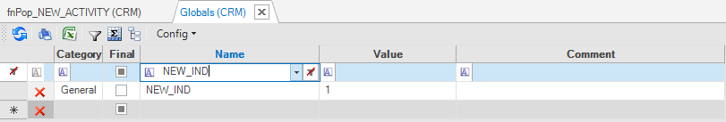

# Globals - Code Examples

### Example of Creating a New Global and Using it in a Function

<studio>

</studio>

Open the **Globals** window under a **Logical Unit** and define a new Global.

After the Global is saved, its definitions are kept in the Globals.java file under the same LU and its initial value = Y. This variable can be used by all functions under this LU.

~~~java
if (getGlobal(CRM.CUSTOMER_CHECKS_ENABLED).equals("Y")) {
	//do something
}
~~~

This example shows how to check the value of a Global variable and to determine whether to perform or to skip specific business logic (validation checks).

Notes: 
- The **getGlobal** method has been added to Fabric by V6.5.1. It can get the Global name or a concatenation of the LU Name and the Global name to get the Global value on the input LU.
- Invoking directly the Global by the user code returns the Global's value as defined in the Studio implementation and does not return the overridden value if exists. To get the Global's overriden value use either the **getGlobal** method or use the **set command**. For example:
~~~java
if (ludb().fetch("SET CRM.CUSTOMER_CHECKS_ENABLED").firstValue().toString().equals("Y")) {
	//do something
}
~~~

### Example of Using a Global in an SQL Statement in a Function

<studio>

</studio>

Open the **Globals** window under a **Logical Unit** and define a new Global.

The global can be used in an SQL prepared statement in an LU function. The syntax is: '@[global_name]@'. For Integer value, the use of apostrophe is optional.

~~~java
String sql = "SELECT * From ACTIVITY WHERE CUSTOMER_ID = ? AND ACTIVITY_ID = ? AND NEW_NOTE_IND = @NEW_IND@";
ludb().fetch(sql, input1, input2).each(row->{
    yield(row.cells());
});
~~~

<studio>

### Example of Using a Global in a Table Population

Open the **Globals** window under a **Logical Unit** and [define two new **Globals**](/articles/08_globals/01_globals_overview.md) and then create a new [**Table Population**](/articles/07_table_population/01_table_population_overview.md) and add the **Globals** to it.

This example shows how a Global can be used in a [Table Population](/articles/07_table_population/01_table_population_overview.md). Since the SOURCE_PRODUCT_VERSION and ACTIVITY_NOTE Globals are defined in the LU’s Globals list in the **Globals.java** file, they are part of the LU’s scope and therefore can be used by the Table Population in the same LU.

[Click to display an example of Globals under a Logical Unit in the Demo project.](/articles/demo_project/README.md)

</studio>

### Example of Using a Global in a Fabric Web Service

<studio>

</studio>

Open the **Globals** window under **Shared Objects** and define new Globals and use the Globals.

This example shows how Globals can be used within a Fabric Web Service.

Three Globals are defined under Shared Objects Globals in the SharedGlobals.java file and therefore can be used by the Fabric Web Service.

~~~java
if (contrID == "" && adrID == "") {
	result = fnErrorCheck(getGlobal(MISSING_INPUT)); //Missing input
	return result;	
} else if (contrID != "" && adrID != "") {
	result = fnErrorCheck(getGlobal(TOO_MANY_INPUTS)); //Too many inputs
	return result;
}
~~~

[Click to display an example of Globals under Shared Objects in the Demo project.](/articles/demo_project/README.md)

### Example of Overriding a Global in a Function or a Web Service

<studio>

</studio>

Open the **Globals** window under a **Logical Unit** and define a new Global and then [create a **Web Service**](/articles/15_web_services_and_graphit/03_create_a_web_service.md#creating-a-web-service) or a [**Project function**](/articles/07_table_population/08_project_functions.md) that will override the initial value of this Global.

The following examples show how a Global can be overridden in a cluster and per session.

#### Override the Global Per Cluster
The RECEIVED_ERROR Global is created with an initial value of 0 and in a function its value is overridden per cluster.

~~~java
if (...) {
	...
	fabric().execute("set_global global '*.RECEIVED_ERROR="+anotherValue+"'");
}
~~~

#### Set the Global Value on a Session Level

The RECEIVED_ERROR Global is created with an initial value of 0 and in a function its value is overridden on a session level. Check the value of the overridden variable in another function or a WS, for example to perform business logic. 

In **fnErrorCheck:** override the global or a variable **per session**:

~~~java
if (...) {
	...
    fabric().execute("set RECEIVED_ERROR="+ anotherValue);
}
~~~

The **wsGetCustomerDetails** Web Service calls the **fnErrorCheck** function and then checks the value of this variable set by the **fnErrorCheck** function:

~~~java
Object val;
String receivedErr = "";
Map<String,Object> result = new HashMap<>(); 
//invoke fnErrorCheck() which sets the value of RECEIVED_ERROR
result = fnErrorCheck(input); 
...
//get the value of RECEIVED_ERROR as set by fnErrorCheck() and do something...
val = db("fabric").fetch("set RECEIVED_ERROR").firstValue();
receivedErr = k2_ifNull(val.toString(),"No error");
result.put("p_error", receivedErr);
~~~

  

