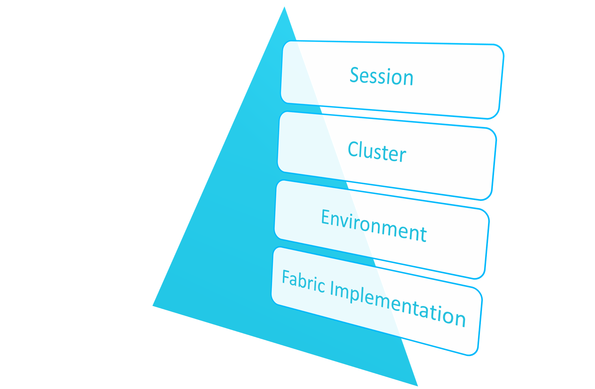
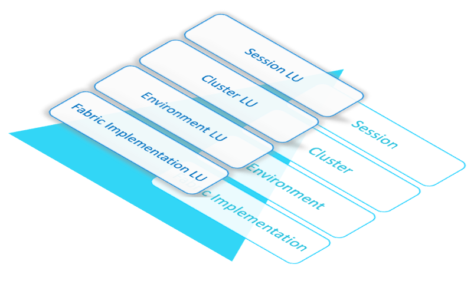
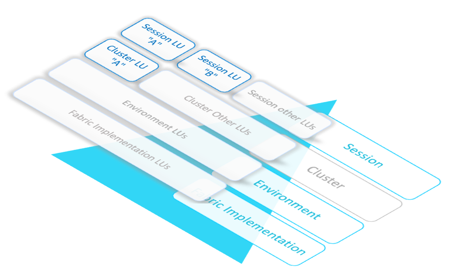

# Globals Overrides Priorities

### Overview

Global variables are defined within **scopes**:

* [Logical Unit](/articles/03_logical_units/01_LU_overview.md), whereby the Global is available within the specific Logical Unit where it is defined.
* [References Tables](/articles/22_reference(commonDB)_tables/01_fabric_commonDB_overview.md)
* [Shared Objects](/articles/04_fabric_studio/12_shared_objects.md), whereby a Global variable is available and permeated to all objects in a project under all Logical Units, Reference Tables and [Web Services](/articles/15_web_services_and_graphit/01_web_services_overview.md).

The basic definition aka Fabric Implementation can be overridden at environment, global cluster and session levels.


### Override Priority and Hierarchy

The override prioritization is based on **levels** as illustrated in the following diagram, where the upper level has the highest priority:

##### 


* **Session**, use SET commands during Fabric runtime, which only impacts the session where it is executed.
* **Cluster**, use SET_GLOBAL commands during Fabric runtime which persists in the DB and impact all cluster nodes and sessions. The Global's value set by the set_global command is taken even if the LUs or the Environments are redeployed since it has a higher priority.
* **Environment**, populated in the Environment Settings Globals table.  
* **Fabric Implementation**, populated in Fabric Studio Globals tables and reflected in Globals.java files.

The priority is also managed by the **scope**. If a Global is defined in both Shared Objects and Logical Unit scopes, the Logical Unit definition is used in the Logical Unit scope. Other Logical Units use the Shared Objects definition.

The following illustrates by-scope prioritization:  

##### 

-  Once a Global variable is set at a lower level, per scope / LU, it is reflected and inherited by upper levels (unless overridden). For example, an Implementation holding a value for LU A, when creating an environment it is also displayed as a Global variable associated to that LU.
-  Another split can be applied on any upper level.


### Applying Overrides

SET commands are used to apply overrides:

-   Click [here](/articles/08_globals/03_set_globals.md) for more information about overriding Globals using SET and SET_GLOBAL commands.

-   Click [here](/articles/25_environments/05_set_and_list_commands.md) for more information about Environments and switching SET commands.

Note that as explained in the above links, overrides can be canceled / reset whereby the Globals return to their original values. 


### Examples - Levelled Priorities

The following examples demonstrate use cases of the priorities explained above. Note that the examples display the consecutive levels and the priority between other levels like session which is stronger than environment.

##### Environment VS. Implementation 

This example refers to the SOURCE_ENV_NAME which is defined in the CRM LU. The Fabric Implementation is set to UAT.

Assuming that the UAT  UAT1, UAT2, UAT3 environments have been created:

The entire environment cluster which includes the CRM.SOURCE_ENV_NAME="UAT2_ALPHA" has been switched to work with UAT2.

When running the `set_global environment='UAT2';` switch environment command the UAT2_ALPHA value for CRM.SOURCE_ENV_NAME Global is set for all sessions in all cluster nodes.

```
set;
|key                              |value                               |
+---------------------------------+------------------------------------+
|...                              |                                    |
|ENVIRONMENT                      |UAT2                                |
|...                              |                                    |
|Global.CRM.SOURCE_ENV_NAME       |UAT2_ALPHA                          |
```

Since values are defined for the Environment, a SET_GLOBAL command was not required. 

For more information about creating and editing Globals per environment, click [here](/articles/25_environments/02_create_new_environment.md).

For more information about switching between environments click [here](/articles/25_environments/05_set_and_list_commands.md).

##### Cluster VS. Environment

In this example although specific values have been for the UAT environment, they are updated for today by reducing the CASES_THERSHOLD Shared Object Global variable from 30,000 to 10,000.

```
set;
|key                              |value                               |
+---------------------------------+------------------------------------+
|...                              |                                    |
|ENVIRONMENT                      |UAT2                                |	
|...                              |                                    |
|Global.Customer.CASES_THRESHOLD  |30000                               |
|Global.CRM.CASES_THRESHOLD       |30000                               |
|...                              |                                    |
```

When running `set_global global '*.CASES_THRESHOLD=10000';` the result is:

```
set;
|key                              |value                               |
+---------------------------------+------------------------------------+
|...                              |                                    |
|ENVIRONMENT                      |UAT2                                |	
|...                              |                                    |
|Customer.CASES_THRESHOLD         |10000                               |
|Global.CRM.CASES_THRESHOLD       |10000                               |
|...                              |                                    |
```

To return to the environment's original values, the following `set_global global '*.CASES_THRESHOLD=';` command is executed.


##### Session VS. Cluster

Assuming that in the previous example the threshold was set to 10000, this time a session is used as a means for examining another value by running the `set CASES_THRESHOLD='20000';` command. 

To return to its original non-session level value the `set CASES_THRESHOLD='';` command is executed. Note that if at cluster level this value has not been overwritten, it returns to the environment's Global variable value, and if it has not been overwritten for the environment, it returns to the implementation value.

### Examples - Scope Priorities

Scope priorities are applied using SET commands. Click here for the command syntax and available options. 

##### Session LU vs Session

There are times that when tests on an UAT environment are required while the system is running. Sessions can be used for this whereby an LU refers to another UAT environment for data.
To do so, `set SOURCE_ENV_NAME='UAT1'` is used to call for all LUs in this session, and `set CRM.SOURCE_ENV_NAME='UAT2'` is used to run the CRM LU at a session level. The order the commands are run is irrelevant, although the LU command is stronger in both scenarios.

Once tests are completed, use the `set SOURCE_ENV_NAME=''` command to return to the original cluster / environment / implementation. 


### Example - Combined Priorities

The following example demonstrates combined priority rules settings. Colored objects hold Global settings, as described below

##### 

 In this example:

-  At the Fabric Implementation, there is no override per LU, the Shared Objects values are taken for all objects.
-  At the Environment level, an override is performed on the Shared Object and applied on all objects and LUs. The LU is not updated.
-  At the Cluster level, an override is performed on one LU only which inherits from the previous level.
-  At the Session level, an override is performed on two LUs, and the Shared Objects are updated and applied on other reference and WS LUs and objects.


Using the previous examples, let's refer to the SOURCE_ENV_NAME Global variable, the following the example examines the actual values retrieved in the `set;` command.

The defined values for the SOURCE_ENV_NAME are:

* Fabric Implementation, Shared Objects - UAT.
* Environment, Shared Objects (empty Logical Unit) - UAT2_ALPHA. 
* Cluster, LU A - UAT2_ALPHA_123. 
* Session, Shared Objects - UAT2_ALPHA_EXPORT_5 ; LU A - UAT12; LU B - UAT17.

The actual values are:

<table>
<thead>
<tr>
<th>Variable Key</th>
<th>Variable Value</th>
</tr>
</thead>
<tbody>
<tr>
<td>Global.A.SOURCE_ENV_NAME</td>
<td>UAT12</td>
</tr>
<tr>
<td>Global.B.SOURCE_ENV_NAME</td>
<td>UAT17</td>
</tr>
<tr>
<td>Global.C.SOURCE_ENV_NAME</td>
<td>UAT2_ALPHA_EXPORT_5</td>
</tr>
<tr>
<td>Global.k2_ws.SOURCE_ENV_NAME</td>
<td>UAT2_ALPHA_EXPORT_5</td>
</tr>
<tr>
<td>Global.k2_ref.SOURCE_ENV_NAME</td>
<td>UAT2_ALPHA_EXPORT_5</td>
</tr>
<tr>
<td>SOURCE_ENV_NAME</td>
<td>UAT2_ALPHA_EXPORT_5</td>
</tr>
</tbody>
</table>

When reseting the session values, the actual values are:

<table style="width: 381px;">
<thead>
<tr>
<th style="width: 250px;">Variable Key</th>
<th style="width: 131px;">Variable Value</th>
</tr>
</thead>
<tbody>
<tr data-sourcepos="237:1-237:50">
<td style="width: 250px;" data-sourcepos="237:2-237:32">Global.A.SOURCE_ENV_NAME</td>
<td style="width: 131px;" data-sourcepos="237:34-237:49">UAT2_ALPHA_123</td>
</tr>
<tr data-sourcepos="238:1-238:50">
<td style="width: 250px;" data-sourcepos="238:2-238:32">Global.B.SOURCE_ENV_NAME</td>
<td style="width: 131px;" data-sourcepos="238:34-238:49">UAT2_ALPHA</td>
</tr>
<tr data-sourcepos="239:1-239:50">
<td style="width: 250px;" data-sourcepos="239:2-239:32">Global.C.SOURCE_ENV_NAME</td>
<td style="width: 131px;" data-sourcepos="239:34-239:49">UAT2_ALPHA</td>
</tr>
<tr data-sourcepos="240:1-240:50">
<td style="width: 250px;" data-sourcepos="240:2-240:32">Global.k2_ws.SOURCE_ENV_NAME</td>
<td style="width: 131px;" data-sourcepos="240:34-240:49">UAT2_ALPHA</td>
</tr>
<tr data-sourcepos="241:1-241:50">
<td style="width: 250px;" data-sourcepos="241:2-241:32">Global.k2_ref.SOURCE_ENV_NAME</td>
<td style="width: 131px;" data-sourcepos="241:34-241:49">UAT2_ALPHA</td>
</tr>
</tbody>
</table>


[](/articles/08_globals/04_globals_code_examples.md)
