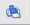
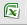
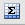
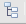
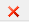
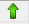

# Translations Overview

<web>

A **Translation** is a Fabric Studio object used for creating data transformation rules. The Translation editor exists in the Fabric .NET Studio only. In the Web Studio, the translations are presented as XML files and can be still used by the Fabric server, however there is no dedicated editor for them.

The Web Studio introduces a new object - **MTable** - to be used for defining the data transformation rules via several dedicated Actors.

[Click for more information about MTables.](06_mtables_overview.md)

</web>

<studio>

### What Is a Translation?

A Translation is a Fabric Studio object that transforms data from one set of valid values to another in order to enable the execution of various transformation rules. Translation objects can be used as decision tables in Fabric and can be defined either on a [Shared Object](/articles/04_fabric_studio/12_shared_objects.md) level or on a [Logical Unit](/articles/03_logical_units/01_LU_overview.md) level or both. 
*	Translations defined on a Shared Object level can be used in all objects in a project. 
*	When a Translation is used for [web services](/articles/15_web_services_and_graphit/01_web_services_overview.md), it must be defined on a Shared Object level.  

There are several options for populating data in a Translation in the Fabric Studio: 
*	Manual population via the Translation window. 
*	Retrieving the Translation’s data from a file. The data is loaded from the file once.
*	Retrieving the Translation’s data from a database to create a Dynamic Translation. The data is loaded from the database during each [sync](/articles/01_fabric_overview/02_fabric_glossary.md#sync) process.

[Click for more information about Data Population in Translations.](/articles/09_translations/03_data_population_in_a_translation.md#data-population-in-a-translation)

### How Can I Use a Translation in Fabric?
A Translation can be used when a [table population](/articles/07_table_population/01_table_population_overview.md) or [project function](/articles/07_table_population/08_project_functions.md) needs to apply transformation rules.
For example:
*	When there are several source systems, each having a list of valid values for the customer type attribute. The translation defines one unified set of valid values for the target (Fabric) and transformation rules from the input value (source) to the output value (target).
*	When there are several DB interfaces, the translation can map between the system name and its [DB interface](/articles/05_DB_interfaces/03_DB_interfaces_overview.md) name to be used in the code. 
*	When there is a list of attributes or business rules in the LU, the translation can define an SQL query for each attribute or business rule.

### Translation Window
Translations are defined via the translation window which has two tabs:
*	[Translation Schema tab](/articles/09_translations/01_translations_overview_and_use_cases.md#translation-schema), defines the Translation Schema properties. Each column in a Translation Schema must be either input or output and can have different data types.
*	[Translation Data tab](/articles/09_translations/03_data_population_in_a_translation.md#data-population-in-a-translation), which is populated by the translation’s values in the input and output fields. The data can be populated in a translation in several ways.

### Translation Schema Tab Icons
The following icons are displayed at the top of the **Translation Schema tab**:
<table>
<tbody>
<tr>
<td width="200pxl">

<strong>Icon</strong>

</td>
<td width="700pxl">

<strong>Action</strong>

</td>
</tr>
<tr>
<td width="56">&nbsp;&nbsp;</td>
<td width="446">

Print translation definition.

</td>
</tr>
<tr>
<td width="56">&nbsp;&nbsp;</td>
<td width="446">

Export translation definition as an Excel file.

</td>
</tr>
<tr>
<td width="56">&nbsp;&nbsp;</td>
<td width="446">

Filter definition by one or more columns.

</td>
</tr>
<tr>
<td width="56">&nbsp;&nbsp;</td>
<td width="446">

Toggle summaries.

</td>
</tr>
<tr>
<td width="56">&nbsp;&nbsp;</td>
<td width="446">

Toggle groupings.

</td>
</tr>
</tbody>
</table>

### Translation Options
The following options define system behavior when a matching translation is not found. Select an option from the dropdown list on the bottom of the **Translation Schema tab**. The *Use Default* option is always defined when a new translation is created and can be modified when needed.
<table>
<tbody>
<tr>
<td width="200pxl">

<strong>Option</strong>

</td>
<td width="700pxl">

<strong>Description</strong>

</td>
</tr>
<tr>
<td width="156">

Use Default

</td>
<td width="420">

Use the value defined in the <strong>Default Value</strong> column in the Translation Schema tab.

</td>
</tr>
<tr>
<td width="156">

Reject Record

</td>
<td width="420">

Rejects a single record.

</td>
</tr>
<tr>
<td width="156">

Reject Instance

</td>
<td width="420">

Rejects the entire instance.

</td>
</tr>
<tr>
<td width="156">

Report and Use Default

</td>
<td width="420">

Reports the missing value and uses the default value.

</td>
</tr>
</tbody>
</table>

### Translation Schema
The structure of a translation is defined in the Translation Schema tab and is comprised of Input and Output fields: 
*	There can be one or more than one Input field. 
*	A translation’s primary key is a combination of all translation input fields. The primary key defines which translation entries are used to apply the data transformation rules and therefore must be unique.   
*	An output value does not need to be unique and can be repeated. 

A Translation Schema has the following structure: 
<table width="614">
<tbody>
<tr>
<td width="200pxl">

<strong>Parameter Property</strong>

</td>
<td width="700pxl">

<strong>Description</strong>

</td>
</tr>
<tr>
<td width="141">

<strong>Title</strong>

</td>
<td width="472">

Name of the parameter.

</td>
</tr>
<tr>
<td width="141">

<strong>Direction</strong>

</td>
<td width="472">

Indicates whether a parameter is <strong>Input</strong> or <strong>Output</strong>.

</td>
</tr>
<tr>
<td width="141">

<strong>Type</strong>

</td>
<td width="472">

Parameter type. The following types are supported:

<ul>
<li>Integer.</li>
<li>Real.</li>
<li>Text.</li>
<li>Blob (applicable only for a DB that supports Blob).</li>
<li>Auto increment. Creates an automatic sequence starting from 1 and incremented by 1. The value cannot be updated by the user.</li>
<li><a href="/articles/07_table_population/08_project_functions.md"> Project function</a>. Fabric provides a list of all functions available in the project. The value must be selected from the dropdown list.</li>
<li><a href="/articles/07_table_population/08_project_functions.md#ludb-function"> LUDB function</a>, applicable for Translations on LU levels only. Fabric provides a list of LUDB functions available in the LU. The value must be selected from the dropdown list.</li>
<li><a href="/articles/06_LU_tables/01_LU_tables_overview.md"> LUDB table</a>, applicable for Translations on LU levels only. Fabric provides a list of LU tables available in the LU. The value must be selected from the dropdown list.</li>
<li><a href="/articles/05_DB_interfaces/03_DB_interfaces_overview.md"> DB Interface</a>. Fabric provides a list of the Interfaces in the project. The value must be selected from the dropdown list.</li>
<li>SQL. Fabric enables testing the SQL query by opening a <a href="/articles/11_query_builder/01_query_builder_overview.md"> Query Builder</a> from the Table Schema window.</li>
<li><a href="/articles/03_logical_units/01_LU_overview.md "> LU Name</a>, applicable for Translations on a Shared Objects level only. Fabric provides a list of all LU available in the project. The value must be selected from the dropdown list.</li>
</ul>
</td>
</tr>
<tr>
<td width="141">

<strong>Length</strong>

</td>
<td width="472">

Field length, max number of characters. Populated automatically for several types, for example Project function. Ignored for Blob and Auto increment types.

</td>
</tr>
<tr>
<td width="141">

<strong>Match</strong>

</td>
<td width="472">

Optional: A Regular expression that indicates a restricted format for each value and is applied for manual Translation population only. Ignored for Blob and Auto increment types.

</td>
</tr>
<tr>
<td width="141">

<strong>Default Value</strong>

</td>
<td width="472">

Default value used when no entry is found (relevant for an Output setting).

</td>
</tr>
<tr>
<td width="141">

<strong>Allow NULL</strong>

</td>
<td width="472">

True / False indicates whether the setting can be NULL. Default is True.

</td>
</tr>
<tr>
<td width="141">

<strong>Comment</strong>

</td>
<td width="472">

Optional: Additional information.

</td>
</tr>
</tbody>
</table>

Note that all Translation Schema constraints are only applied in the Fabric Studio. The Fabric Server uses the data only and not the Schema’s information.
The following icons are displayed next to each Translation setting:
<table>
<tbody>
<tr>
<td width="200pxl">

<strong>Icon</strong>

</td>
<td width="700pxl">

<strong>Action</strong>

</td>
</tr>
<tr>
<td width="56">&nbsp;&nbsp;</td>
<td width="417">

Deletes the Translation row.

</td>
</tr>
<tr>
<td width="56">&nbsp;&nbsp;</td>
<td width="417">

Moves the Translation row up.

</td>
</tr>
<tr>
<td width="56">&nbsp;&nbsp;</td>
<td width="417">

Moves the Translation row down.

</td>
</tr>
</tbody>
</table>

&nbsp;

</studio>

