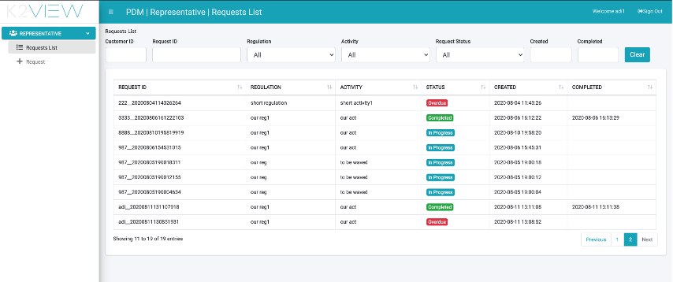
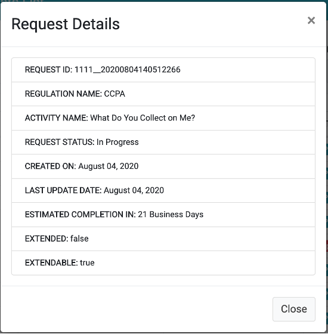

# Representative User Interface

A Customer Service Representative that supports the DPM processes should have his user assigned to a corporate role that is mapped to the Representative DPM Application role. 
A Representative can:

- Search for Requests that were previously submitted.
- Submit a new Request. 

 

## Representative Search a Request

Under the Representative menu, select the “Requests List” menu option. The screen that is presented includes the list of existing requests and allows searching for a specific request based on multiple parameters.

<table>
<tbody>
<tr>
<td width="100">

<strong>Column</strong>

</td>
<td width="800">

<strong>Description</strong>

</td>
</tr>
<tr>
<td width="100">

Request ID

</td>
<td width="800">

The unique identification of the request.

</td>
</tr>
<tr>
<td width="100">

Regulation

</td>
<td width="800">

The Regulation that this request was created for.

</td>
</tr>
<tr>
<td width="100">

Activity

</td>
<td width="800">

The Activity that this Request executes.

</td>
</tr>
<tr>
<td width="100">

Status

</td>
<td width="800">

The Request status. Values may be: In Progress, Completed, Stopped. A Stopped Request is a Request that during its execution the system identified it should stop the execution. For example, if there is a validation that the same customer cannot open two equal Requests, and there is already another Request for this same customer and Activity which is still in progress

</td>
</tr>
<tr>
<td width="100">

Created

</td>
<td width="800">

The date and time that the Request was submitted.

</td>
</tr>
<tr>
<td width="100">

Completed

</td>
<td width="800">

The date and time that the Request was completed (completed requests only).

</td>
</tr>
</tbody>
</table>

For the search criteria that are selected by a drop-down list or selecting a date: Regulation, Activity, Request Status, Created and Completed – the search is executed as soon as a value is selected. 
For the search criteria which allow typing: customer ID and Request ID, the search is invoked as soon as the representative types 3 characters or more. 
Once the search results are presented, the representative can view further details of a specific request by clicking the row of this request:

<table>
<tbody>
<tr>
<td width="100">

<strong>Field</strong>

</td>
<td width="800">

<strong>Description</strong>

</td>
</tr>
<tr>
<td width="100">

Request ID

</td>
<td width="800">

The unique identification of the request.

</td>
</tr>
<tr>
<td width="100">

Regulation name

</td>
<td width="800">

The Regulation that this request was created for.

</td>
</tr>
<tr>
<td width="100">

Activity name

</td>
<td width="800">

The Activity that this Request executes.

</td>
</tr>
<tr>
<td width="100">

Request Status

</td>
<td width="800">

The Request status.

</td>
</tr>
<tr>
<td width="100">

Created on

</td>
<td width="800">

The date and time that the Request was submitted.

</td>
</tr>
<tr>
<td width="100">

Last Update Date

</td>
<td width="800">

The last time this request was updated. The Request is updated as its execution is progressing &ndash; so this date indicates the last date that a Task was executed in the Flow that is fulfilling this Request.

</td>
</tr>
<tr>
<td width="100">

Estimated completion in

</td>
<td width="800">

The number of days till the request is expected to be completed. The number of days is calculated based on the Request creation date and the Activity SLA.

</td>
</tr>
<tr>
<td width="100">

Extended

</td>
<td width="800">

Indicates if the Request SLA was extended. The values are true/false

</td>
</tr>
<tr>
<td width="100">

Extendable

</td>
<td width="800">

Indicates if the Request SLA can be extended. This depends on the configuration of the Activity of this task.

</td>
</tr>
</tbody>
</table>

 ## Representative Submits a Request

A representative can submit a request on behalf of a customer, using the “Submit a Request” button that is located on the search screen or by using the menu on the left. The list of requests type and the information that should be provided for each of them is defined by implementation using the Admin module.

When submitting a new request, the representative first selects the regulation that applies to the customer out of the Regulation dropdown list and fills the customer number at the Customer field. 
The representative can add notes to the Request before submitting it. 
The list of Request Types options that is presented at the bottom of the submission form changes according to the selected Regulation.
Once the Request type is selected, the right side of the form presents the list of fields that should be completed before submitting the request. This list is automatically adapted in accordance with the Request type.

<table>
<tbody>
<tr>
<td width="100">

<strong>Field</strong>

</td>
<td width="800">

<strong>Description</strong>

</td>
</tr>
<tr>
<td width="100">

Regulation

</td>
<td width="800">

The Regulation that applies to the customer that is asking to submit a request.

</td>
</tr>
<tr>
<td width="100">

Customer

</td>
<td width="800">

The customer identification of the customer that is asking to submit the request

</td>
</tr>
<tr>
<td width="100">

Notes

</td>
<td width="800">

Free text. Comments that the representative would like to be registered as part of the request.

</td>
</tr>
<tr>
<td width="100">

Request Type

</td>
<td width="800">

The specific Request that should be submitted. The options in this section depend on the selected Regulation.

</td>
</tr>
<tr>
<td width="100">

Request Form Fields

</td>
<td width="800">

Depending on the selected Request Type, different fields will be presented in this section, and the representative should populate them according to the information of the requesting customer.

</td>
</tr>
</tbody>
</table>

