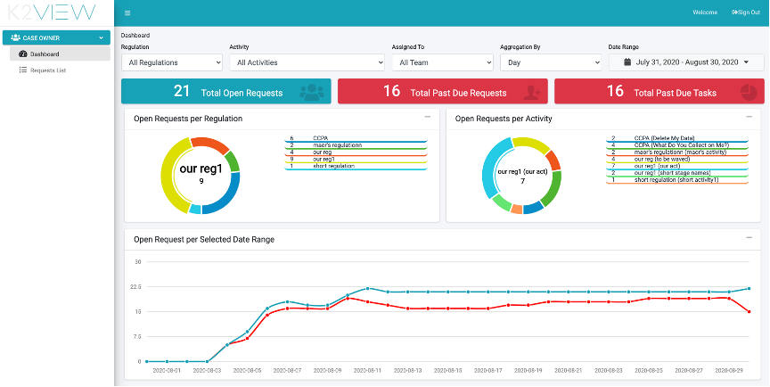
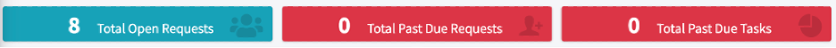
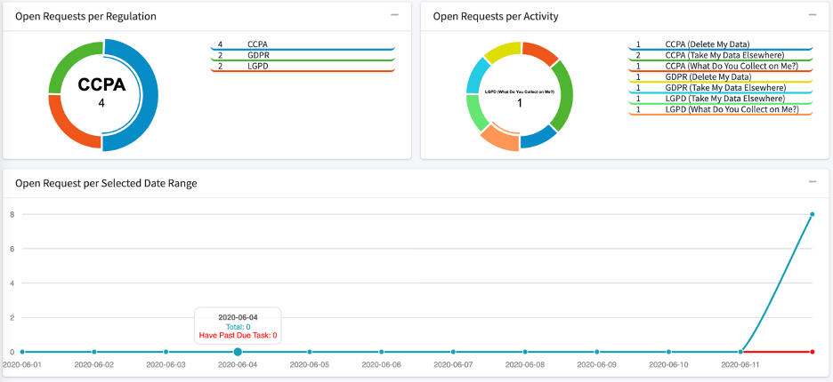
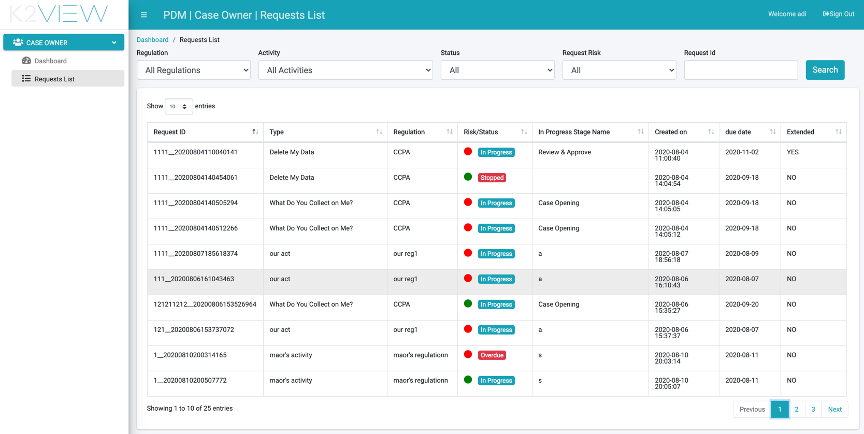
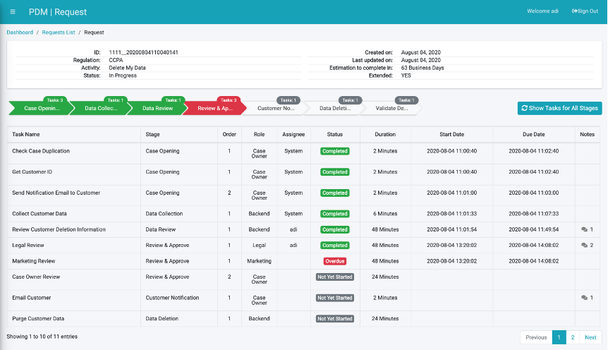
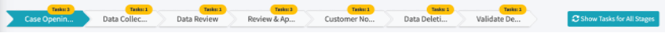
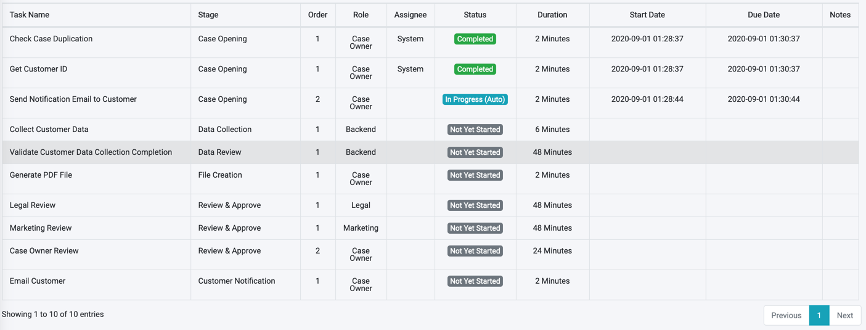

# Case Owner User Interface

A Case Owner is the role that is responsible to assure the fulfilment of the DPM requests within the established SLA. The case owner is expected to monitor the DPM Requests that are allocated to him and act if one of the Requests seems not to progress as expected. 
Every open request is automatically allocated to a specific member of the Case Owners group. This automatic allocation is configurable by the Case Owner Supervisor. For further details on the allocation configuration options, please check the Supervisor user interface.

## Case Owner Dashboard

When a member of the Case Owners group logs into the DPM system, the initial screen that is presented is the Case Owner Dashboard:

 

The dashboard provides an overall status of the requests currently in process in the DPM system. Based on the information presented in this screen the case owner can identify bottlenecks in the process and evaluate risk of missed SLAs.

### Case Owner Dashboard Filters:

The graphs in the dashboard can be filtered based on a set of parameters that appear a at the upper part of the screen. The filters can be:

- Regulation – Filter the information presented in the dashboard to Requests of a specific Regulation
- Activity - Filter the information presented in the dashboard to Requests of a specific Activity
- Assigned to - Filter the information presented in the dashboard to Requests of a specific case owner or if to present the information about Requests regardless of their Case Owner.
- Aggregation by – This filter impacts the graph of “Open Requests per Selected Date Range” in the area below the filters line. It defines the time units of the horizontal Axis. If “Month” is selected, then the open requests would be aggregated per month. If “Day” is selected, then the graph will present the information per day.
- Data Range – this filter defines the date range that is used to filter the open Requests. 

 

The selection made in those filters impacts the information presented in the totals and graphs that are presented at the lower sections of the dashboard.

### Case Owner Dashboard Totals:

The totals in the dashboard reflect the list of DPM Requests that match the selection criteria specified by the dashboard filters:

- Total Open Requests – the total number of requests which are in progress. 
- Total Past Due Requests – The total number of requests that have exceeded the expected SLA period for their Activity.
- Total Past Due Tasks – The total of tasks in progress that have exceeded the expected SLA period of the task. 

 

Clicking each of those totals will take the user to the “Requests List” screen, which will present the Requests that answer the conditions of this total.

### Case Owner Graphs:

- Open Requests per regulation – a view of the distribution of the open requests per Regulation.
- Open Requests Per Activity – a view of the distribution of the open requests per Regulation and Activity type.
- Open Requests per Selected Date Range – this graph shows the distribution of the open requests according to the request submission date. The blue line on the graph indicates the number of open Requests. The red line indicates how many of those requests have at least one Task that is overdue. 

 

## Case Owner Requests List

The Case Owner Requests List presents to the Case Owner the list of Requests that are under his responsibility.

 

The Request list can be filtered based on: 

- Regulation – Filter to present only Requests of a specific Regulation
- Activity - Filter to present only Requests of a specific Activity.
- Status - Filter by Request status.
- Request Risk – This filter enables the user to present only requests which are under risk of missing the overall request SLA.
- Request ID – search for a specific Request. 

The Request List table presents the following information:

<table>
<tbody>
<tr>
<td width="100">

<strong>Field</strong>

</td>
<td width="800">

<strong>Description</strong>

</td>
</tr>
<tr>
<td width="100">

Request ID

</td>
<td width="800">

The unique identification of the request.

</td>
</tr>
<tr>
<td width="100">

Type

</td>
<td width="800">

The Activity that this Request executes.

</td>
</tr>
<tr>
<td width="100">

Regulation

</td>
<td width="800">

The Regulation that this request was created for.

</td>
</tr>
<tr>
<td width="100">

Risk/Status

</td>
<td width="800">

This fields includes both the Request status as well as an indication if the request is under any type of risk. This is presented with the colored circle on the left side of the status: Red color indicates that the Request is past due to that one or more of its Tasks are past due. Green indicates that the Request is on track.

</td>
</tr>
<tr>
<td width="100">

Created on

</td>
<td width="800">

The date and time that the Request was submitted.

</td>
</tr>
<tr>
<td width="100">

Due date

</td>
<td width="800">

The expected completion date based on the Request creation date and the Activity SLA.

</td>
</tr>
<tr>
<td width="100">

Extended

</td>
<td width="800">

Indicates if the Request SLA was extended. The values are Yes/No.

</td>
</tr>
</tbody>
</table>

## Case Owner Request Details

From the Requests List screen, the case owner can click on the row of a specific Request in order to open the Request Details Screen:

 

This screen presents to the Case Owner the full view of the request, complete with all its details. 

At the upper part of the screen, general information about the Request is presented:

 

Under the header section, the different stages that make part of the Request process are presented: 

 

Stages that were already completed are presented in green. The current Stage is presented in blue if it is on track, and red if it is past due. Future Stages appear in grey. 

The number of Tasks in the Stage is presented on top of every stage. If a Stage includes a Task that is overdue, then the Tasks count is presented in red.

The Case Owner can navigate between the stages by clicking on the Stage section in this chart. Navigating to one of the stages will present only the tasks that make part of the selected Stage. The view of all Tasks can be restored by clicking the “Show Tasks for All Stages” button. 

At the bottom of the screen, the list of Tasks is presented:

 

<table>
<tbody>
<tr>
<td width="100">

<strong>Field</strong>

</td>
<td width="800">

<strong>Description</strong>

</td>
</tr>
<tr>
<td width="100">

Task Name

</td>
<td width="800">

The name of the Task.

</td>
</tr>
<tr>
<td width="100">

Stage

</td>
<td width="800">

The Stage that this Task makes part of.

</td>
</tr>
<tr>
<td width="100">

Order

</td>
<td width="800">

The order of this Task within its Stage (details about the Task order are described in the Flow chapter).

</td>
</tr>
<tr>
<td width="100">

Role

</td>
<td width="800">

The Corporate Role that is defined as the owner of this Task and expected to execute it.

</td>
</tr>
<tr>
<td width="100">

Assignee

</td>
<td width="800">

The user that is executing the Task. Only populated if a user took ownership on a Task by clicking the &ldquo;Get&rdquo; button at the Task details screen.

</td>
</tr>
<tr>
<td width="100">

Task Status

</td>
<td width="800">

The Task status.

</td>
</tr>
<tr>
<td width="100">

Duration

</td>
<td width="800">

The duration that this Task is expected to take. The time unit that measures the duration can be configured. Hours is the most common configuration

</td>
</tr>
<tr>
<td width="100">

Start Date

</td>
<td width="800">

The date and time that the Task execution was started. Only populated for Tasks that are already in the execution phase.

</td>
</tr>
<tr>
<td width="100">

Due Date

</td>
<td width="800">

The date and time that the Task was completed. Filled only for a Task that was already completed.

</td>
</tr>
<tr>
<td width="100">

Notes

</td>
<td width="800">

This field indicates if notes were submitted for this Task.

</td>
</tr>
</tbody>
</table>

The Case Owner can select a specific Task to view it in detail.

## Case Owner Task Details

When the Case Owner selects a specific Task from the Request Details screen, the DPM opens the Task Details screen:

 

The content and Activities that can be executed in this screen are the same as those of the Task Details screen at the Steward interface. Please refer to the Steward chapter for additional information.

