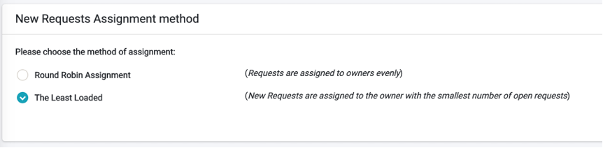

# Supervisor User Interface

The Supervisor role is to oversee the overall DPM process. 
A Supervisor can:

- View the Requests Dashboard 
- View the Requests List 
- Configure the way new Requests are allocated to a Case Owner

 

## Supervisor Requests Dashboard

The Supervisor Dashboard is equal to the Case Owner Dashboard. For additional information please refer to the Case Owner chapter.

## Supervisor Requests List

The Supervisor Request List and subsequent Request Details and Task Details screens are the same screen as presented to the Case Owner.

## Supervisor Case Owner Allocation Configuration 

A supervisor is responsible for the configuration of how new DPM requests are allocated to the users that make part of the Case Owners team: Whenever a new Request is submitted, the system will automatically select one of the users that are defined as Case Owners, and will allocate the new Request to this user. The resource management screen is where the Supervisor can configure the method that the system uses in order to select one of the users
The supervisor accesses the screen of assignment method configuration by using the    menu option.

 

There are two categories of configuration:

- Assignment method – defines how to allocate a new Request if there is more than one Case Owner that could take this ownership. 
- Assignment criteria – refinement of the assignment method, allowing the supervisor the indicate specific Case Owners as responsible for cases of a specific Regulation or Activities under a specific regulation.

### Assignment Method

The Assignment method is defined in the upper section of the Resource Management screen:

 

The supervisor can select if new Requests would be allocated to Case Owners based on:

- Round Robin assignment – New Requests are allocated to the Case Owners in turns. With this assignment method all the Case Owners are assigned an equal share of the Requests.
- The Least Loaded – New Requests are allocated to the Case Owner that has the smallest number of open Requests. 

### Assignment Criteria 

The Assignment Criteria is defined in the lower section of the Resource Management screen:

 

The assignment criteria provide the ability to define who are the Case Owners that are responsible for a specific Regulation or for a specific Activity under this Regulation. 
If the option that is selected is  , it means no special criteria should be used, and the system will simply follow the assignment method that was selected in the upper section of the screen (see previous sub-chapter).

To activate the option to define Case Owners per Regulation, select the option  . This present to the user the list of regulations active in the DPM system and allows to define for each Regulation one or more users that can be allocated to Requests opened for this Regulation. In the example above, CCPA Requests would be allocated only to the Case Owner called “John Blake”, the GDPR Requests can be allocated to either “John Blake” or “Linda Pie”, and HAWAII_SB418 Requests can be allocated to any Case Owner. 

To define who are the users that are allocated to each Regulation, click the line of the Regulation you want to configure. The system opens a pop-up screen that allows to select one or more of the Case Owner users. 

 

The next level of assignment criteria is the  . When this option is switched on, the supervisor can define additional assignment criteria at the Activity level. In the example above, every Request of the Regulation CCPA and Activity “What Do You Collect on Me” will be allocated to the Case Owner user called “Linda Pie”. 
To add new assignment criteria at the Activity level, use the   option at the right side of the screen. This opens a pop-up screen where the supervisor can select the Regulation, Activity and one or more Case Owners that should be responsible for the Requests of this kind. 

 

