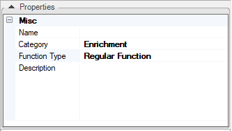
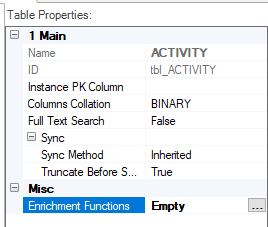
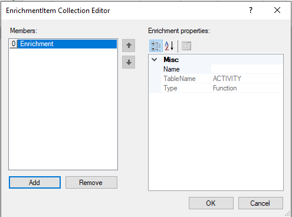
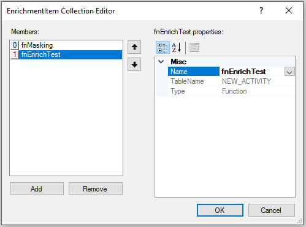

# Creating or Editing an Enrichment Function

An Enrichment function is a [Project function](/articles/07_table_population/08_project_functions.md) without Input / Output parameters that is used to insert, update, or delete an LU Table's data after it has already been populated from a source object. It is defined as a specific category of Fabric [Regular functions](/articles/07_table_population/08_project_functions.md).

### How Can I Create or Edit an Enrichment Function?

The steps for creating an Enrichment function in Fabric Studio are the same as those for a Regular function. 

<web>

When editing the Java script file, define the function as a *public class Enrichment*.

</web>

<studio>

The steps which are unique for Enrichment functions are as follows:

1. In the **Function Properties** tab, set the **Function Type** to **Regular Function**. 
2. Do not define Input / Output parameters.
3. It is recommended to set the **Category** to **Enrichment**.

</studio>

[Click for more information about How to Create a Project Function.](/articles/07_table_population/10_creating_a_project_function.md)

<web>

### How Do I Attach or Remove an Enrichment Function?

An Enrichment function must be attached to one or more [LU tables](/articles/06_LU_tables/01_LU_tables_overview.md) in the [LU schema](/articles/03_logical_units/03_LU_schema_window.md) to be executed during the [LUI sync](/articles/14_sync_LU_instance/01_sync_LUI_overview.md). 

Do the following:

1. Go to **Project Tree** > **Implementation** > **Logical Units** > [**LU Name**] > **Tables** > [**Table Name**] to display the **Table Schema** window.
2. Click the side arrow icon  to open the Table Properties window. 
3. Open the **Enrichments** tab.
4. Click the  icon in the **Enrichments** tab to add an existing Enrichment function from the list. 
5. If needed, add additional Enrichment functions and use the arrows to set the correct execution order.
6. To remove an Enrichment function, click  icon next to the Enrichment function definition in the Table Properties.
7. **Save** the LU Table (File > Save or CTRL-S). 

</web>

<studio>

### How Do I Attach an Enrichment Function to an LU Table?

An Enrichment function must be attached to one or more [LU tables](/articles/06_LU_tables/01_LU_tables_overview.md) in the [LU schema](/articles/03_logical_units/03_LU_schema_window.md) to be executed during the [LUI sync](/articles/14_sync_LU_instance/01_sync_LUI_overview.md). 

Do the following:
1. Go to **Project Tree** > **Logical Units** > [**LU Name**] > **Tables** > [**Table Name**] to display the **Table Schema** window.

2. To attach the Enrichment function using the [LU Table Properties tab](/articles/06_LU_tables/04_table_properties.md), click the **three dots** next to the **Enrichment Functions** option to open the **Enrichment Item Collection Editor**. 

   

3. Click **Add** and then click the area next to **Name** to display the list of Enrichment functions. Note that only the functions without Input and Output parameters are displayed.

   

4. Select the function from the list. 

5. (Optional) To add more **Enrichment functions** to the same LU table, click **Add** again and select the additional functions. Define the Enrichment functions execution order using the **arrows** next to the **function names** in the **Editor**.

   

6. Click **OK** to close the Editor.

7. **Save** the table.

8. Open the **LU Schema > Enrichment Order** tab to verify that the enrichment order of all the Enrichment functions in the LU is correct. Note that you can [edit the enrichment order](/articles/03_logical_units/14_edit%20enrichment%20order.md#edit-enrichment-order) on the LU schema level.

### How Do I Remove an Enrichment Function from an LU Table? 

To remove an Enrichment function from the LU table, do the following:

1. Go to **Project Tree** > **Logical Units** > [**LU Name**] > **Tables** > [**Table Name**] to display the **Table Schema** window.

2. In the [Table Properties tab](/articles/06_LU_tables/04_table_properties.md), click the **three dots** next to the **Enrichment Functions** option to open the **Enrichment Item Collection Editor**.

   

3. Select the function and click **Remove**.

4. Click **OK** to close the Editor.

5. **Save** the table.

</studio>
