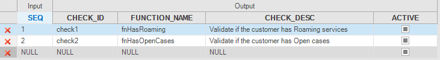
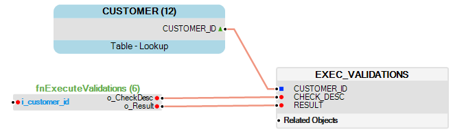
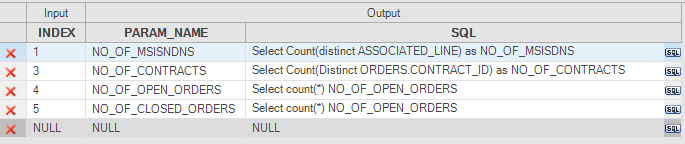
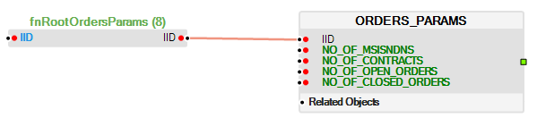

<web>

# Enrichment Functions - Code Example 

</web>

<studio>

# Enrichment Functions - Code Examples

</studio>

### Example of an Enrichment Function that Populates a Table's Field

Use an Enrichment function to validate the retrieved data and update a table. For example, to calculate the number of months a case is not Closed and populate this information in the CASES table for each case, whereby for all Closed cases - set the number of month to 0.

1. Create an **Enrichment function**.

   ~~~java
   String caseStatus = "Closed";
   String sqlNotClosed = "UPDATE CASES SET CASE_OPEN_MONTHS = "+
     "(SELECT round((julianday('now') - julianday(C2.CASE_DATE))/365*12) from CASES C2 "+
     " WHERE C2.CASE_ID = CASES.CASE_ID AND C2.STATUS != ?)";
   ludb().execute(sqlNotClosed,caseStatus);
   String sqlClosed = "UPDATE CASES SET CASE_OPEN_MONTHS = 0 WHERE STATUS = ?";
   ludb().execute(sqlClosed,caseStatus);
   ~~~

2. Add a new column to the **CASES table** and attach the **Enrichment function** to the **CASES table** via the Table Properties tab. 

A detailed example of the **fnMonthsOpenCase** Enrichment Function can be found in the Demo project.

<studio>

### Complex Example of Several Validations, Including the Use of an Enrichment Function 

Run validation functions to validate LUI data during the [Sync process](/articles/14_sync_LU_instance/01_sync_LUI_overview.md) and save the results in a dedicated LU table. Then run an Enrichment function to check the validation results and update a **Validation Indicator** column in the LU table based on the validation results. The following example describes the validation check if a customer has roaming services and Open cases. It saves the validation results in an LU table and updates CUSTOMER LU table accordingly:

1. Create the validations as a set of [Regular Project functions](/articles/07_table_population/08_project_functions.md#regular-function) - one per each validation. For example, the **fnHasRoaming** function:

   ~~~java
   String roamingService = "Roaming special";
   String sql = "SELECT count(*) FROM SUBSCRIBER WHERE CONTRACT_DESCRIPTION=? ";
   Db.Rows rows = ludb().fetch(sql, roamingService);
   Integer hasRoaming = Integer.parseInt(rows.firstValue().toString());
   if (hasRoaming > 0){
   	return  "Customer has Roaming services !!";
   }
   else
   	return  "OK";
   ~~~

2. Define a new [translation object](/articles/09_translations/02_creating_a_new_translation_in_fabric.md) and populate it using the list of validation functions, created in Step 1. Check the relevant translation entries as **Active** so that you can include their validations as needed. For example, a **trnValidationFuncList** translation.

   

3. Create a new [LU table](/articles/06_LU_tables/02_create_an_LU_table.md) populated by a [Root function](/articles/07_table_population/08_project_functions.md#root-function) that executes the validations and populates the results in the table. For example, the **EXEC_VALIDATIONS** table is populated by the **fnExecuteValidations** Root function in the **popExecValidations** population.

   
   
   ~~~java
   	Map <String, Map <String,String>> ChecksTrn = getTranslationsData("trnValidationFuncList");
   	String Func = null;
   
   	for(java.util.Map.Entry<String, Map <String,String>> trnVals : ChecksTrn.entrySet()){
   		Map <String,String> trnVal = (Map <String,String>) trnVals.getValue();
   		// Checks that the record is active
   		if(trnVal.get("ACTIVE") != null && rnVal.get("ACTIVE").equalsIgnoreCase("false"))
   			continue;
   		String CheckDesc = trnVal.get("CHECK_DESC");
   		String FuncName = trnVal.get("FUNCTION_NAME");
   
   		if(FuncName != null && !FuncName.isEmpty() ){
   	    		String Result =  Factory.valueOf(FuncName).invoke();			
   	    		yield(new Object[]{CheckDesc,Result});
   		}
   	}
   ~~~

4. Create an **Enrichment function**. For example, an **fnCheckValidationsResults** Enrichment function that will go over the results in the table and update a specific indicator in the CUSTOMER table.

   ~~~java
   String sqlSelect = "SELECT count(*) FROM EXEC_VALIDATIONS WHERE RESULT !='OK'";
   Db.Rows rows = ludb().fetch(sqlSelect);
   Integer validationsNotOK = Integer.parseInt(rows.firstValue().toString());
   if (validationsNotOK > 0){
   	String sqlUpdate = "UPDATE CUSTOMER SET VALIDATIONS_NOT_PASSED = ?";
   	ludb().execute(sqlUpdate, validationsNotOK);
   }
   ~~~

5. Attach the **Enrichment function** to the **EXEC_VALIDATIONS** table via the **Table Properties** tab. 

Full example of the code in all the above functions can be found in the Demo project.

### Example of an Enrichment Function that Populates the Param Table

A common scenario in Test Data Management (TDM) projects is to add a Parameters [LU table](/articles/06_LU_tables/02_create_an_LU_table.md) to the LU schema, populate it and then aggregate the LU's parameters for business logic and validations. For example, in the Orders LU to get various parameters like the number of MSISDNS or the number of open orders for each Order type, define the list of parameters and the SQL query to be executed on the LU tables for each parameter in a [translation object](/articles/09_translations/01_translations_overview_and_use_cases.md). The Enrichment function then executes the SQL queries for each parameter and populates the Parameters LU table.

1. Create a new **translation** named **trnOrdersParams** that defines a list of parameters and an SQL query for calculating each parameter.

   
   
2. Create a new [LU table](/articles/06_LU_tables/02_create_an_LU_table.md) named **ORDERS_PARAMS** which is populated by a dummy **fnRootORdersParams** [Root function](/articles/07_table_population/08_project_functions.md#root-function), the actual population of the table is implemented by the enrichment function.

   

   ~~~java
   if (1 == 2) yield(new Object[]{null});
   ~~~

3. Create an Enrichment function named **fnEnrichmentOrderParam** that retrieves and loops over the translation's data, calculates the parameter and populates it into the target ORDERS_PARAMS [LU table](/articles/06_LU_tables/01_LU_tables_overview.md) for each entry.

   ~~~java
      Map<String,Map<String,String>> data = getTranslationsData("trnOrdersParams");
      StringBuilder stringInsertFabricLuParam = 
      new StringBuilder().append("INSERT OR REPLACE INFO ORDERS_PARAMS (IID, ");
      String prefix = "";
      ...
      if(data.size() > 0){
      
      	// Loop on the translation record
   	for(String index: data.keySet()) {
      	   ...
       	   // Get the SQL query for each parameter
   	    String sql = valMap.get("SQL");
       		...
      	   //Run the SQL statement on the LU
   	    Db.Rows rows = ludb().fetch(sql);
      	   ...
      	   // Build the insert statement by the parameters and their values
              String insertSQL = stringInsertFabricLuParam.append(sqlInsertBind).toString();
   	
   	} // end of loop on the translation values
        
        //Insert a new record to ORDERS_PARAM
       ludb().execute(insertSQL, params);
      }
   ~~~

Full example of the **fnEnrichmentOrderParam** function can be found in the Demo project.

</studio>

