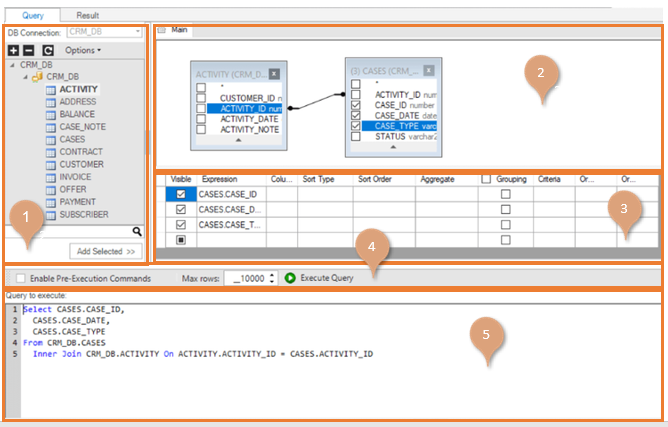
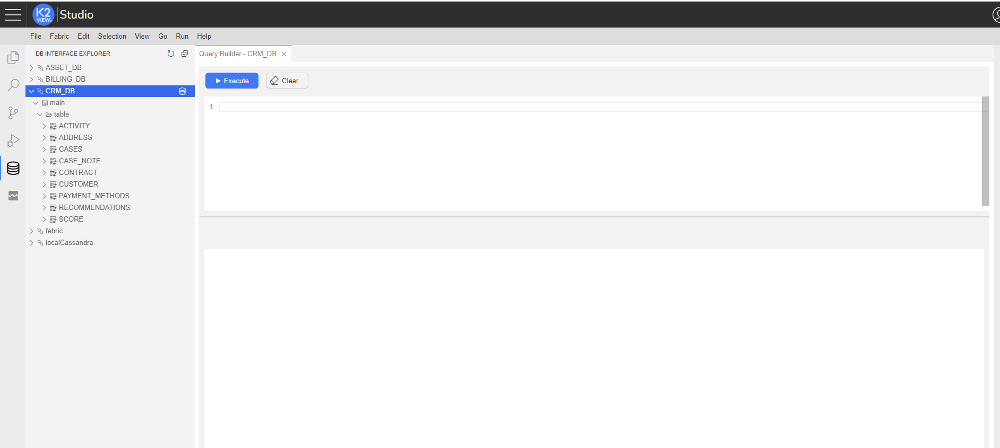
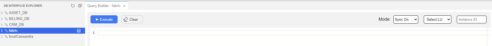

# Query Builder Window

The Query Builder is an embedded visual query building component that allows you to build complex SQL queries on a selected [DB Interface](/articles/05_DB_interfaces/03_DB_interfaces_overview.md) using an intuitive interface. 
The Query Builder window has two parts: 

* [Query](/articles/11_query_builder/02_query_builder_window.md#query-tab), where you can build and run an SQL query on selected DB Tables, Views or Synonyms. 
* [Results](/articles/11_query_builder/02_query_builder_window.md#result-tab), which displays the results of the executed SQL query. 

> Note: 
> The [DB Interface](/articles/05_DB_interfaces/03_DB_interfaces_overview.md) has a [Schema Filter](/articles/05_DB_interfaces/03_DB_interfaces_overview.md#schema-filter) setting which enables filtering the DB Schema’s list that is used by the Query Builder and the [DB Queries](/articles/07_table_population/01_table_population_overview.md) in the DB Interface.

<studio>

### Query Tab

 The Query tab enables you to build and run an SQL query on selected DB Tables and is divided into the following working areas:
1. DB Tree (top left), enables selecting a Project’s [DB interface](/articles/05_DB_interfaces/04_creating_a_new_database_interface.md) from the DB Interfaces dropdown list and displays a tree of DB objects (Tables, Views, and Synonyms) and their columns of the selected DB interface.
2.	Main Window (top right), displays a graphical map of the selected tables and columns for the SQL query. 
3.	Selected Columns Table (bottom right), displays the same information as the Main Window in a tabular format and enables editing the SQL query. 
4.	Query Settings toolbar.
5.	Query display (bottom of the window), displays the generated SQL statement which can be edited manually.

### Result Tab
Displays the data that is received from the executed query. Click **Export to Excel** to export the data into an Excel file.   

</studio>

<web>

When opened via the [DB Interface Explorer](/articles/04_fabric_studio/25_web_data_explorer.md), the Query Builder is opened the right main panel

When Opened from Schema Editor, Graphit or Broadway, the Query Builder is opened as popup window

You can open Query Builder where Fabric is the data source. In this case, several fields will be shown at the Query Editor window top bar: Sync mode, Select LU, Instance ID. Fill in and set their values and accordingly the query will be executed.

> You can control of the Query Editor and Results windows sizes: Hover your mouse on the horizontal separator, which appears between these parts, and you will see the ellipsis indication and your cursor type will turn to be cursor-resize . Then use the cursor to resize the windows heights.

</web>

