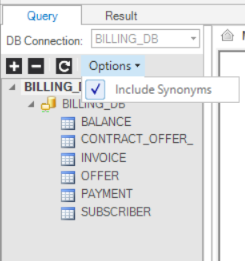
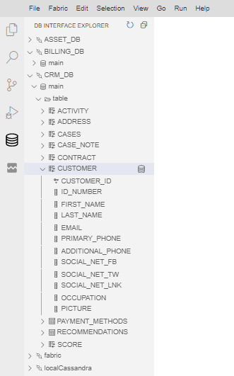
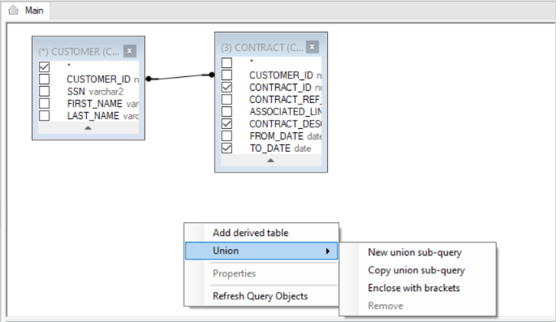
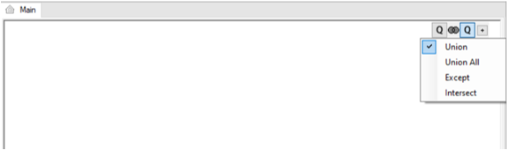
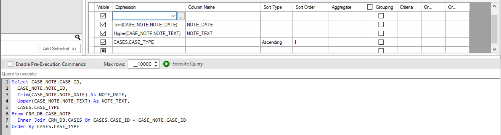
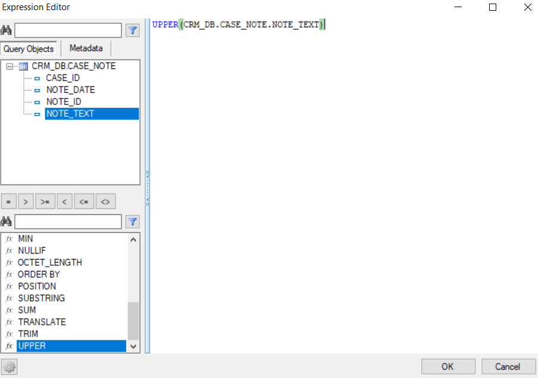
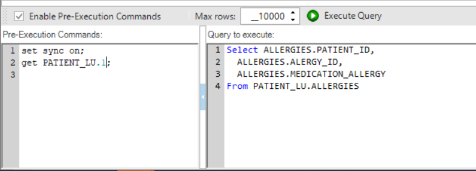
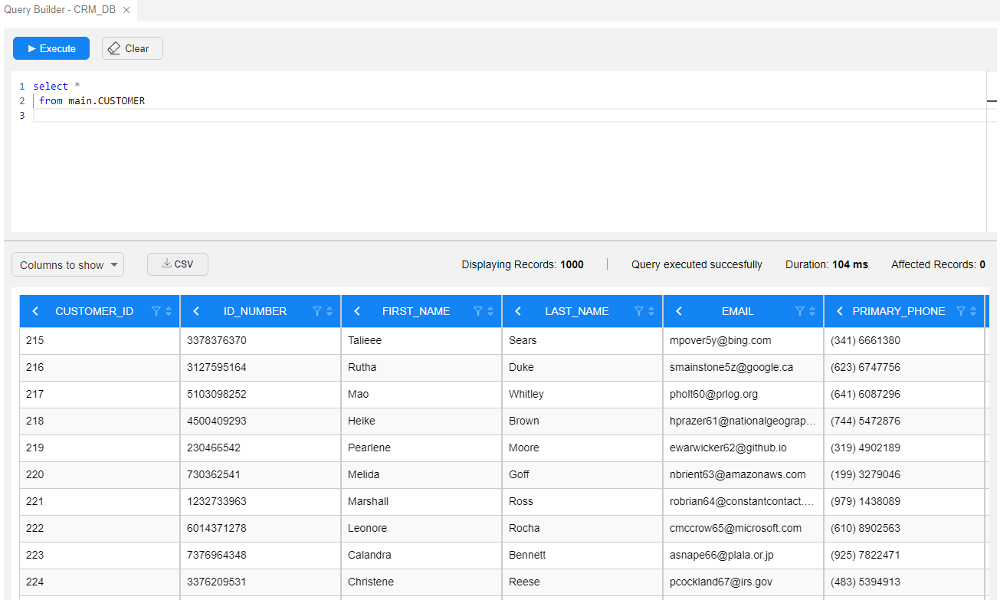
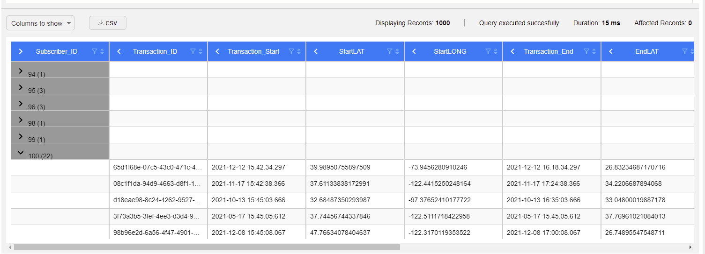

# Using the Query Builder - Building and Running an SQL Query

<studio>
​    

1.	Go to [**Query Builder**](/articles/11_query_builder/01_query_builder_overview.md) > **DB Connection** > [**DB Interface**](/articles/05_DB_interfaces/01_interfaces_overview.md). The [List of DB objects](/articles/11_query_builder/03_building_and_running_an_sql_query.md#query-tab---viewing-the-list-of-db-objects) (Tables, Views and Synonyms) of the DB connection is displayed in the DB Tree. 
  2.Create and edit the **SQL query**. You can either create the **SQL query** manually or edit an SQL query using the [Query Builder window](/articles/11_query_builder/02_query_builder_window.md). 
  3.To execute the SQL statement, click on **Execute Query**.
  4.Open the [**Results tab**](/articles/11_query_builder/02_query_builder_window.md#result-tab) to view the **SQL results**.

Note: The Insert, Update and Delete statements (performed by the DB query) may cause an auto-commit to the DB (based on the DB driver’s definition). 

## Query Tab - Viewing the List of DB Objects
* Click the **+** or **–** icons to expand or collapse the list in the DB objects.
* Click **Refresh** to refresh the DB objects list. 
* Click **Options** and check/uncheck the **Include Synonyms** options to include or exclude the DB Synonyms from the DB objects list.

</studio> 
<web>

## Viewing the List of DB Objects
Expand or collapse the DB objects tree. The below image shows how it looks like when opened via the DB Interface Explorer, where similar tree appear at Query Builder popup (when opened at Schema Editor, Graphit and Broadway)

  

</web>
<studio>    

## Main Window - Editing an SQL Query  

### 1. Adding a DB Object to the Main Window
Select the **DB object** (Table, View or Synonym) from the **DB Tree** and do either:
* Double-click the **DB object**.
* Select the **DB objects** and drag them to the **Main** window.
* Select the **DB objects** and click on **Add Selected**.
  The selected DB objects are added onto the Main window and their SQL statement is displayed in the [Query window](/articles/11_query_builder/02_query_builder_window.md#query-tab).

### 2. Removing a DB object from the Main Window
Either click the **DB object** and press **Delete** on your keyboard or right-click the **DB object** > **Remove**. 
Note: The removal of a DB object automatically updates the SQL query in the **Query Builder** window.

### 3. Selecting the Columns in a DB Object 
To select columns from a DB object, do either:
* Check specific **columns** in the **DB object** to include them in the SELECT statement.
* Click the **asterisk** in the **DB object** to generate the following SQL syntax: <pre><code> Select * from [Table Name]; </code></pre>

* Right-click on the **DB object** > **Check All** to check all the columns in the table and add them to the SQL query.

### 4. Removing the Selected Columns in a DB Object
To remove columns from a DB object, do either:
* Uncheck the selected columns. 
* Right-click on the **DB object** > **Uncheck All** to remove all the table’s columns from the SELECT statement. Note that when this option is selected for all DB objects in the Main window, the Query Builder generates the following SQL syntax: select * from …

  ​

## Main Window - Advanced SQL Setting

### 5. Joining the Selected Tables 

To add a JOIN to the SQL query, do the following:
* Click on the **DB object column** and drag it to the linked **DB object** and column to add an INNER JOIN to the SQL query.

* Right-click the **link’s line** and select one or both **Select all rows from** … options to edit the link and update the JOIN to LEFT OUTER JOIN, RIGHT OUTER JOIN or FULL OUTER JOIN.

* Right-click on the **link’s line** > **Properties** to edit the Join properties.

### 6. Union SQL Queries  
1. Do either:
* Right-click in the **Main window > Union > New Union Sub-query/Copy Union Sub-Query**.
* Click the **+** next to the **Q** of the query to add a UNION operator, which combines the result-set of two or more SELECT statements. 

Each SQL statement that is combined by the UNION operator has a **Q** icon in the **Main Window**. Clicking the **Q** icon of each SQL statement opens its Main window, where you can add DB objects and link them to each other to edit the SQL statement in the Union query. 

2. To modify the **Union query** do either:

* Right-click **Link** -  - between the queries to edit the Union type.

* Right-click the **Q** icon to change the order of the SQL statements in the Union SQL query.
* Right-click the **Q** icon to change the order of the SQL statements in the Union SQL query. 
  3.To remove the **Union SQL** query do either:\
    a. Right-click the **Q** icon of the removed query and select **Remove**.\
    b. Right-click the **Main** window, select **Union > Remove**. 

## Table of Selected Columns - Edit the SQL Query
This table is displayed on the bottom right of the main window and enables editing the SQL query. Its selected columns hold the same information as the graphic map in a tabular format.

### Adding an SQL Function to a DB object Column 
1.	Click on the **3 dots** in the **Expression** column for opening the **Expression Editor** window. 

2.	Select the **Function** and the **DB object** column in order to add them to the **SQL query**.

3.	Populate the **Column Name** column to add an **alias** to the selected DB object column.
4.	Populate the **Sort Type** and **Sort Order** columns to add an **Order by** to the SQL query.
5.	Populate the **Aggregate** column to add an **aggregation function** like Min, Max, Avg to the selected DB object column. This updates the Grouping column and is reflected as a 'Group by' statement in the SQL query.
6.	Populate the **Criteria** and **Or** columns in order to add the DB object column to the WHERE statement of the SQL query.

## Query Settings Toolbar
The **Enable Pre-Execution Commands** checkbox enables running commands on the selected DB before running the SQL query. When this checkbox is checked, the Pre-Execution Commands window opens.
Note that when running the Query Builder on a Fabric interface, you should run the [Get Instance] command in the Pre-Execution Commands window as the SQL query must run on an [LU Instance](/articles/01_fabric_overview/02_fabric_glossary.md#lui) level.

The **Max rows** setting is used to set the maximum number of rows returned by the SQL query. The default value is 10,000 rows. You can set a different number of rows to be returned by the SQL query

</studio> 

<web>

To use the Query Builder:

* Edit the SQL commands in the top Query Editor window. 
* Execute the query. The results are shown in a table view at the bottom Results window.

### Query Editor Window

 * You can clear the whole Query Editor window by clicking on the Clear button.
 * The Query Editor window can hold and execute several queries. When clicking on the Execute button all of them will be execute one by one, where the Results window will show the results of the last query.
 * If Query Editor window contains several queries and you wish to run part of them, you do not need to delete the other. To execute specific commands, select them and then click on Execute.
 * You can add Fabric commands to the Query Editor and they will be executed too. 
 * When Fabric is the selected data source interface, set the top bar fields before execute the query.

### Results Window

* The Results window shows up to 1000 entries.

* The Results window's top bar is divided to information part (on the right side) and actions (on the left side):

  * Information part contains 
    * Number of displayed rows (as explained, up to 1000 rows)
    * Query status - success/failure. In case of a failure, a failure reason will be shown in the results area, instead of the results table.
    * Duration took to execute the query. Note that the duration is not the time until result table is rendered and displayed as a table in the results window.
    * How many rows were affected during the query execution. In case of a select statement, no rows are affected, so it shows zero.
  * Actions part contains:
    * Columns to show - allows you to adjust the Results table display. When clicked, a popup opens where you can set up the Result tables columns that will be shown.
    * CSV - allows you to download the results.

* The Results table enables some manipulations that let you adjust the display according to your needs, in addition to the *Columns to show* option:

  * Sort Order - click on the column's header sort icon  to reorder the table (Ascending/Descending).

  * Filter - click on the column's header filter icon to filter table's display accordingly.

  * Group - click on the column's header left arrow to group the table rows by this column. 

    * Grouping by a column will show it as the left most column, change its color to gray and flip the arrow direction.
    * Click on a table row arrow to expand and collapse its grouped rows.
    * You can group by several columns
    * To ungroup click again on the column header arrow.

    

</web>

