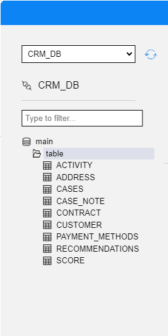
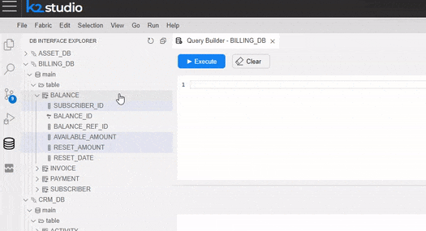
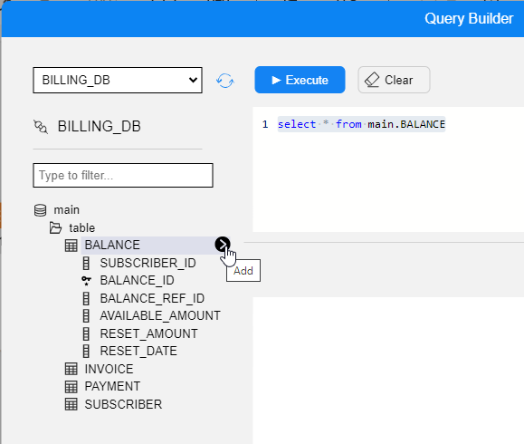

# Building an SQL Query

To use the Query Builder:

<web>

1. Open the DB Explorer objects tree.
2. Edit the SQL commands in the top Query Editor window. You can either create the SQL query manually or use the DB Explorer objects tree menu.
3. Click to execute the query. 
4. The results are presented in a table view in the Results window.

</web>

<studio>​    

1.	Go to [**Query Builder**](/articles/11_query_builder/01_query_builder_overview.md) > **DB Connection** > [**DB Interface**](/articles/05_DB_interfaces/01_interfaces_overview.md). The [List of DB objects](/articles/11_query_builder/03_building_and_running_an_sql_query.md#query-tab---viewing-the-list-of-db-objects) (Tables, Views and Synonyms) of the DB connection is displayed in the DB Tree. 
2.	Create and edit the SQL query. You can either create the SQL query manually or edit an SQL query using the [Query Builder window](/articles/11_query_builder/02_query_builder_window.md). 
3.	To execute the SQL statement, click on **Execute Query**.
4.	Open the [**Results tab**](/articles/11_query_builder/02_query_builder_window.md#result-tab) to view the **SQL results**.

</studio>  

> Note: The Insert, Update and Delete statements (performed by the DB query) may cause an auto-commit to the DB (based on the DB driver’s definition). 

<studio>

## Viewing the List of DB Objects
* Click the **+** or **–** icons to expand or collapse the list in the DB objects.
* Click **Refresh** to refresh the DB objects list. 
* Click **Options** and check/uncheck the **Include Synonyms** option to include or exclude the DB Synonyms from the DB objects list.

</studio> 

<web>

## Viewing the List of DB Objects
Expand or collapse the DB objects tree. When opened via the DB Interface Explorer, the DB objects tree looks as shown in the below image.

  

 A similar tree appears inside the Query Builder pop-up window, when the Query Builder is opened via Schema Editor, Graphit and Broadway. Select the relevant Interface and then expand or collapse the DB objects tree, as needed.

</web>

## Editing an SQL Query  

<studio> 

### 1. Adding a DB Object to the Main Window
Select the **DB object** (Table, View or Synonym) from the **DB Tree** and do either:
* Double-click the **DB object**.
* Select the **DB objects** and drag them to the **Main** window.
* Select the **DB objects** and click on **Add Selected**.
  The selected DB objects are added onto the Main window, when the related SQL statement is displayed in the [Query window](/articles/11_query_builder/02_query_builder_window.md#query-tab).

### 2. Removing a DB Object from the Main Window
Either click the **DB object** and press **Delete** on your keyboard or right-click the **DB object** > **Remove**. 
Note: The removal of a DB object automatically updates the SQL query in the **Query Builder** window.

### 3. Selecting the Columns in a DB Object 
To select columns from a DB object, do either:
* Check specific **columns** in the **DB object** to include them in the SELECT statement.
* Click the **asterisk** in the **DB object** to generate the following SQL syntax: <pre><code> Select * from [Table Name]; </code></pre>

* Right-click on the **DB object** > **Check All** to check all the columns in the table and add them to the SQL query.

### 4. Removing the Selected Columns in a DB Object
To remove columns from a DB object, do either:
* Uncheck the selected columns. 
* Right-click on the **DB object** > **Uncheck All** to remove all the table’s columns from the SELECT statement. Note that when this option is selected for all DB objects in the Main window, the Query Builder generates the following SQL syntax: select * from …

  

## Advanced SQL Setting

### 5. Joining the Selected Tables 

To add a JOIN to the SQL query, do the following:
* Click on the **DB object column** (in the below example, it is the CUSTOMER_ID, in the CUSTOMER table) and drag a line to link it to a column in another **DB object** (CUSTOMER_ID, in the CONTRACT table). This would add an INNER JOIN to the SQL query.

* Right-click the **link’s line** and select one or both **Select all rows from** … option/s to edit the link and update the JOIN to LEFT OUTER JOIN, RIGHT OUTER JOIN or FULL OUTER JOIN.

* Right-click on the **link’s line** > **Properties** to edit the JOIN's properties.

### 6. Union SQL Queries  
1. Do either:
* Right-click in the **Main window > Union > New Union Sub-query/Copy Union Sub-Query**.
* Click the **+** next to the **Q** of the query to add a UNION operator, which combines the result-set of 2 or more SELECT statements. 

Each SQL statement that is combined by the UNION operator has a **Q** icon in the **Main Window**. Clicking the **Q** icon of each SQL statement opens its Main window, where you can add DB objects and link them to each other in order to edit the SQL statement in the Union query. 

2. To modify the **Union query** do either:

* Right-click **Link** -  - between the queries to edit the Union type.

* Right-click the **Q** icon to change the order of the SQL statements in the Union SQL query.

3.  To remove the **Union SQL** query do either:\
    a. Right-click the **Q** icon of the removed query and select **Remove**.\
    b. Right-click the **Main** window, select **Union > Remove**. 

## Table of Selected Columns - Edit the SQL Query
This table is displayed at the bottom-right of the Main window and it enables editing the SQL query. Its selected columns hold the same information as the graphic map in a tabular format.

### Adding an SQL Function to a DB object Column 
1.	Click on the **3 dots** in the **Expression** column for opening the **Expression Editor** window. 

2.	Select the **Function** and the **DB object** column in order to add them to the **SQL query**.

3.	Populate the **Column Name** column to add an **alias** to the selected DB object column.
4.	Populate the **Sort Type** and **Sort Order** columns to add an **Order by** to the SQL query.
5.	Populate the **Aggregate** column to add an **aggregation function** like Min, Max, Avg to the selected DB object column. This act updates the Grouping column and is reflected as a 'Group by' statement in the SQL query.
6.	Populate the **Criteria** and **Or** columns in order to add the DB object column to the WHERE statement of the SQL query.

## Query Settings Toolbar
The **Enable Pre-Execution Commands** checkbox enables running commands on the selected DB before running the SQL query. When this checkbox is checked, the Pre-Execution Commands window opens.
Note that when running the Query Builder on a Fabric interface, you should run the [Get Instance] command in the Pre-Execution Commands window as the SQL query must run on an [LU Instance](/articles/01_fabric_overview/02_fabric_glossary.md#lui) level.

The **Max rows** setting is used for setting the maximum number of rows returned by the SQL query. The default value is 10,000 rows. It is possible to set a different number of rows to be returned by the SQL query.

</studio> 

<web>

You can either create the SQL query manually or use the DB objects tree menu.

### Adding a query using the DB Object Tree

Adding a query to the Query Editor panel using the DB Object Tree, is depended on its occurrence - at DB Interface Explorer, or when opened as popup at Schema Editor, Graphit and Broadway.

At DB Interface Explorer, choose the required SQL statement by using the context menu (right click) on the relevant tree entry. The available statements are: *select* statement, *insert* statement, *update* statement, *delete* statement.

You can choose either a table or specific table's fields so that the query will contain only those fields.

At Query Builder popup, you can click on the right arrow, which appear on hoovering a table in the tree. Once clicked, a "select *" statement from that table is added to the Query Editor editing board.

### Query Editor Assistant 

While editing the SQL statements manually, you can be assisted by the Editor Assistant, which suggest you code completion. The completion suggestion is for schemas, tables, columns names of the current interface, as well as set of base SQL clauses.

The Assistant code completion is done while typing and on hitting CTRL+SPACE, as used while code programming.

> **Notes**
>
>  * You can clear the whole Query Editor window by clicking on the Clear button.
>  * The Query Editor window can hold and execute several queries. When clicking on the Execute button, all queries will be executed, one by one, where the Results window will show the results of the last query.
>  * If the Query Editor window contains several queries and you wish to run some of them, there is no need to delete the others. To execute specific commands, select them and then click on Execute.
>  * You can add Fabric commands to the Query Editor and they will also be executed. 
>  * When Fabric is the selected data source interface, set the top bar fields before executing the query.

</web>

