# Building an SQL Query

Use the Query Builder to create SQL queries as shown below:

<web>

1. Open the Query Builder window, as described [here](/articles/11_query_builder/01_query_builder_overview.md#opening-the-query-builder-window) (remember to choose the interface you wish to query).
2. Edit the SQL commands in the top Query Editor window. 
3. Click to execute the query. 
4. The results are presented in a table view in the Results window.

</web>

<studio>​    

1.	Go to [**Query Builder**](/articles/11_query_builder/01_query_builder_overview.md) > **DB Connection** > select a [**DB Interface**](/articles/05_DB_interfaces/01_interfaces_overview.md). The [list of DB objects](/articles/11_query_builder/03_building_and_running_an_sql_query.md#query-tab---viewing-the-list-of-db-objects) (Tables, Views and Synonyms) of the DB connection is displayed in the DB Tree. 
2.	Create and edit the SQL query. You can either create the SQL query manually or edit an SQL query using the [Query Builder window](/articles/11_query_builder/02_query_builder_window.md). 
3.	To execute the SQL statement, click on **Execute Query**.
4.	Open the [**Results tab**](/articles/11_query_builder/02_query_builder_window.md#result-tab) to view the **SQL results**.

</studio>  

> Note: The Insert, Update and Delete statements (performed by the DB query) may cause an auto-commit to the DB (based on the DB driver’s definition). 

<studio>

## Viewing the List of DB Objects
* Click the **+** or **–** icons to either expand or collapse the list in the DB objects.
* Click **Refresh** to refresh the DB objects list. 
* Click **Options** and check/uncheck the **Include Synonyms** option to include or exclude the DB Synonyms from the DB objects list.

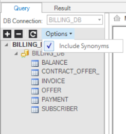

## Editing an SQL Statement  

### 1. Adding a DB Object to the Main Window
Select the **DB object** (Table, View or Synonym) from the **DB Tree** and proceed with one of the following actions:
* Double-click the **DB object**.
* Select the **DB objects** and drag them to the **Main** window.
* Select the **DB objects** and click on **Add Selected** (at the bottom of the DB Tree pane).
  The selected DB objects are added onto the Main window, when the related SQL statement is displayed in the [Query window](/articles/11_query_builder/02_query_builder_window.md#query-tab).

### 2. Removing a DB Object from the Main Window
To remove a DB object from the Main window, you can either click the **DB object** and press **Delete** on your keyboard or right-click the **DB object** > **Remove**. 

Note: Such removal automatically updates the SQL query in the **Query Builder** window.

### 3. Selecting Columns in a DB Object 
To select columns from a DB object, perform either one of the following actions:
* Check specific **column checkboxes** in the **DB object** to include them in the SELECT statement.
* Check the checkbox next to the **asterisk** in the **DB object** to generate the following SQL syntax: <pre><code> Select * from [Table Name]; </code></pre>

* Right-click on the **DB object** > **Check All** to check all column checkboxes in the table and add them to the SQL query.

### 4. Removing Selected Columns from a DB Object
To remove columns from a DB object, perform either one of the following actions:
* Uncheck the checkboxes of the selected columns. 
* Right-click on the **DB object** > **Uncheck All** to remove all columns of the table from the SELECT statement. Note that when this option is selected for all DB objects in the Main window, the Query Builder generates the following SQL syntax: select * from …

  

## Advanced SQL Setting

### 5. Joining the Selected Tables 

To add a JOIN to the SQL query, perform the following:
* Click on the **DB object column** (in the below example, it is the CUSTOMER_ID, in the CUSTOMER table) and drag a line to link it to a column in another **DB object** (CUSTOMER_ID, in the CONTRACT table). This would add an INNER JOIN to the SQL query.

* Right-click the **link’s line** and select one or both **Select all rows from** … option(s) to edit the link and update the JOIN to LEFT OUTER JOIN, RIGHT OUTER JOIN or FULL OUTER JOIN.

* Right-click on the **link’s line** > **Properties** to edit the JOIN's properties.

### 6. Union SQL Queries  
1. Perform either one of the following actions:
* Right-click in the **Main window > Union > New union sub-query/Copy union sub-query**.
* Click the **+** next to the **Q** of the query (top-right corner of the Main window) to add a UNION operator, which combines the result-set of 2 or more SELECT statements. 

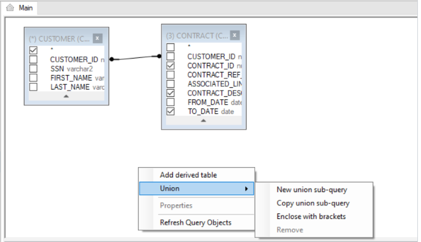

Each SQL statement, which is combined by the UNION operator, has a **Q** icon in the **Main window**. Clicking the **Q** icon of each SQL statement opens it in the Main window, where you can add DB objects and link them to each other in order to edit the SQL statement in the Union query. 

2. To modify the **Union query**, perform either one of the following actions:

* Right-click **Link** -  - between the queries to edit the Union type.

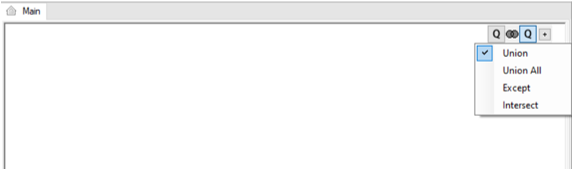

* Right-click the **Q** icon to change the order of the SQL statements in the Union SQL query.

3.  To remove the **Union SQL** query, do one of the following:\
    a. Right-click the **Q** icon of the removed query and select **Remove**.\
    b. Right-click the **Main** window, select **Union > Remove**. 

## Table of Selected Columns - Edit the SQL Statement
This table displays underneath the Query Builder's Main window, and it enables editing the SQL query. Its selected columns hold the same information as the graphical map yet in a tabular format.

### Adding an SQL Function to a DB Object Column 
1.	Click on the **3 dots** in the **Expression** column for opening the **Expression Editor** window. 

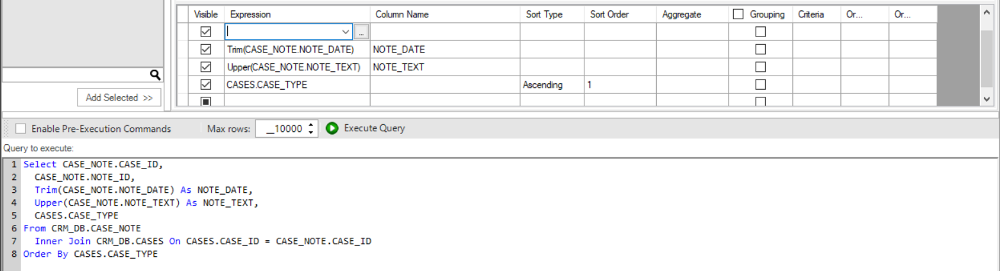

2.	Select the **Function** and the **DB object** column in order to add them to the **SQL query**.

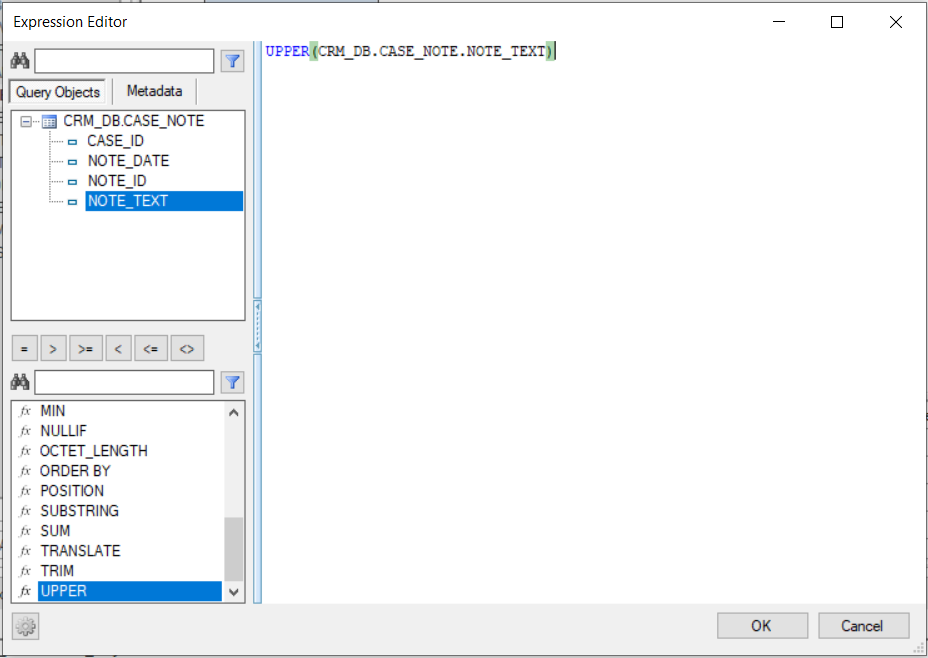

3.	Populate the **Column Name** column to add an **alias** to the selected DB object column.
4.	Populate the **Sort Type** and **Sort Order** columns to add an **Order by** to the SQL query.
5.	Populate the **Aggregate** column to add an **aggregation function** such as Min, Max, Avg to the selected DB object column. This act updates the **Grouping** column and is reflected as a 'Group by' statement in the SQL query.
6.	Populate the **Criteria** and **Or** columns in order to add the DB object column to the WHERE statement of the SQL query.

## Query Settings Toolbar
The **Enable Pre-Execution Commands** checkbox enables running commands on the selected DB before running the SQL query. When this checkbox is checked, the Pre-Execution Commands window opens.
Note that when running the Query Builder on a Fabric interface, you should run the [Get Instance] command in the Pre-Execution Commands window, as the SQL query must run on an [LU Instance](/articles/01_fabric_overview/02_fabric_glossary.md#lui) level.

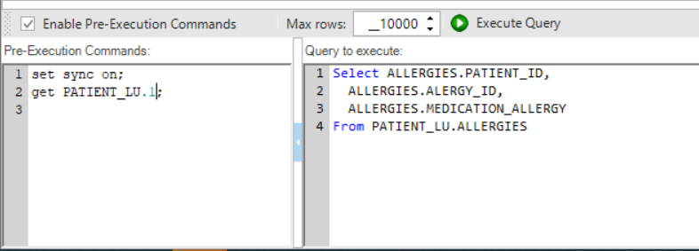

The **Max rows** setting defines the maximum number of rows that the SQL query can return, with a default of 10,000. This limit can be adjusted as needed.

</studio> 

<web>

You can create and edit an SQL statement by selecting the desired action from the Interface Explorer menu tree, typing it manually, or seeking guidance from the built-in AI Assistant. The latter two are used for more complex queries.

## Adding a Query using the Interface Explorer Tree

Adding a query to the Query Editor panel using the Interface Explorer Tree, is depended on its occurrence - at DB Interface Explorer, or when opened as a pop-up at Schema Editor, Graphit and Broadway.

At DB Interface Explorer, choose the required SQL statement by using the context menu (right-click) on the relevant tree entry. The available statements are: *select*, *insert*, *update* and *delete*.

You can choose either a table or specific table fields in a way that the query would include only those fields.

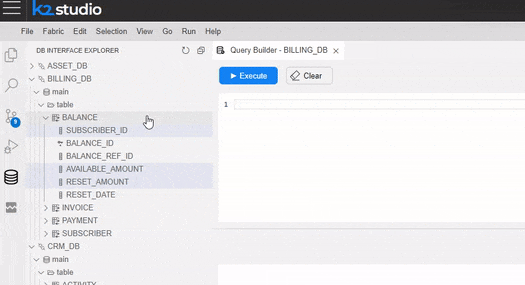

In the Query Builder pop-up window, you can hover over a table in the tree and click on the arrow that appears on its right. Once clicked, a "select *" statement from that table is added to the Query Editor editing board.

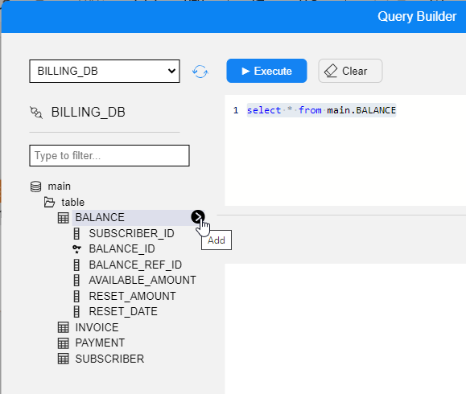

## Writing an SQL statement

While writing your SQL statement in the editor, you can be guided by 2 assistants:

### AI Assistant

You can use the built-in AI Assistant for creating SQL statements, by entering your desired statement in natural language for the AI Assistant. To use the AI Assistant:

1. Click on the AI icon () at the top right side of the Query Builder Editor panel.

   The Editor screen is then split into two side-by-side editors: At left - SQL Editor, where at the right - the native language statements Editor. 

2. Write your desired statement at the right side editor.

3. Choose the relevant schemas that you wish the AI will look at, via the *Schema Filter* select list. This aimed to avoid overwhelming the process. In case of a single schema DB, it is automatically selected

   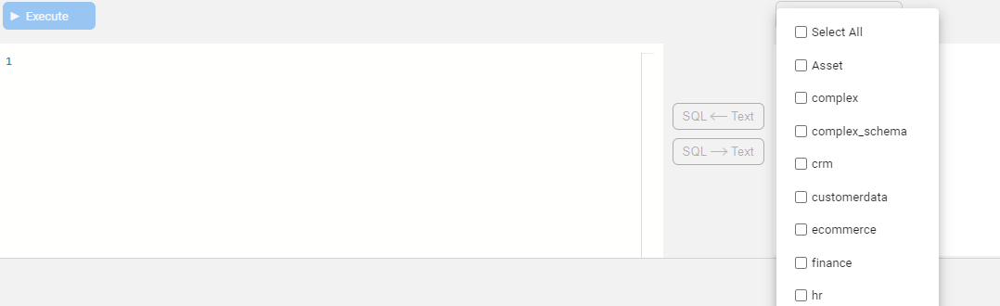

   > You can see which schemas were selected, even without opening the select list again, by mouse hoover 
   >
   > 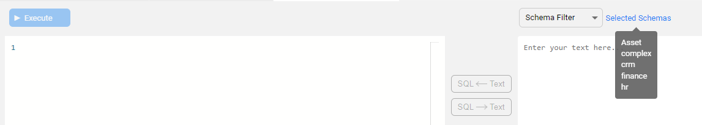 

4. Click on the *Text &rarr; SQL* button.

5. The query will then be generated and will appear at the SQL Editor.

   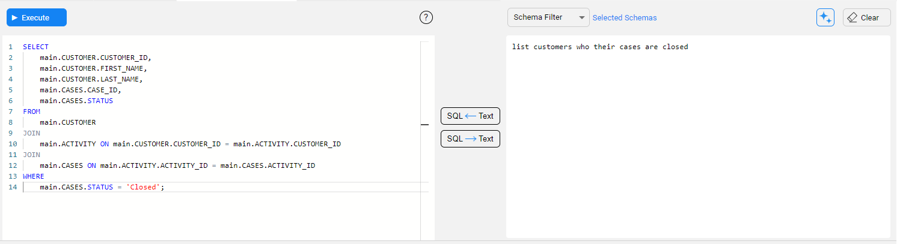

   You can see the AI explanations, of how SQL command was created, by clicking on the question mark icon, which will appear above the SQL Editor, once Text to SQL generations process is ended.

You can also activate the AI Assistant in the opposite way - to explain you an existing SQL in a native language. For this, Click on the *SQL &rarr; Text* button.

When AI Assistant is activated inside a DB select function, like in BW DB Query actors or in Graphit node, the native language statement is saved as a comment alongside the the SQL.

> Notes: To activate the AI Assistant you shall install one of the AI connectors and create an interface upon.

### Query Editor Code Completion Assistant 

While editing the SQL statements manually, you can be assisted by the Editor Assistant, which suggest you code completion. The completion suggestion is for schemas, tables, columns names of the current interface, as well as set of base SQL clauses.

The Assistant code completion is done while typing and on hitting CTRL+SPACE, as used while code programming.

A select list is then opened where you can choose the relevant statement.

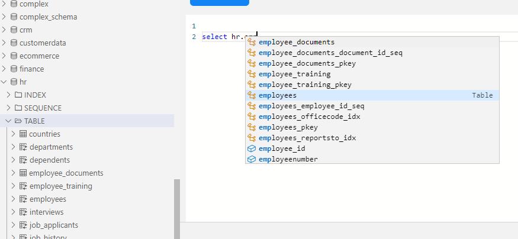

An icon appears aside any item in the select list, where:

*  stands for a DB schema.
*  stands for a DB table.
*  stands for a table.

Code Completion Assistant can also help you when looking for the standard SQL commands, like `Select`, `AND`, `WHERE`. The icon that represents them is: .

> **Notes and Tips**
>
>  * You can clear the whole Query Editor window by clicking on the Clear button.
>  * The Query Editor window can hold and execute several queries. When clicking on the Execute button, all queries will be executed, one by one, where the Results window will show the results of the last query.
>  * If the Query Editor window contains several queries and you wish to run some of them, there is no need to delete the others. To execute specific commands, select them and then click on Execute.
>  * You can add Fabric commands to the Query Editor and they will also be executed. 
>  * When Fabric is the selected data source interface, set the top bar fields before executing the query.

</web>

