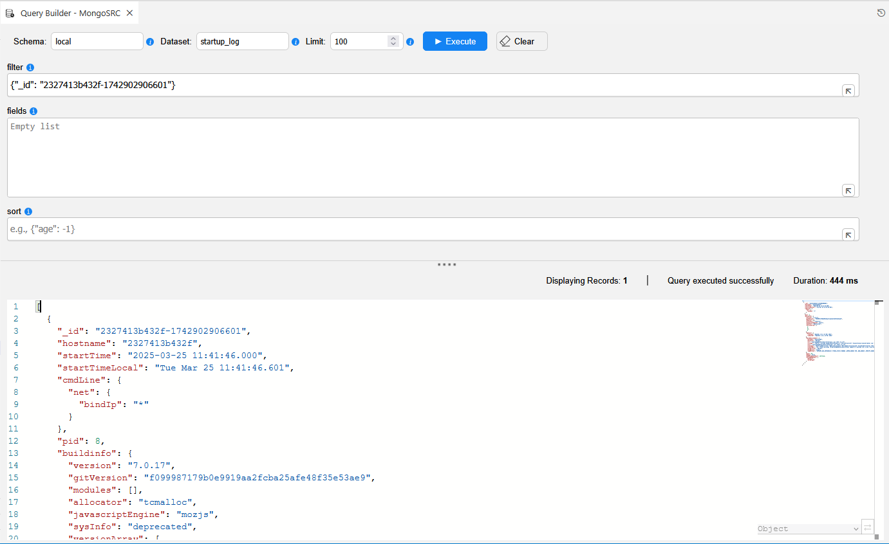

<web>

# Query Builder for NoSQL Interfaces

## Overview

The Query Builder now supports NoSQL interfaces in the Web Studio, enabling you to seamlessly query NoSQL data sources alongside traditional SQL databases. This enhancement introduces a dedicated NoSQL mode that replaces the SQL editor with a Broadway flow-based querying system.

Available in Fabric V8.4.

## How It Works

**NoSQL Mode vs SQL Mode**

When you open the Query Builder, it automatically detects the interface type and switches between two modes:

- **SQL Mode**: Traditional SQL editor for relational databases.
- **NoSQL Mode**: Broadway flow-based interface for NoSQL databases (MongoDB, Couchbase, etc.).

The mode is dynamically selected based on the interface type you choose, when opening the Query Builder.

**Query Execution**

In NoSQL mode, queries are executed through a Broadway flow instead of SQL statements. The flow follows a reserved naming pattern: `<interface-type>_query_builder.flow`

For example, for MongoDB the flow name is `MongoDB_query_builder.flow`.

## Broadway Flow Requirements

If you're implementing Query Builder support for a custom NoSQL interface, start from creating your Broadway flow. The flow name must follow the pattern: `<interface-type>_query_builder.flow` and include the following input and output parameters:

**External Input Parameters**

- `interfaceName` (hidden) - The name of the interface.
- `schema` - The schema/database name.
- `dataset` - The collection/dataset name.
- `limit` - Maximum records to return (the default is set to 1000).

Additional optional parameters can be included such as: `fields`, `filter` or `sort`.

All external input parameters (except for the `interfaceName`) will be shown in the Query Builder screen.

Note that if the Broadway flow has the external input parameter called `sql`, the Query Builder will be opened in a regular SQL Mode, ignoring any other external inputs except `limit`.

**External Output Parameters**

- `result` - The query results defined as an array of objects.

## Using the Query Builder in NoSQL Mode

The Query Builder can be opened:

- **Standalone**: From the Web Studio's interface explorer, by clicking on the **Open Query Builder** icon next to the interface name.
- **As a popup**: From other editors (Flow editor, Graphit editor, Catalog). 

When browsing the interface explorer tree, clicking the **Open Query Builder** icon next to a dataset/collection opens the Query Builder with schema and dataset prepopulated from the tree.

The Query Builder displays results based on the result data structure:

- **Tabular view**: When the result is an array of maps with consistent fields and primitive values, results are displayed in a table grid (same as SQL mode).
- **Monaco editor view**: For complex nested data or non-tabular results, a Monaco editor panel displays the raw output with syntax highlighting (JSON, XML, etc.).

## Example: MongoDB Query

The image below shows a Query Builder session for a MongoDB interface:

**Query Parameters:**
- Schema: `local`
- Dataset: `startup_log`
- Filter: `{"_id": "2327413b432f-1742902906601"}`
- Limit: `100`

**Result:**
A single document displayed in the Monaco editor with JSON syntax highlighting, showing the startup log entry with fields like `_id`, `hostname`, `startTime`, `buildinfo`, and nested objects.

## Tips and Best Practices

- Use the **Clear** button to reset all query parameters.
- The AI icon is not available in NoSQL mode (this feature is reserved for SQL mode).
- Pay attention to the syntax requirements of your specific NoSQL database when writing filters and sort criteria.
- Use the limit parameter to control result size and improve query performance.

## Troubleshooting

**Query returns no results in table view:**
- Check if your data structure is consistent across all documents.
- If documents have nested or varying structures, results will display in the Monaco editor instead.

**Cannot find the NoSQL interface:**
- Ensure the required Broadway flow (`<interface-type>_query_builder.flow`) exists for your connector.
- Verify the interface is properly configured in the Web Studio.

**Error executing query:**
- Validate your filter syntax matches the NoSQL database requirements.
- Ensure the schema and dataset names are correct.
- Check that the interface connection is active and accessible.

</web>