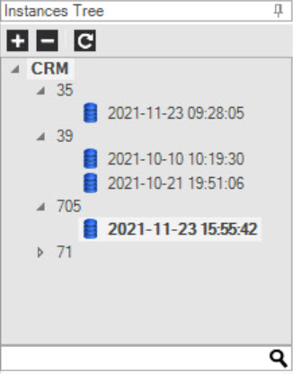
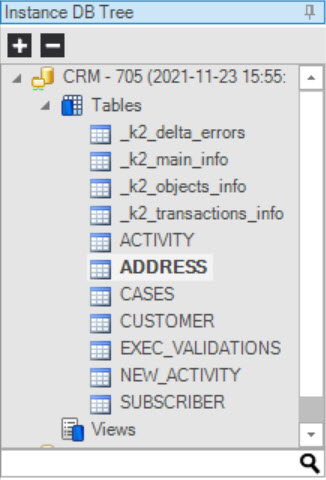
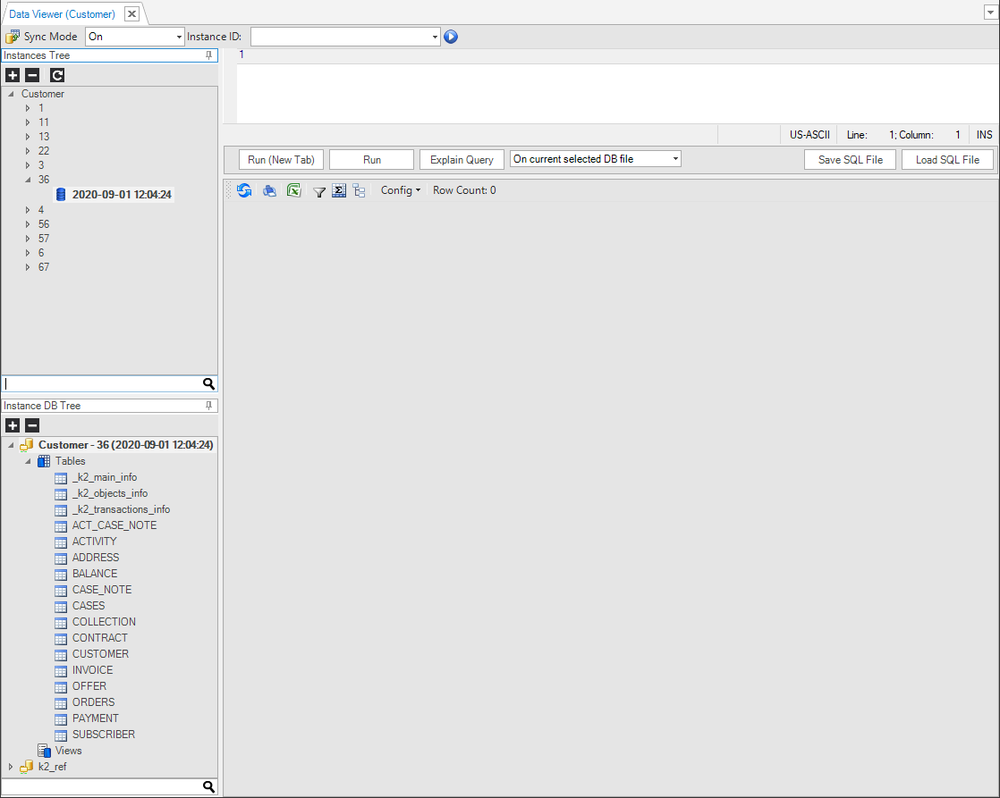
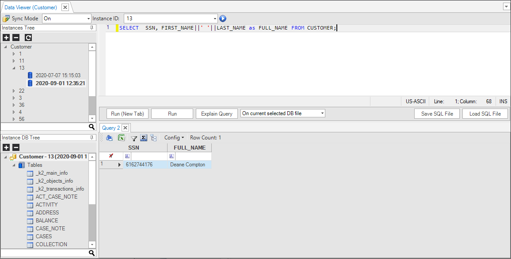
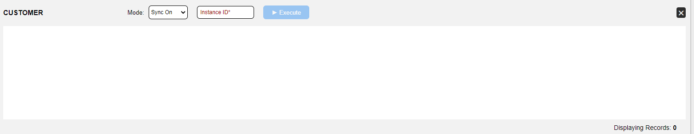
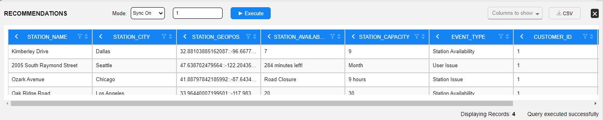
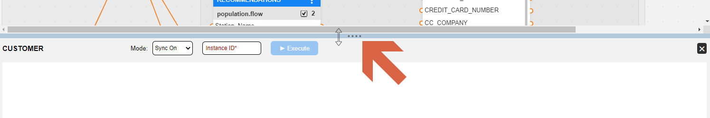
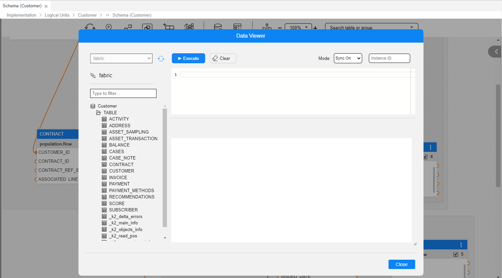

# Data Viewer

The Data Viewer enables you to view a [Logical Unit Instance](/articles/03_logical_units/01_LU_overview.md) database (MicroDB) tables' content, which is useful for testing and defect resolutions. As an LUI is associated to an LU, the viewing of its data is accessible from the LU context within the Studio.

<studio>

## How Do I View Data in a Logical Unit?


1. Go to the **Project Tree**, click **Logical Units** and verify that the LU has a green icon, indicating that it is deployed to the debug server. If the LU has a white icon, deploy it  to the debug server before running the Data Viewer on it. Do either:

   - Right-click the **LU** > **Deploy To debug**.
   - Click the **Deploy** icon, located at the top of [Fabric's Debug Panel](/articles/04_fabric_studio/01_UI_components_and_menus.md#fabric-studio-debug-panel).

2. Click   next to the selected LU to open the **Data Viewer** window.

3. Set the [Sync Mode](/articles/14_sync_LU_instance/02_sync_modes.md) in the top left pane; the default Sync Mode is **ON**.

4. In the **Instance ID** field (top central pane) - enter an Instance ID (an integer). 

5. Click  **Play** to generate a new **Data Viewer file**. 
    Fabric runs the [GET LUI command](/articles/02_fabric_architecture/04_fabric_commands.md#get-lui-commands) on the debug server of the selected Instance ID. Each [sync of an LUI](/articles/14_sync_LU_instance/01_sync_LUI_overview.md) creates a new *.db SQLite file for the LU instance. The LU instance is displayed in the Instances Tree. 

  	Note that if you set the Sync Mode to **OFF** and the Instance ID does not exist in the debug server, the following error message is displayed:
  	
  	 *Instance '[LU Name]:[Instance ID]' was not found and sync is disabled.*

6. Double-click the **Instance ID** to open the **Instances Tree** drop-down list.



7. Click the **Instance DB file** to display its **tables** under the **Instance DB Tree**.



8. Double-click a **table** to display its data and then right-click the **table** to open a context menu with the following options: 

   a. **Show Data**, displays the table’s data.
   
   b. **Show Schema**, displays the table’s structure.
   
   c. **Show Indexes**, displays the table’s indexes, if defined.

[Click for more information about Logical Units.](/articles/03_logical_units/01_LU_overview.md)

## What Are the Data Viewer Components?

The Logical Unit Data Viewer has the following areas:
* Sync Mode and Instance ID
* Instances Tree
* Instance DB Tree
* Scripting Area
* Results Pane and Toolbar



### Sync Mode and Instance ID

This area has the following components:

#### Import DB File 

When clicked, it allows you to browse to an external Data Viewer file and load it. 

#### Sync Mode

Set the [Sync Mode](/articles/14_sync_LU_instance/02_sync_modes.md) for the [GET LUI command](/articles/02_fabric_architecture/04_fabric_commands.md#get-lui-commands), initiated by the execution of the Data Viewer. The options are **On**, **Off** and **Force**. The default mode is **On**.

#### Instance ID

To complete this field, do either:
* Enter a specific Instance ID value.
* Select a previously stored Instance ID from the drop-down list.
* Write a [project (java) function](/articles/07_table_population/08_project_functions.md) to generate the Instance ID. Note that this function must return a string as an output. Once you have created such function, use the function name in the Instance ID field (that is, do not enter the code that contains the function). 


  For example:


  Create an Instance ID by using the function: **fnCreateInstID**. This function takes an input value and adds 10:

  ```java
  if (i_id!=null && !i_id.isEmpty()){
	 return Integer.sum(Integer.valueOf(i_id),10)+"";
   }
  return "0";
  ```
  More complicated functions can be written, of course, such as generating a random instance ID or an instance ID that complies with other criteria (such as certain values). 


#### Play

When  icon is clicked, the data file of the Instance ID is retrieved and saved for debugging.
	
### Instances Tree
The Instance Tree area (top left) displays a tree of available data files in the following order: 
* LU
* Instance 
* Dated file name

### Instance DB Tree

The Instance DB Tree area (bottom left) displays the Table Tree, which includes: 
* **k2_delta_errors** - holds information on errors, including when each error occured.
* **k2_main_info** - holds basic information about the LU, like the LU Name and its Instance ID.
* **k2_objects_info** - holds information for each of the objects in the selected instance.
* **k2_transactions_info** - holds basic information about each transaction (ID and timestamp).

* **Reference tables under k2_Ref**. These are only displayed as part of the Instance DB tree when the [reference object](/articles/03_logical_units/15_LU_schema_edit_reference_tab.md) is enabled in the LU schema properties.

To display the values of a table in the tree, right-click the table and select either:
* **Show Data**, to display the table or view it in the Results pane.
* **Show Schema**, to display the table structure in the Results pane.
* **Show Indexes**, to display the table indexes in the Results pane.

### Results Pane and Toolbar
(Bottom right) Displays the data or schema requested with the row count.
 <table>
<tbody>
<tr>
	<td width="60"><p></p></td>
<td width="274">
<p>Print results</p>
</td>
</tr>
<tr>
	<td width="60"><p></p></td>
<td width="274">
<p>Export results as an Excel file</p>
</td>
</tr>
<tr>
	<td width="60"><p></p></td>
<td width="274">
<p>Filter results by one or more columns</p>
</td>
</tr>
<tr>
	<td width="60"><p></p></td>
<td width="274">
<p>Toggle groupings</p>
</td>
</tr>
<tr>
	<td width="60"><p></p></td>
<td width="274">
<p>Toggle summaries</p>
</td>
</tr>
        <td width="60"><p></p></td>
<td width="274">
<p>Refresh view</p>
</td>
</tr>	
</tbody>
</table>


### Scripting Area
The SQL scripting area is used for writing and running SQL statements on a selected LUDB (upper-right pane).




The following options are supported:
<table>
<tbody>
<tr>
<td width="200pxl" valign="top">
<p><strong>Run or Run on New Tab</strong></p>
<p><strong>&nbsp;</strong></p>
</td>
<td width="650pxl" valign="top">
<ul>
<li>Click Run to execute the given SQL statement.</li>
<li>Click Run on New Tab to open a new Results tab.</li>
</ul>
</td>
</tr>
<tr>
<td width="236" valign="top">
<p><strong>Explain query</strong></p>
</td>
<td width="368" valign="top">
<p>Description of the strategy/plan that the SQLite uses to implement a specific SQL query (e.g. SCAN TABLE).</p>
</td>
</tr>
<tr>
<td width="236" valign="top">
<p><strong>Drop-down menu of special Run options</strong></p>
</td>
<td width="368" valign="top">
<ul>
<li>On current DB file: The SQL is executed on the currently selected instance file.</li>
<li>On newest DB file for each instance: The SQL is executed on the newest instance file of each instance in the Instances tree.</li>
<li>On selected DB files: The SQL is executed on the selected instance's files. Click and press <strong>CTRL </strong>to select the required files.</li>
<li>On all existing DB files: The SQL is executed on all files in the Instances tree.</li>
</ul>
<p>Note that when <strong>On Newest DB file</strong> or <strong>On All Existing DB files </strong>are selected, the Rows Limit drop-down list opens, where you can define the number of results displayed.</p>
</td>
</tr>
<tr>
<td width="236" valign="top">
<p><strong>Save SQL to File</strong></p>
</td>
<td width="368" valign="top">
<p>Saves the current SQL statements to a file.</p>
</td>
</tr>
<tr>
<td width="236" valign="top">
<p><strong>Load SQL from File</strong></p>
</td>
<td width="368" valign="top">
<p>Retrieves an SQL statement from a file previously created in the Scripting area.</p>
</td>
</tr>
</tbody>
</table>

### How Do I Run an SQL Statement in the Data Viewer? 

Run and execute the SQL statement from the scripting area on the selected DB file:
1. Enter the **SQL statement** using **SQLite syntax** into the Scripting area. 
2. Select the **DB file** to be used to run the statement from the dropdown list. 
3. Do the following:\
    a. Click **Run** or **Run on New Tab** under the **Scripting area**.\
    b. Press **F5** or **Ctrl + Enter**. Separate multiple queries with ‘;’.
4. View results in the **Results pane**.

### How Do I Export a Logical Unit Data File?
1. Go to the **Instances Tree** and right click the **DB File**. 
2. Click **Export Selected DB Files** and select the **Location** and **File Name** of the exported file (LUDB format). 
3. **Save** your changes. 

### Additional (Right-Click) DB File Options
* **Open DB** opens the **Instance DB Tree** of the selected DB files. 
* **Delete Selected DB Files**, deletes the selected **Instance DB files** from the **project folder**:
   Fabric\\[project name]\Implementation\LogicalUnits\\[LU name]\VirtualDB_Data.

**Notes**

The latest Data Viewer file can be used in the following components:

* New functions / Web Services, the latest Data Viewer is displayed in the Databases drop-down list whereby the LU table can be invoked on the code. 
[Click for more information on How to Create a New Project Function.](/articles/07_table_population/10_creating_a_project_function.md)
* LU Schema, create a new table based on SQL Options to open the DB query where you can select the latest Data Viewer file. [Click for more information about Adding a Table to a Schema.](/articles/03_logical_units/09_add_table_to_a_schema.md)
* Population object / DB query, to display the latest Data Viewer file in the Database drop-down list. [Click for more information about Creating a New Table Population.](/articles/07_table_population/03_creating_a_new_table_population.md)
* Debugging population objects. [Click for more information about Debugging a Table Population.](/articles/07_table_population/01_table_population_overview.md#debug-toolbar) 


</studio>

<web>

## How Do I View Data in a Logical Unit?

The Data Viewer is accessible via the LU schema:

1. Go to **Project Tree** > right-click **Logical Units / Data Products** 
2. Expand the relevant LU and open its **schema**.


Studio provides 2 methods to view an LUI data:

1. **Table Data Viewer**, Lets you an easy and quick way to look at each table's content data, by navigate between the LU tables which are shown at the schema diagram.
2. **Data Viewer**, Lets you building queries and execute them. This can be useful in case you wish to create cross tables queries.


### Table Data Viewer

To open the Table Data Viewer, click on  which appears at the schema's top bar. Once clicked, a panel is opened at the bottom of the schema window.



The panel is divided to 3 main areas

* Top bar, showing at at left side the selected table name (by default it will be the root table, unless you selected one ahead). In the middle there are 3 action elements - the sync mode for bringing the LUI, the Instance ID field and the Execute button, which brings the LUI, according to the schema definitions. Clicking on the Execute button activates a Fabric ["get" command](/articles/02_fabric_architecture/04_fabric_commands.md#get-commands) (which behaves according to the selected sync method).

  When LUI is brought and table content is shown in the main aera, additional action elements appear at the right side - filter columns and export table content to CSV. This is the same capability as enabled in the [Query Builder results window](/articles/11_query_builder/03_building_and_running_an_sql_query.md#results-window).

* The main area, where table's data is shown. This area and its capabilities like filtering, sorting or grouping are the same as enabled in the [Query Builder results window](/articles/11_query_builder/03_building_and_running_an_sql_query.md#results-window).

* Bottom information bar, shows the execution status and if succeeded - of how many entries/rows are shown for the selected table (up to 1000 rows).



To see another table's content data of this LUI, just click on it at the schema. 


You can change the panel's height, according to your needs, by moving your mouse to the top panel area. You will then see the 3-dots ellipsis sign and the cursor will turn into *resize* mode.



> NOTES:
>
> * Clicking on the Execute button will first save the schema and deploy the LU, if it was changed.
> * If you made changes in the schema you shall click on the Execute button over again, in order to see how they affect on the LUI content.
> * When changing the sync mode or cleaning the Instance ID field - the panel is reset and the shown content is cleared. This is done in order to avoid confusion about what is currently shown.


To close the panel click on the X close button at the right side of the panel.


### Data Viewer

To open the Table Data Viewer, click on  which appears at the schema's top bar. Once clicked, a Query Builder popup window will appear.

This is similar to other Query Builder popup windows, where here the interface - fabric - and the schema - the current LU - are preselected and are read-only. 

The LU's tables list is already expanded within the DB explorer at the left side. 

> The table's list includes also several [built-in LU tables](/articles/06_LU_tables/01_LU_tables_overview.md#built-in-platform-lu-tables/articles/06_LU_tables/01_LU_tables_overview.md#built-in-platform-lu-tables), which contain statistical information about the specific LUI. These tables are not displayed in the LU Schema. For example: 
>
> * **k2_main_info**, holds basic information about the LU like LU Name and Instance ID.
> * **k2_objects_info**, holds information for each of the objects (=tables) in the selected instance. For example, what populations used for each table, how much time took to populate each table, how many records brought for each table, and how much time took to load data into Fabric.

In addition, similar to any Query Builder which is opened for fabric type interface, Sync mode select list and instance ID field appear at the right side of the window's top bar.

 

Similar to the Table Data Viewer:

* The data results area, has same capabilities as enabled in the [Query Builder results window](/articles/11_query_builder/03_building_and_running_an_sql_query.md#results-window), like filtering, sorting and grouping. 
* Bottom information bar, shows the execution status and if succeeded - of how many entries/rows are shown for the selected table (up to 1000 rows).

> NOTES:
>
> * Clicking on the Execute button will first save the schema and deploy the LU, if it was changed, before popup is opened.
> * When changing the sync mode or cleaning the Instance ID field - the main results area is reset and the shown content is cleared. This is done in order to avoid confusion about what is currently shown.


### Get & Sync Modes

To get information about an instance ID, you shall specify the retrieval *mode*.

Set the [Sync Mode](/articles/14_sync_LU_instance/02_sync_modes.md) for the [GET LUI command](/articles/02_fabric_architecture/04_fabric_commands.md#get-lui-commands), initiated by the execution of the Data Viewer. The options are **On**, **Off**, and **Force**. The default mode is **On**.

In addition, Data Viewer provides another mode, named "New", that when selected the LU instance is first deleted and then instance is brought from scratch. (Such option appears also in Broadway Debug Population *Mode*).


</web>


[](02_fabric_studio_log_files.md)

