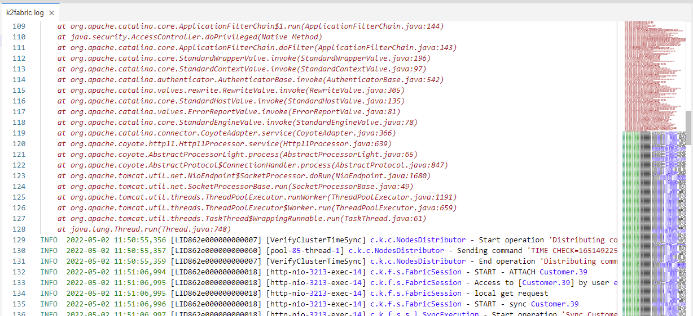
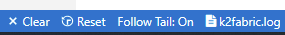

# Fabric Studio Log Files

Fabric Studio enables you to develop, test and monitor projects within the Studio using Fabric’s test and log capabilities. 

<studio>

To display a list of recent messages from the server, click
 Server / Activity Logs (left menu). By default, this window only displays warnings and error messages, however additional messages and notices can also be reviewed.

The following are the main log options:
* Server logs.
* Activity logs.
* Compilation errors.

[Click for more information about UI Components and Menus.](/articles/04_fabric_studio/01_UI_components_and_menus.md)

### How do I Review Server / Activity Logs and Compilation Errors?
**Server Logs**
1. Click   **Server Logs** and then click either **Errors**, **Warnings** or **Messages** to display the relevant server logs list.

2. Right click in the **Log’s list** area to display the following context menu options:
    * **Select Open Selected Items Data in Notepad**, to review the entire error or notification message.
    * **Select Copy Selected Items Data**, to copy the entire text onto the clipboard.
    * **Clear List** to remove the listed logs. Clear list can also be accessed by clicking the **Clear List** icon (top pane).

**Activity Logs**  

3. Click  **Activity Logs** to open the Activity Logs window.

 

4. Follow **Step 2** to select and review the log. 

**Compilation Errors**

5. Click   **Compilation Errors** to open the following window. 

6. Follow **Step 2** to select and review the log. 

**Output**

7. Click  **Output** to open the following window where you can review the K2Fabric log:

### Debugging Logs and Messages

Logs and messages can also be used for debugging purposes. The **log.info ()** method is available to enable Fabric’s runtime Debug options. This method can be added to any Java code and its output can be viewed after deployment and during runtime. 

For example, see the **fnCreateInstID** function under Customer LU in the demo project:

~~~java
if (i_id!=null && !i_id.isEmpty()){
// Increase the input by 10 and return
   log.info("o_id: "(Integer.sum(Integer.valueOf(i_id),10)+""));
	return Integer.sum(Integer.valueOf(i_id),10)+"";
}
return "0";
~~~

The runtime log (k2fabric.log) can be reviewed in the Fabric Server’s Logs directory or in the Studio’s Output logs.

</studio>

<web>

Press the Log icon at the Activity Bar to open the Log Viewer, where you can see list of logs. 

The most useful log file is the k2fabric.log. Click and see it at main pane.

Log files are shown with two important features:

* Showing you the log files with syntax coloring and highlighting.
* Allowing you to easily identify and navigate faults using the right minimap.

Like any file which is shown and automatically opened at the main panel, you can drag and drop it to other panels. for example - drag the log to the bottom panel and track on issues, while continuing work and debug your project at the main panel. In the below illustration, Graphit file is opened at main panel while log is at the bottom panel

Use the bottom status bar log items to:

- Clear log view (without modifying the file).
- Reset back the log view.
- Set if automatically follow log's tail based on scroll position.

</web>

