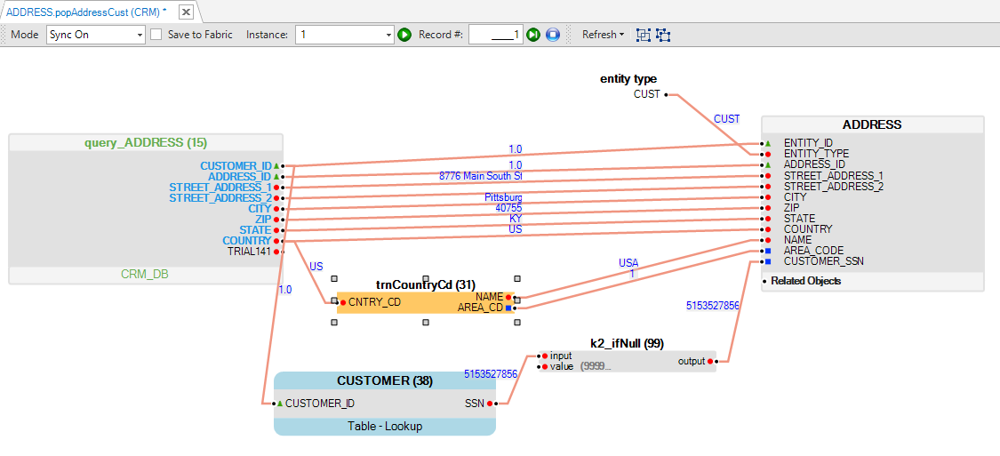
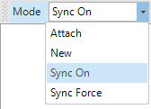
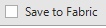
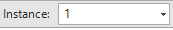

# Debug Table Population

A [Table Population](/articles/07_table_population/01_table_population_overview.md) is a Fabric Studio component that defines and executes the mapping and data[ transformation rules](/articles/07_table_population/05_table_population_mode.md) from a data source, like a DB table or Input file, into a target [Logical Unit (LU) table.](/articles/03_logical_units/01_LU_overview.md) 

The Table Population window is used to define and display the transformation rules that are applied to data when it is loaded into a Fabric database.

The following is an example of the Table Population window:

The Population window has a **Debug** option which activates a [GET LUI](/articles/02_fabric_architecture/04_fabric_commands.md#get-lui-commands) Fabric command over the Fabric debug server.  

The mapped data is displayed in the Population Window working area and errors, if they exist, are displayed in the [Log window](02_fabric_studio_log_files.md). 

In the Table Population a source object can return one or many records whereby each output record is mapped and populated into a target LU table. A Debug process can be executed on each record in the population.

### How do I Use the Debug Toolbar?

The **Debug Toolbar** is used to test the Table Population map by executing its population logic on a selected [Instance ID](/articles/01_fabric_overview/02_fabric_glossary.md#instance-id).
* When the execution is successful, the values of the Input and Output fields are displayed in the working area above the connection lines between the source and the target. 
* If there is an error, it is displayed in the Fabric Studio [Server Log](02_fabric_studio_log_files.md) section.

The **Debug Toolbar** has the following icons:

<table>
<tbody>
<tr>
  <td width="200pxl">

</td>
<td width="700pxl">

Sync Mode. Sync mode values:

<li><strong>Sync On</strong>. This is the default value. Set the&nbsp;<a href="/articles/14_sync_LU_instance/02_sync_modes.md">sync mode</a> to ON when running the <a href="/articles/02_fabric_architecture/04_fabric_commands.md#get-lui-commands">GET LUI</a> command on the selected Instance.</li>
<li><strong>Sync Force</strong>. Set the&nbsp;<a href="/articles/14_sync_LU_instance/02_sync_modes.md">sync mode</a> to FORCE when running the <a href="/articles/02_fabric_architecture/04_fabric_commands.md#get-lui-commands">GET LUI</a> command on the selected Instance.</li>
<li><strong>New</strong>. Delete the LUI (Instance) from the Fabric debug server and run GET LUI with a sync ON mode to get the selected Instance.</li>
<li><strong>Attach</strong>. Listens to external sync in the Fabric debug server which activates the population debug. Displays the input and output values of the table population.</li>
</td>
</tr>
<tr>
  <td width="200pxl">

</td>
<td width="700pxl">

If checked, the sync of the instance is committed in the Fabric debug server. Otherwise, the sync transaction is rollbacked in the Fabric debug server. By default, this checkbox is unchecked.

</td>
</tr>
<tr>
  <td width="200pxl">

</td>
<td width="700pxl">

Populate the LUI (instance ID) for the debug.

</td>
</tr>
<tr>
  <td width="200pxl">

</td>
<td width="700pxl">

Displays the current record&rsquo;s number.

</td>
</tr>
<tr>
<td width="200pxl">

</td>
<td width="700pxl">

Execute Debug, Debug Next Record, and Stop Debug.

</td>
</tr>
</tbody>
</table>

